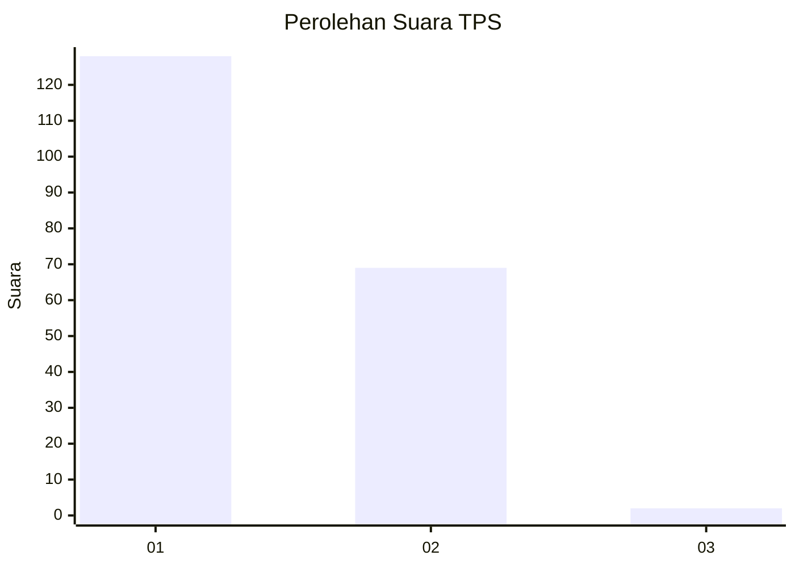
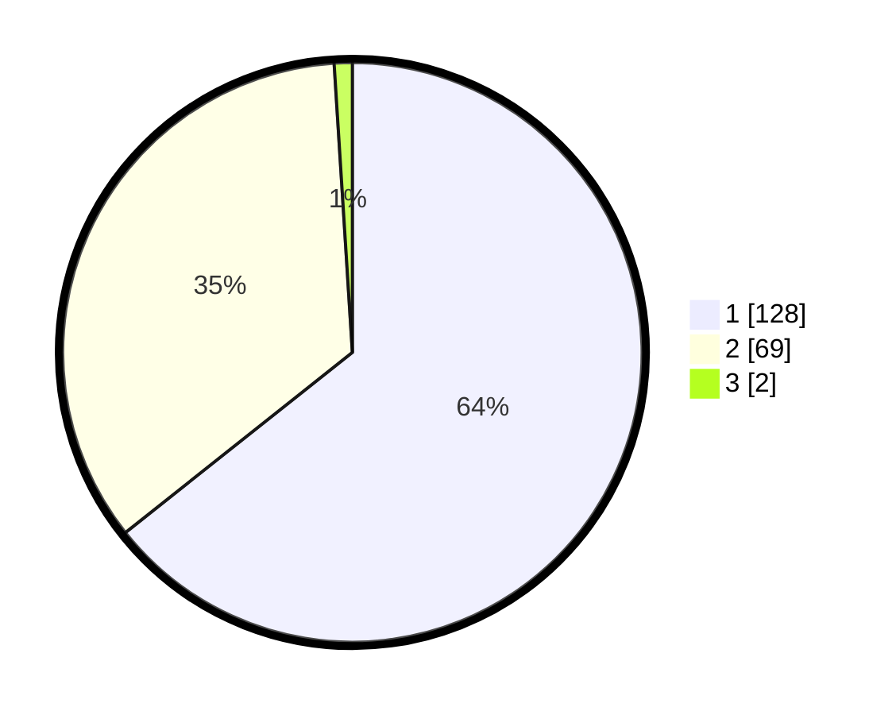

# Hasil

## Grafik

## Tabel

| No. | Nama Paslon    | Suara | Suara (raw) | Persentase |
|:--- |:-------------- | -----:| -----------:| ----------:|
| 1   | ANIES MUHAIMIN | 128   | [128][p-1]  | 64,32      |
| 2   | PRABOWO GIBRAN | 69    | [69][p-2]   | 34,67      |
| 3   | GANJAR MAHFUD  | 2     | [2][p-3]    | 1,01       |

[p-1]: https://github.com/gigit-pemilu/pemilu-2024-12-sumatera-utara/blob/main/pilpres/hitung-suara/sub/12-sumatera-utara/sub/19-batu-bara/sub/01-medang-deras/sub/2005-lalang/sub/019-tps/sub/paslon-1.txt
[p-2]: https://github.com/gigit-pemilu/pemilu-2024-12-sumatera-utara/blob/main/pilpres/hitung-suara/sub/12-sumatera-utara/sub/19-batu-bara/sub/01-medang-deras/sub/2005-lalang/sub/019-tps/sub/paslon-2.txt
[p-3]: https://github.com/gigit-pemilu/pemilu-2024-12-sumatera-utara/blob/main/pilpres/hitung-suara/sub/12-sumatera-utara/sub/19-batu-bara/sub/01-medang-deras/sub/2005-lalang/sub/019-tps/sub/paslon-3.txt

## Foto C Plano

https://sirekap-obj-formc.kpu.go.id/a4ea/pemilu/ppwp/12/19/01/20/05/1219012005019-20240215-070157--7e521ff3-1091-49b0-83eb-5ff8d0fb910d.jpg

https://sirekap-obj-formc.kpu.go.id/a4ea/pemilu/ppwp/12/19/01/20/05/1219012005019-20240215-070907--874ec0de-30ff-422a-9de4-a6eee8ef2dab.jpg

https://sirekap-obj-formc.kpu.go.id/a4ea/pemilu/ppwp/12/19/01/20/05/1219012005019-20240215-071038--26fc28db-4800-44b9-affb-07a1e992351a.jpg

## Metadata

| Key        | Value               |
| ---------- | ------------------- |
| Time Stamp | 2024-02-15 18:30:25 |

