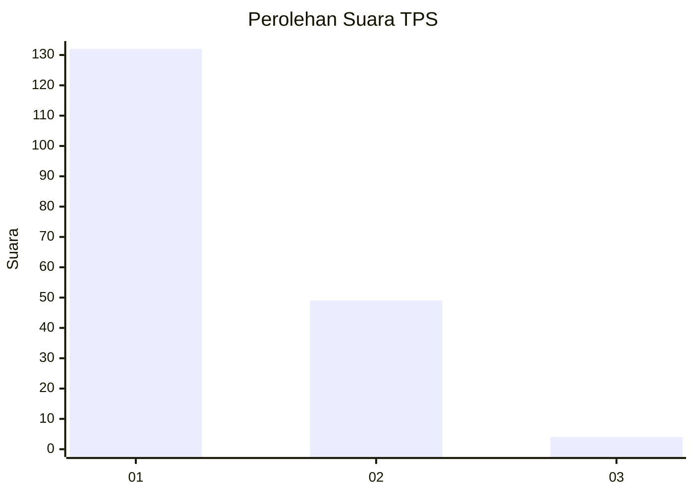
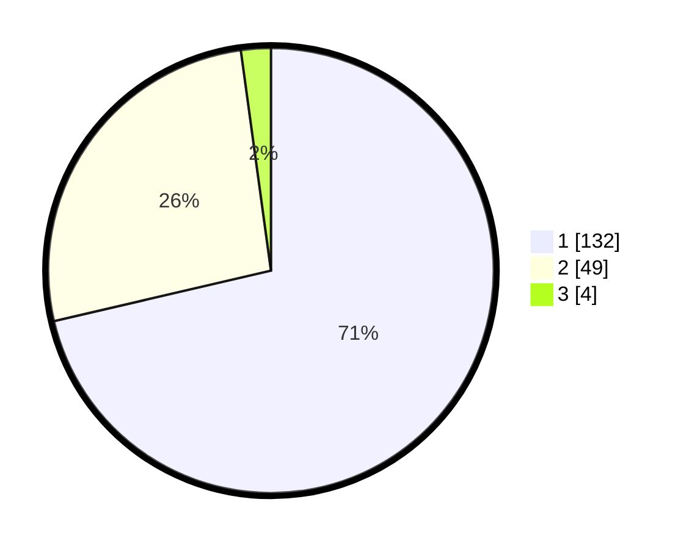

# Hasil

## Grafik

## Tabel

| No. | Nama Paslon    | Suara | Suara (raw) | Persentase |
|:--- |:-------------- | -----:| -----------:| ----------:|
| 1   | ANIES MUHAIMIN | 132   | [132][p-1]  | 71,35      |
| 2   | PRABOWO GIBRAN | 49    | [49][p-2]   | 26,49      |
| 3   | GANJAR MAHFUD  | 4     | [4][p-3]    | 2,16       |

[p-1]: https://github.com/gigit-pemilu/pemilu-2024/blob/main/pilpres/hitung-suara/sub/12-sumatera-utara/sub/19-batu-bara/sub/01-medang-deras/sub/2006-medang/sub/011-tps/sub/paslon-1.txt
[p-2]: https://github.com/gigit-pemilu/pemilu-2024/blob/main/pilpres/hitung-suara/sub/12-sumatera-utara/sub/19-batu-bara/sub/01-medang-deras/sub/2006-medang/sub/011-tps/sub/paslon-2.txt
[p-3]: https://github.com/gigit-pemilu/pemilu-2024/blob/main/pilpres/hitung-suara/sub/12-sumatera-utara/sub/19-batu-bara/sub/01-medang-deras/sub/2006-medang/sub/011-tps/sub/paslon-3.txt

## Foto C Plano

https://sirekap-obj-formc.kpu.go.id/d342/pemilu/ppwp/12/19/01/20/06/1219012006011-20240215-072737--facec056-1063-4bff-a83d-8a6fb9ee5be5.jpg

https://sirekap-obj-formc.kpu.go.id/d342/pemilu/ppwp/12/19/01/20/06/1219012006011-20240214-190245--a176ad79-ce8b-45f7-ab6e-09d5d424fb2c.jpg

https://sirekap-obj-formc.kpu.go.id/d342/pemilu/ppwp/12/19/01/20/06/1219012006011-20240214-190302--883bcdf4-9b26-457a-a4e5-ece2396da14d.jpg

## Metadata

| Key        | Value               |
| ---------- | ------------------- |
| Time Stamp | 2024-02-15 21:01:18 |

