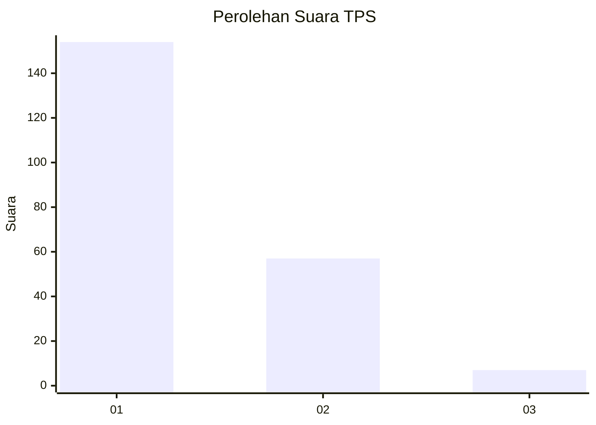
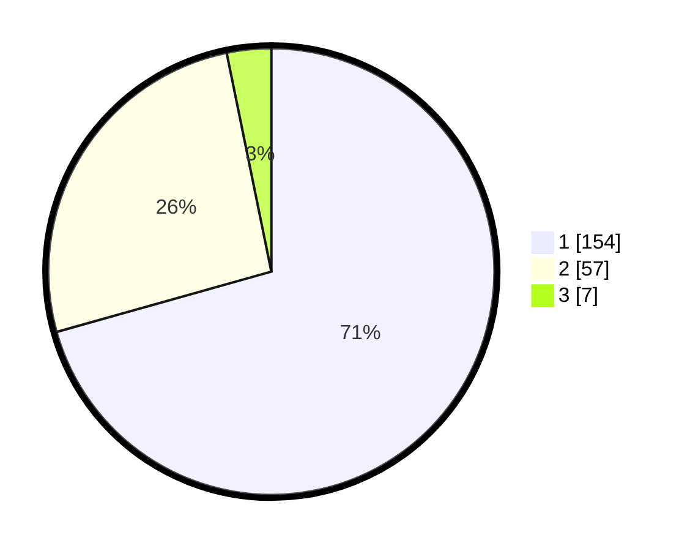

# Hasil

## Grafik

## Tabel

| No. | Nama Paslon    | Suara | Suara (raw) | Persentase |
|:--- |:-------------- | -----:| -----------:| ----------:|
| 1   | ANIES MUHAIMIN | 154   | [154][p-1]  | 70,64      |
| 2   | PRABOWO GIBRAN | 57    | [57][p-2]   | 26,15      |
| 3   | GANJAR MAHFUD  | 7     | [7][p-3]    | 3,21       |

[p-1]: https://github.com/gigit-pemilu/pemilu-2024/blob/main/pilpres/hitung-suara/sub/12-sumatera-utara/sub/19-batu-bara/sub/01-medang-deras/sub/2006-medang/sub/012-tps/sub/paslon-1.txt
[p-2]: https://github.com/gigit-pemilu/pemilu-2024/blob/main/pilpres/hitung-suara/sub/12-sumatera-utara/sub/19-batu-bara/sub/01-medang-deras/sub/2006-medang/sub/012-tps/sub/paslon-2.txt
[p-3]: https://github.com/gigit-pemilu/pemilu-2024/blob/main/pilpres/hitung-suara/sub/12-sumatera-utara/sub/19-batu-bara/sub/01-medang-deras/sub/2006-medang/sub/012-tps/sub/paslon-3.txt

## Foto C Plano

https://sirekap-obj-formc.kpu.go.id/33b3/pemilu/ppwp/12/19/01/20/06/1219012006012-20240214-214827--8c216d2c-e39a-48a6-8ee0-c313392ede8b.jpg

https://sirekap-obj-formc.kpu.go.id/33b3/pemilu/ppwp/12/19/01/20/06/1219012006012-20240214-214835--94c06697-db13-4684-8301-d77b7e87e227.jpg

https://sirekap-obj-formc.kpu.go.id/33b3/pemilu/ppwp/12/19/01/20/06/1219012006012-20240214-214841--b70a81b1-3c82-45bc-af9a-3be101a8f809.jpg

## Metadata

| Key        | Value               |
| ---------- | ------------------- |
| Time Stamp | 2024-02-15 18:30:25 |

