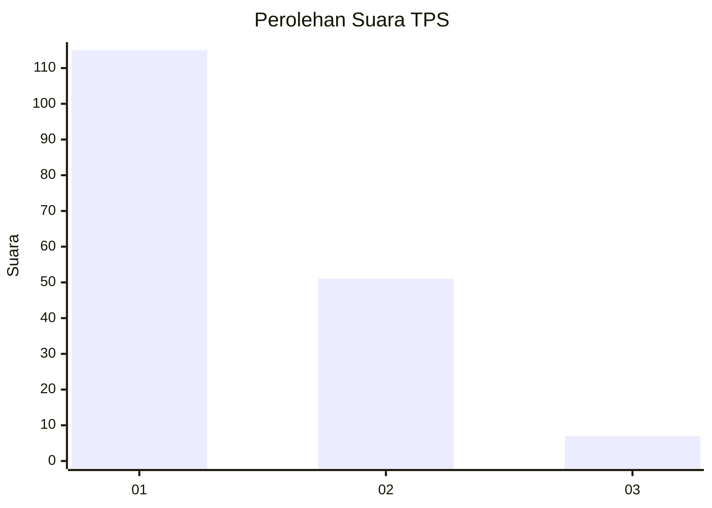
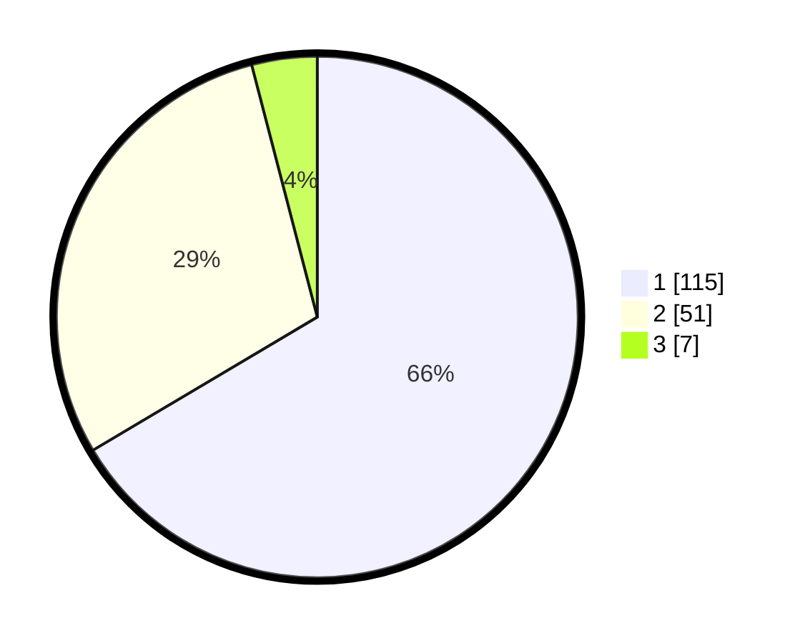

# Hasil

## Grafik

## Tabel

| No. | Nama Paslon    | Suara | Suara (raw) | Persentase |
|:--- |:-------------- | -----:| -----------:| ----------:|
| 1   | ANIES MUHAIMIN | 115   | [115][p-1]  | 66,47      |
| 2   | PRABOWO GIBRAN | 51    | [51][p-2]   | 29,48      |
| 3   | GANJAR MAHFUD  | 7     | [7][p-3]    | 4,05       |

[p-1]: https://github.com/gigit-pemilu/pemilu-2024/blob/main/pilpres/hitung-suara/sub/12-sumatera-utara/sub/19-batu-bara/sub/01-medang-deras/sub/2009-pematang-cengkering/sub/008-tps/sub/paslon-1.txt
[p-2]: https://github.com/gigit-pemilu/pemilu-2024/blob/main/pilpres/hitung-suara/sub/12-sumatera-utara/sub/19-batu-bara/sub/01-medang-deras/sub/2009-pematang-cengkering/sub/008-tps/sub/paslon-2.txt
[p-3]: https://github.com/gigit-pemilu/pemilu-2024/blob/main/pilpres/hitung-suara/sub/12-sumatera-utara/sub/19-batu-bara/sub/01-medang-deras/sub/2009-pematang-cengkering/sub/008-tps/sub/paslon-3.txt

## Foto C Plano

https://sirekap-obj-formc.kpu.go.id/bceb/pemilu/ppwp/12/19/01/20/09/1219012009008-20240214-231800--cbeb76be-badf-4fd4-ad53-c23947045833.jpg

https://sirekap-obj-formc.kpu.go.id/bceb/pemilu/ppwp/12/19/01/20/09/1219012009008-20240214-231045--c37094f4-3505-4c4f-a72c-5bfb859a180b.jpg

https://sirekap-obj-formc.kpu.go.id/bceb/pemilu/ppwp/12/19/01/20/09/1219012009008-20240214-234055--9291cfdf-3c10-4108-a4b6-8bc4d1ef41f6.jpg

## Metadata

| Key        | Value               |
| ---------- | ------------------- |
| Time Stamp | 2024-02-15 19:00:26 |

