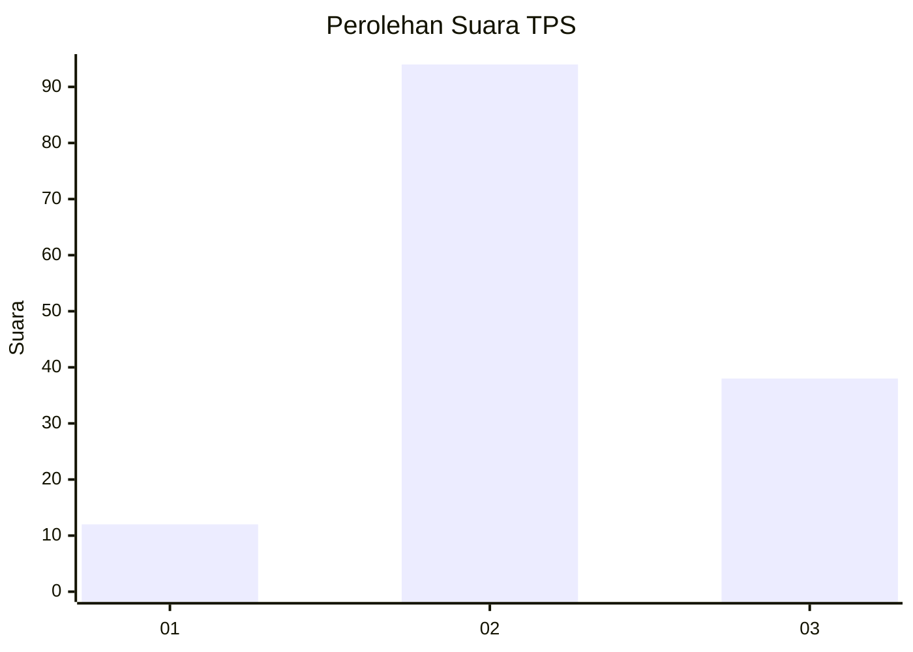
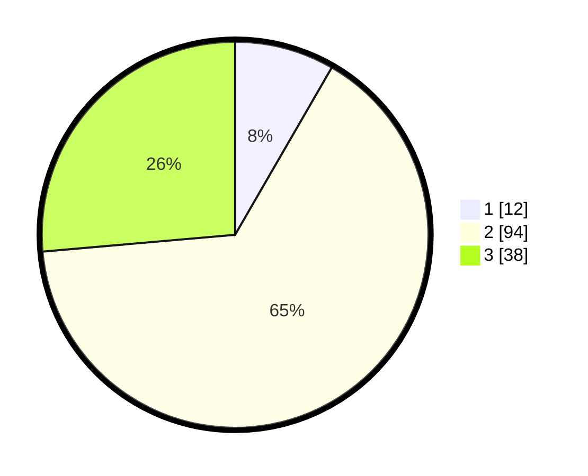

# Hasil

## Grafik

## Tabel

| No. | Nama Paslon    | Suara | Suara (raw) | Persentase |
|:--- |:-------------- | -----:| -----------:| ----------:|
| 1   | ANIES MUHAIMIN | 12    | [12][p-1]   | 8,33       |
| 2   | PRABOWO GIBRAN | 94    | [94][p-2]   | 65,28      |
| 3   | GANJAR MAHFUD  | 38    | [38][p-3]   | 26,39      |

[p-1]: https://github.com/gigit-pemilu/pemilu-2024/blob/main/pilpres/hitung-suara/sub/12-sumatera-utara/sub/19-batu-bara/sub/01-medang-deras/sub/2010-sei-buah-keras/sub/003-tps/sub/paslon-1.txt
[p-2]: https://github.com/gigit-pemilu/pemilu-2024/blob/main/pilpres/hitung-suara/sub/12-sumatera-utara/sub/19-batu-bara/sub/01-medang-deras/sub/2010-sei-buah-keras/sub/003-tps/sub/paslon-2.txt
[p-3]: https://github.com/gigit-pemilu/pemilu-2024/blob/main/pilpres/hitung-suara/sub/12-sumatera-utara/sub/19-batu-bara/sub/01-medang-deras/sub/2010-sei-buah-keras/sub/003-tps/sub/paslon-3.txt

## Foto C Plano

https://sirekap-obj-formc.kpu.go.id/9bb5/pemilu/ppwp/12/19/01/20/10/1219012010003-20240214-215838--86862ef5-1884-487d-9636-bdcf2d3625d3.jpg

https://sirekap-obj-formc.kpu.go.id/9bb5/pemilu/ppwp/12/19/01/20/10/1219012010003-20240215-033933--895c9c74-c74c-4e42-a7f8-f5fe7aeab29d.jpg

https://sirekap-obj-formc.kpu.go.id/9bb5/pemilu/ppwp/12/19/01/20/10/1219012010003-20240215-034344--e616c461-4f3d-4296-baeb-da0d5b1bc65c.jpg

## Metadata

| Key        | Value               |
| ---------- | ------------------- |
| Time Stamp | 2024-02-15 19:00:26 |

