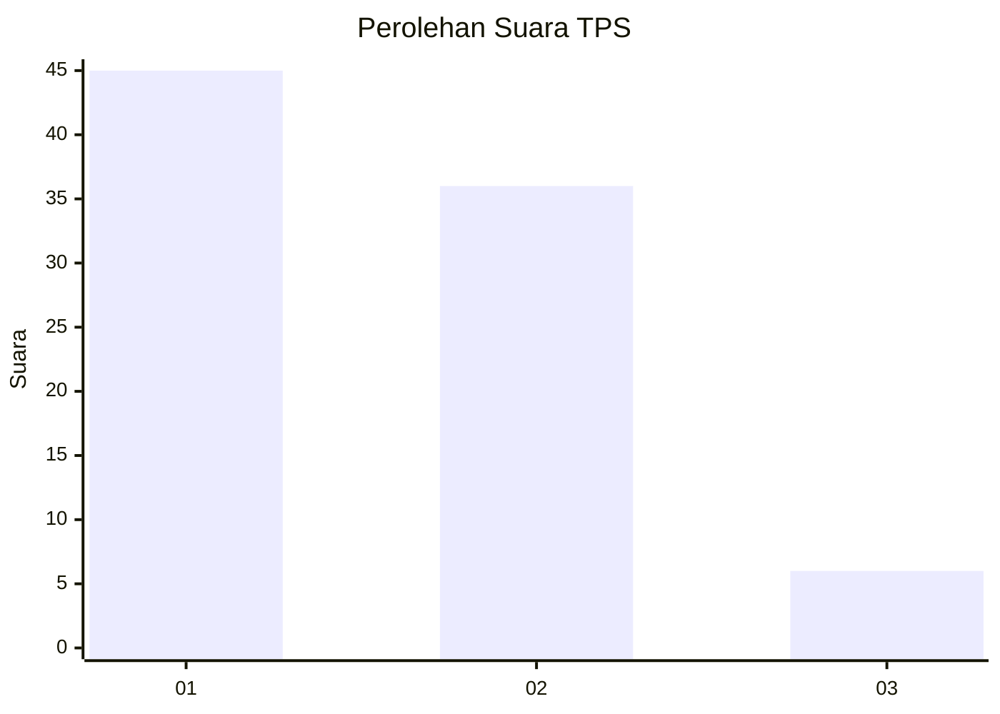
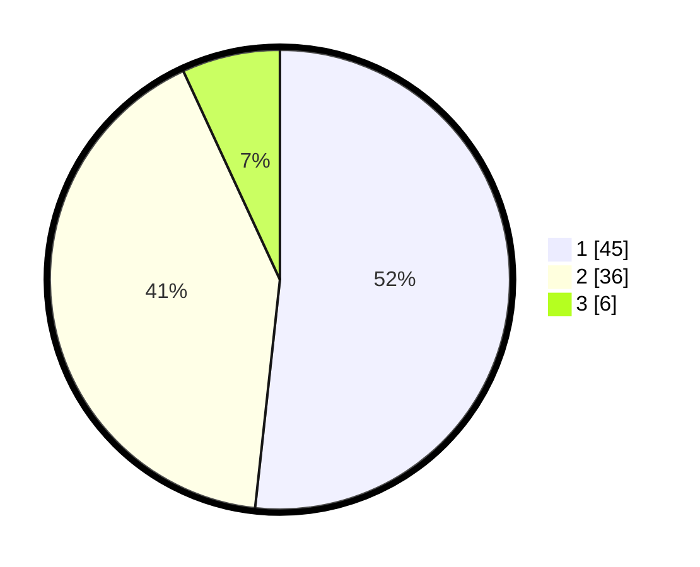

# Hasil

## Grafik

## Tabel

| No. | Nama Paslon    | Suara | Suara (raw) | Persentase |
|:--- |:-------------- | -----:| -----------:| ----------:|
| 1   | ANIES MUHAIMIN | 45    | [45][p-1]   | 51,72      |
| 2   | PRABOWO GIBRAN | 36    | [36][p-2]   | 41,38      |
| 3   | GANJAR MAHFUD  | 6     | [6][p-3]    | 6,90       |

[p-1]: https://github.com/gigit-pemilu/pemilu-2024/blob/main/pilpres/hitung-suara/sub/12-sumatera-utara/sub/19-batu-bara/sub/02-sei-suka/sub/1001-perkebunan-sipare-pare/sub/003-tps/sub/paslon-1.txt
[p-2]: https://github.com/gigit-pemilu/pemilu-2024/blob/main/pilpres/hitung-suara/sub/12-sumatera-utara/sub/19-batu-bara/sub/02-sei-suka/sub/1001-perkebunan-sipare-pare/sub/003-tps/sub/paslon-2.txt
[p-3]: https://github.com/gigit-pemilu/pemilu-2024/blob/main/pilpres/hitung-suara/sub/12-sumatera-utara/sub/19-batu-bara/sub/02-sei-suka/sub/1001-perkebunan-sipare-pare/sub/003-tps/sub/paslon-3.txt

## Foto C Plano

https://sirekap-obj-formc.kpu.go.id/45ff/pemilu/ppwp/12/19/02/10/01/1219021001003-20240214-235542--a92401e3-1def-432a-b945-b3da846a8ace.jpg

https://sirekap-obj-formc.kpu.go.id/45ff/pemilu/ppwp/12/19/02/10/01/1219021001003-20240214-235537--75b0f4a2-fa7e-461c-8ed6-18f6b36e0fa5.jpg

https://sirekap-obj-formc.kpu.go.id/45ff/pemilu/ppwp/12/19/02/10/01/1219021001003-20240214-212736--3ef3fdd1-1422-4c08-8672-a3ece625447b.jpg

## Metadata

| Key        | Value               |
| ---------- | ------------------- |
| Time Stamp | 2024-02-15 15:00:29 |

