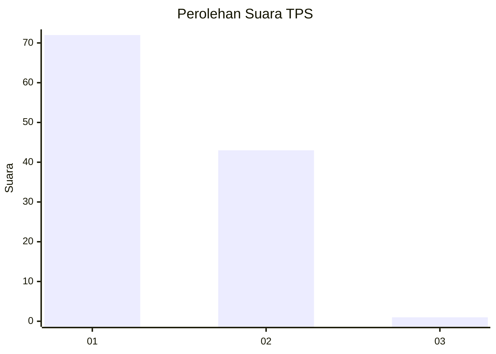
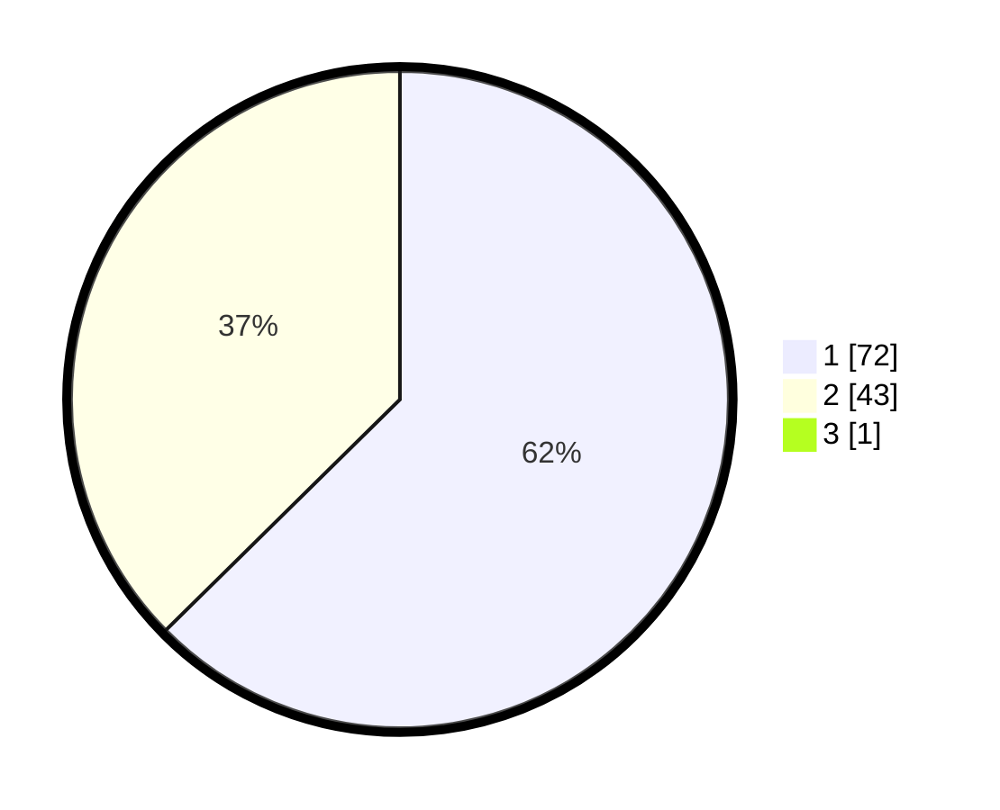

# Hasil

## Grafik

## Tabel

| No. | Nama Paslon    | Suara | Suara (raw) | Persentase |
|:--- |:-------------- | -----:| -----------:| ----------:|
| 1   | ANIES MUHAIMIN | 72    | [72][p-1]   | 62,07      |
| 2   | PRABOWO GIBRAN | 43    | [43][p-2]   | 37,07      |
| 3   | GANJAR MAHFUD  | 1     | [1][p-3]    | 0,86       |

[p-1]: https://github.com/gigit-pemilu/pemilu-2024-12-sumatera-utara/blob/main/pilpres/hitung-suara/sub/12-sumatera-utara/sub/19-batu-bara/sub/02-sei-suka/sub/1001-perkebunan-sipare-pare/sub/005-tps/sub/paslon-1.txt
[p-2]: https://github.com/gigit-pemilu/pemilu-2024-12-sumatera-utara/blob/main/pilpres/hitung-suara/sub/12-sumatera-utara/sub/19-batu-bara/sub/02-sei-suka/sub/1001-perkebunan-sipare-pare/sub/005-tps/sub/paslon-2.txt
[p-3]: https://github.com/gigit-pemilu/pemilu-2024-12-sumatera-utara/blob/main/pilpres/hitung-suara/sub/12-sumatera-utara/sub/19-batu-bara/sub/02-sei-suka/sub/1001-perkebunan-sipare-pare/sub/005-tps/sub/paslon-3.txt

## Foto C Plano

https://sirekap-obj-formc.kpu.go.id/df59/pemilu/ppwp/12/19/02/10/01/1219021001005-20240214-205940--87f18eb8-5858-45f4-81cc-bc9125f8c748.jpg

https://sirekap-obj-formc.kpu.go.id/df59/pemilu/ppwp/12/19/02/10/01/1219021001005-20240214-205957--b7c0783e-05b1-4ea4-9df7-83bf3316150f.jpg

https://sirekap-obj-formc.kpu.go.id/df59/pemilu/ppwp/12/19/02/10/01/1219021001005-20240214-210013--5b00547b-b9f4-4883-8868-78760397478d.jpg

## Metadata

| Key        | Value               |
| ---------- | ------------------- |
| Time Stamp | 2024-02-15 18:00:26 |

## DATA PEMILIH TETAP

Jumlah pemilih dalam DPT: **124**.
 * L: **66**.
 * P: **58**.

## DATA PENGGUNA HAK PILIH

Jumlah pengguna hak pilih dalam DPT: **106**.
 * L: **54**.
 * P: **52**.

Jumlah pengguna hak pilih dalam DPTb: **1**.
 * L: **1**.
 * P: **0**.

Jumlah pengguna hak pilih dalam DPK: **9**.
 * L: **4**.
 * P: **5**.

Jumlah pengguna hak pilih: **116**.
 * L: **59**.
 * P: **57**.

## JUMLAH SUARA SAH DAN TIDAK SAH

JUMLAH SELURUH SUARA SAH: **116**.

JUMLAH SUARA TIDAK SAH: **0**.

JUMLAH SELURUH SUARA SAH DAN SUARA TIDAK SAH: **116**.

