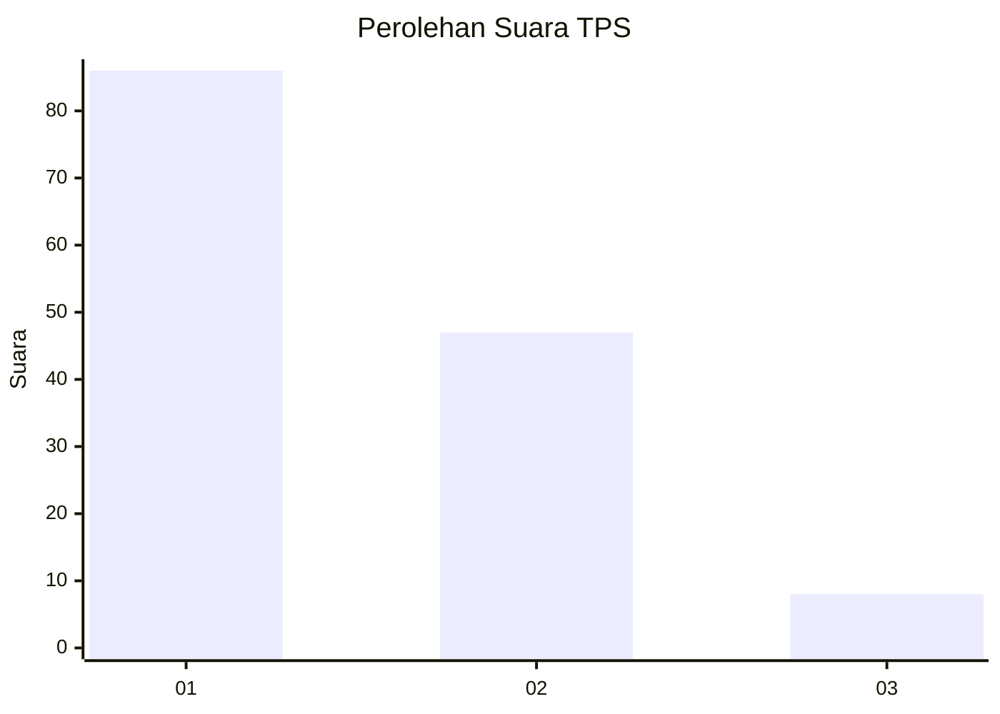
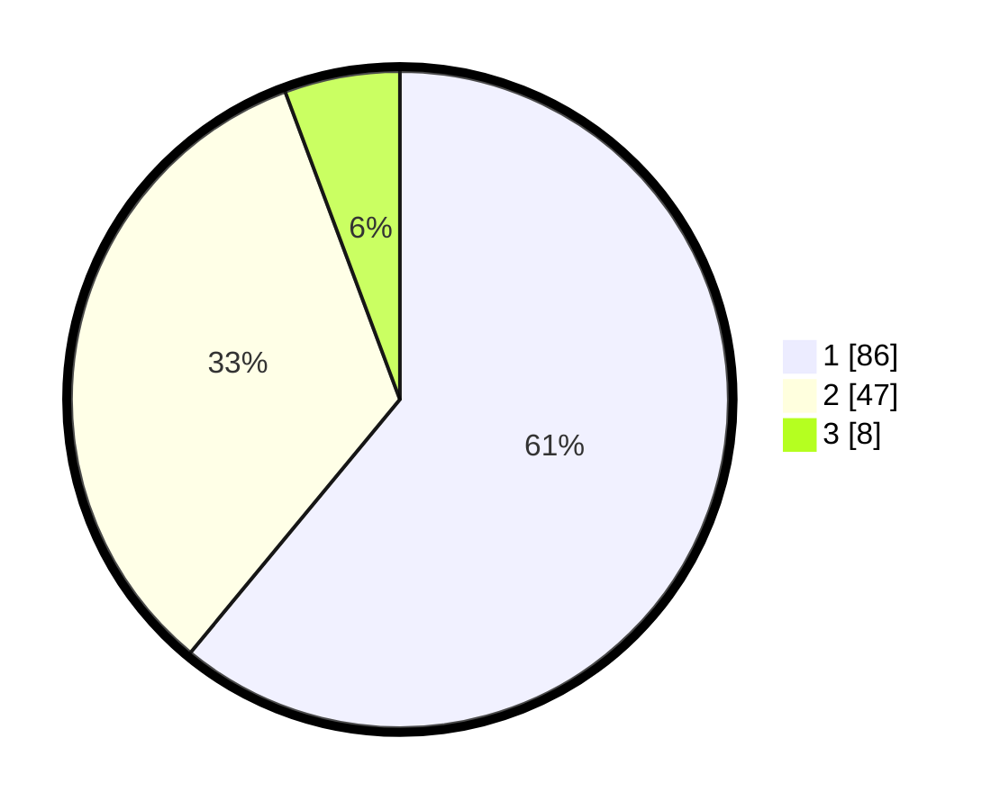

# Hasil

## Grafik

## Tabel

| No. | Nama Paslon    | Suara | Suara (raw) | Persentase |
|:--- |:-------------- | -----:| -----------:| ----------:|
| 1   | ANIES MUHAIMIN | 86    | [86][p-1]   | 60,99      |
| 2   | PRABOWO GIBRAN | 47    | [47][p-2]   | 33,33      |
| 3   | GANJAR MAHFUD  | 8     | [8][p-3]    | 5,67       |

[p-1]: https://github.com/gigit-pemilu/pemilu-2024/blob/main/pilpres/hitung-suara/sub/12-sumatera-utara/sub/19-batu-bara/sub/02-sei-suka/sub/1001-perkebunan-sipare-pare/sub/006-tps/sub/paslon-1.txt
[p-2]: https://github.com/gigit-pemilu/pemilu-2024/blob/main/pilpres/hitung-suara/sub/12-sumatera-utara/sub/19-batu-bara/sub/02-sei-suka/sub/1001-perkebunan-sipare-pare/sub/006-tps/sub/paslon-2.txt
[p-3]: https://github.com/gigit-pemilu/pemilu-2024/blob/main/pilpres/hitung-suara/sub/12-sumatera-utara/sub/19-batu-bara/sub/02-sei-suka/sub/1001-perkebunan-sipare-pare/sub/006-tps/sub/paslon-3.txt

## Foto C Plano

https://sirekap-obj-formc.kpu.go.id/88e0/pemilu/ppwp/12/19/02/10/01/1219021001006-20240214-211150--316f8f15-cfa7-4b7c-93d1-1cdebbad292b.jpg

https://sirekap-obj-formc.kpu.go.id/88e0/pemilu/ppwp/12/19/02/10/01/1219021001006-20240214-211501--86fd3f0d-1b48-415a-a0a8-08a79db534eb.jpg

https://sirekap-obj-formc.kpu.go.id/88e0/pemilu/ppwp/12/19/02/10/01/1219021001006-20240214-211332--c92d00af-e0e1-4b7a-a67e-e0fd23f8d5aa.jpg

## Metadata

| Key        | Value               |
| ---------- | ------------------- |
| Time Stamp | 2024-02-15 15:00:29 |

