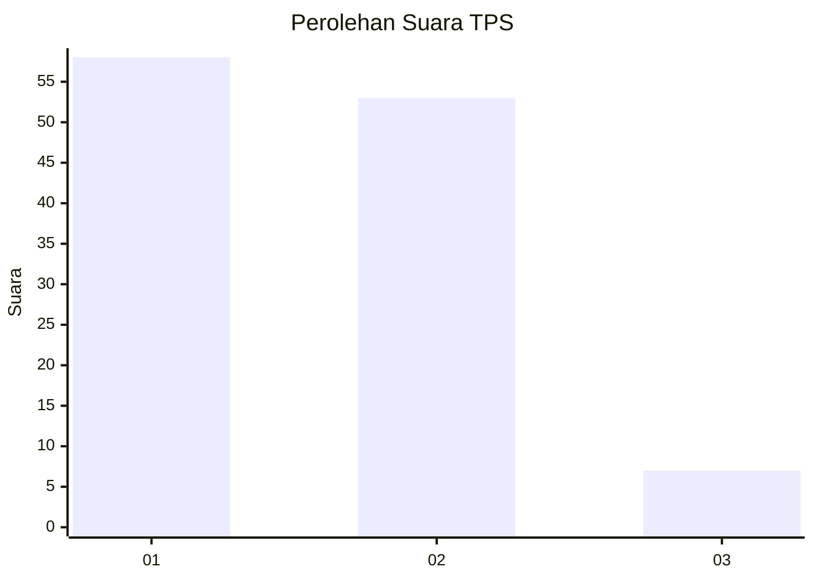
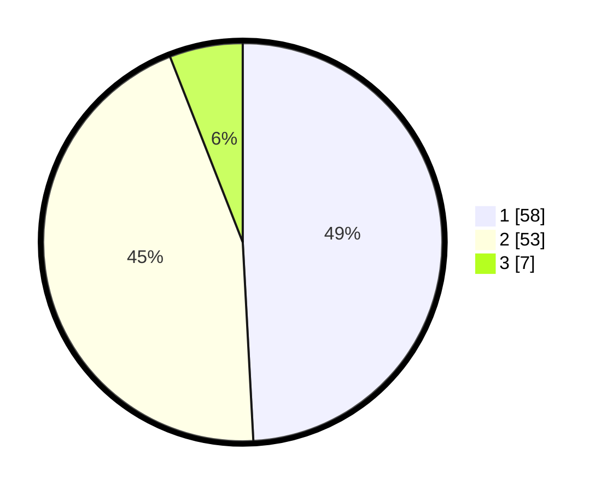

# Hasil

## Grafik

## Tabel

| No. | Nama Paslon    | Suara | Suara (raw) | Persentase |
|:--- |:-------------- | -----:| -----------:| ----------:|
| 1   | ANIES MUHAIMIN | 58    | [58][p-1]   | 49,15      |
| 2   | PRABOWO GIBRAN | 53    | [53][p-2]   | 44,92      |
| 3   | GANJAR MAHFUD  | 7     | [7][p-3]    | 5,93       |

[p-1]: https://github.com/gigit-pemilu/pemilu-2024/blob/main/pilpres/hitung-suara/sub/12-sumatera-utara/sub/19-batu-bara/sub/02-sei-suka/sub/1001-perkebunan-sipare-pare/sub/007-tps/sub/paslon-1.txt
[p-2]: https://github.com/gigit-pemilu/pemilu-2024/blob/main/pilpres/hitung-suara/sub/12-sumatera-utara/sub/19-batu-bara/sub/02-sei-suka/sub/1001-perkebunan-sipare-pare/sub/007-tps/sub/paslon-2.txt
[p-3]: https://github.com/gigit-pemilu/pemilu-2024/blob/main/pilpres/hitung-suara/sub/12-sumatera-utara/sub/19-batu-bara/sub/02-sei-suka/sub/1001-perkebunan-sipare-pare/sub/007-tps/sub/paslon-3.txt

## Foto C Plano

https://sirekap-obj-formc.kpu.go.id/09c1/pemilu/ppwp/12/19/02/10/01/1219021001007-20240215-012842--0f8ea928-6f03-4f19-8470-b0fa816b4ced.jpg

https://sirekap-obj-formc.kpu.go.id/09c1/pemilu/ppwp/12/19/02/10/01/1219021001007-20240215-013318--6ae16b2f-f574-4634-841c-09965d8c0ed1.jpg

https://sirekap-obj-formc.kpu.go.id/09c1/pemilu/ppwp/12/19/02/10/01/1219021001007-20240215-013426--d2874116-91f8-4bb3-8fee-a36d87679a59.jpg

## Metadata

| Key        | Value               |
| ---------- | ------------------- |
| Time Stamp | 2024-02-15 15:00:29 |

