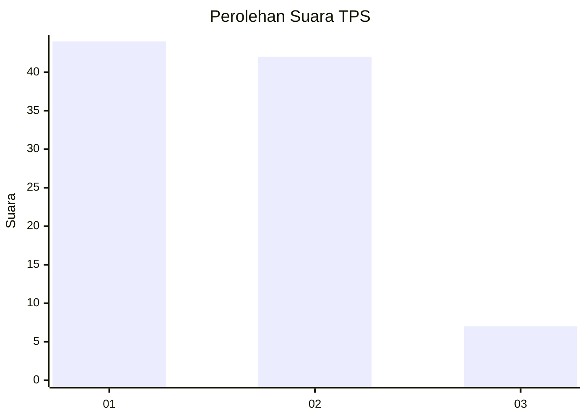
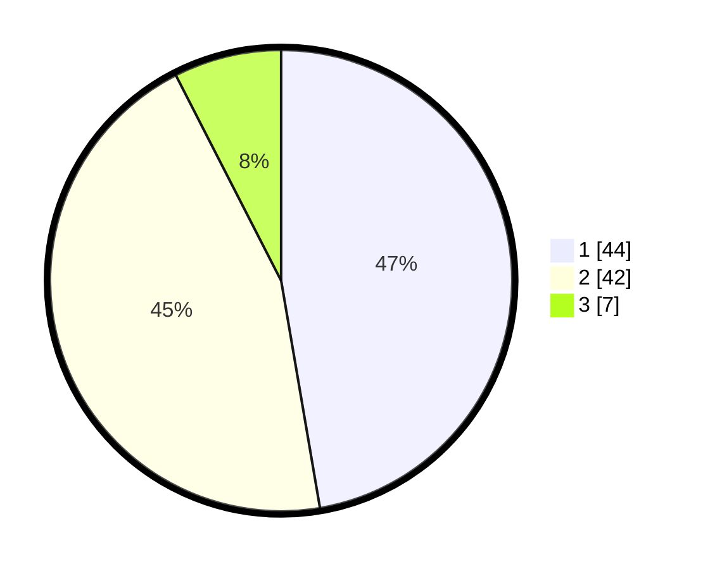

# Hasil

## Grafik

## Tabel

| No. | Nama Paslon    | Suara | Suara (raw) | Persentase |
|:--- |:-------------- | -----:| -----------:| ----------:|
| 1   | ANIES MUHAIMIN | 44    | [44][p-1]   | 47,31      |
| 2   | PRABOWO GIBRAN | 42    | [42][p-2]   | 45,16      |
| 3   | GANJAR MAHFUD  | 7     | [7][p-3]    | 7,53       |

[p-1]: https://github.com/gigit-pemilu/pemilu-2024/blob/main/pilpres/hitung-suara/sub/12-sumatera-utara/sub/19-batu-bara/sub/02-sei-suka/sub/1001-perkebunan-sipare-pare/sub/010-tps/sub/paslon-1.txt
[p-2]: https://github.com/gigit-pemilu/pemilu-2024/blob/main/pilpres/hitung-suara/sub/12-sumatera-utara/sub/19-batu-bara/sub/02-sei-suka/sub/1001-perkebunan-sipare-pare/sub/010-tps/sub/paslon-2.txt
[p-3]: https://github.com/gigit-pemilu/pemilu-2024/blob/main/pilpres/hitung-suara/sub/12-sumatera-utara/sub/19-batu-bara/sub/02-sei-suka/sub/1001-perkebunan-sipare-pare/sub/010-tps/sub/paslon-3.txt

## Foto C Plano

https://sirekap-obj-formc.kpu.go.id/2470/pemilu/ppwp/12/19/02/10/01/1219021001010-20240214-235018--90869b86-4f83-4a20-b9f8-ea2e60140cb7.jpg

https://sirekap-obj-formc.kpu.go.id/2470/pemilu/ppwp/12/19/02/10/01/1219021001010-20240214-235001--665bea10-7137-4565-a7cf-c72a59a9f82d.jpg

https://sirekap-obj-formc.kpu.go.id/2470/pemilu/ppwp/12/19/02/10/01/1219021001010-20240214-234938--c9123de6-5364-41bd-bdc6-2c2da2863602.jpg

## Metadata

| Key        | Value               |
| ---------- | ------------------- |
| Time Stamp | 2024-02-15 15:00:29 |

