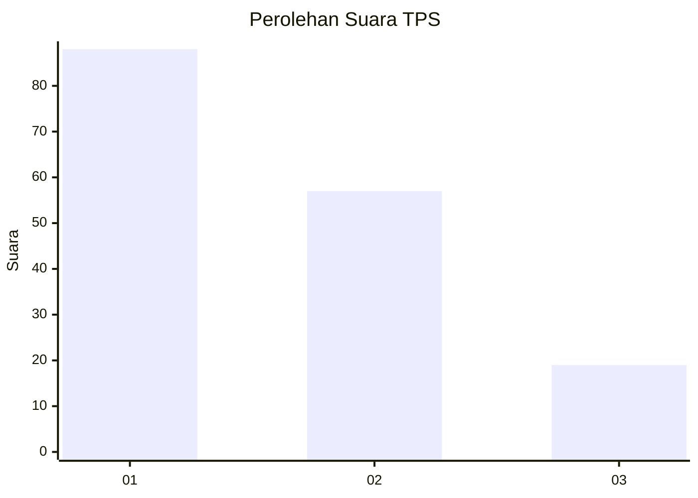
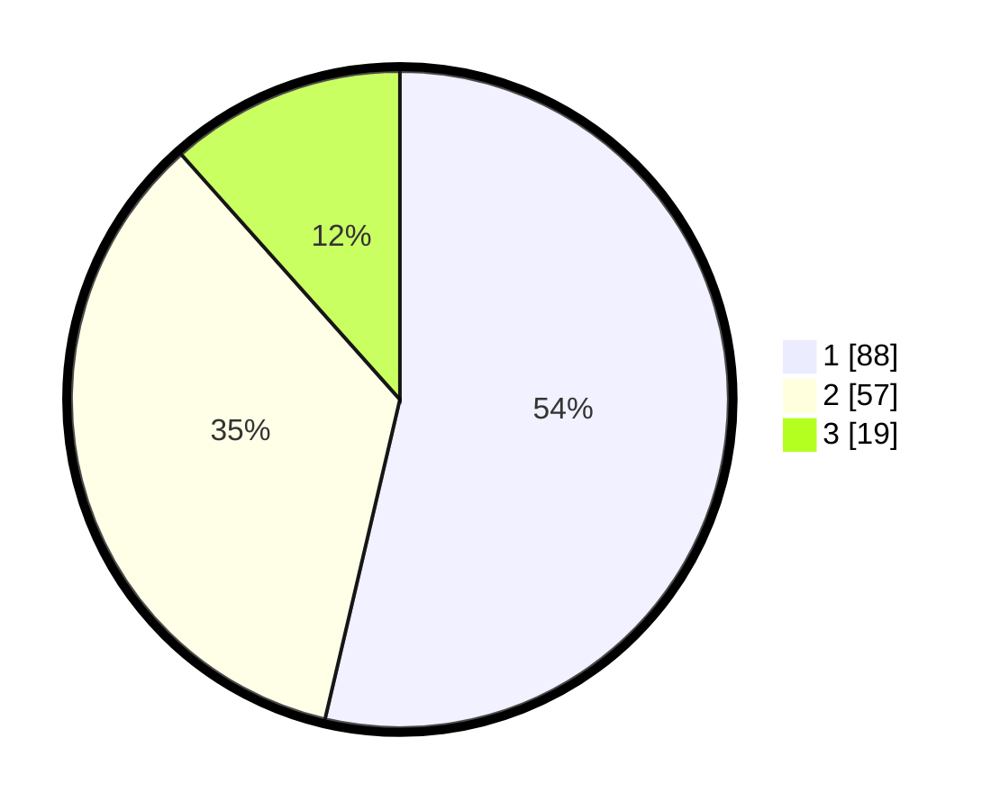

# Hasil

## Grafik

## Tabel

| No. | Nama Paslon    | Suara | Suara (raw) | Persentase |
|:--- |:-------------- | -----:| -----------:| ----------:|
| 1   | ANIES MUHAIMIN | 88    | [88][p-1]   | 53,66      |
| 2   | PRABOWO GIBRAN | 57    | [57][p-2]   | 34,76      |
| 3   | GANJAR MAHFUD  | 19    | [19][p-3]   | 11,59      |

[p-1]: https://github.com/gigit-pemilu/pemilu-2024-12-sumatera-utara/blob/main/pilpres/hitung-suara/sub/12-sumatera-utara/sub/19-batu-bara/sub/02-sei-suka/sub/2018-tanjung-gading/sub/006-tps/sub/paslon-1.txt
[p-2]: https://github.com/gigit-pemilu/pemilu-2024-12-sumatera-utara/blob/main/pilpres/hitung-suara/sub/12-sumatera-utara/sub/19-batu-bara/sub/02-sei-suka/sub/2018-tanjung-gading/sub/006-tps/sub/paslon-2.txt
[p-3]: https://github.com/gigit-pemilu/pemilu-2024-12-sumatera-utara/blob/main/pilpres/hitung-suara/sub/12-sumatera-utara/sub/19-batu-bara/sub/02-sei-suka/sub/2018-tanjung-gading/sub/006-tps/sub/paslon-3.txt

## Foto C Plano

https://sirekap-obj-formc.kpu.go.id/9486/pemilu/ppwp/12/19/02/20/18/1219022018006-20240215-035012--61ffc0dd-3b91-4a45-91f1-22103ba851bd.jpg

https://sirekap-obj-formc.kpu.go.id/9486/pemilu/ppwp/12/19/02/20/18/1219022018006-20240215-035104--6896ea73-733c-4262-92b2-ea0fcc4b8071.jpg

https://sirekap-obj-formc.kpu.go.id/9486/pemilu/ppwp/12/19/02/20/18/1219022018006-20240215-035157--40179842-fa63-4f6c-aaca-652b42a446cc.jpg

## Metadata

| Key        | Value               |
| ---------- | ------------------- |
| Time Stamp | 2024-02-15 15:00:29 |

