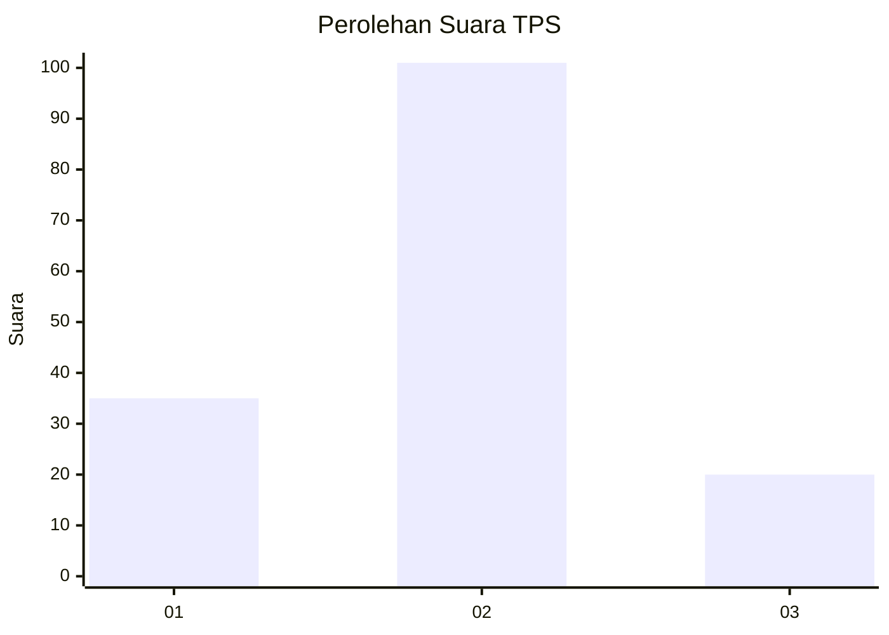
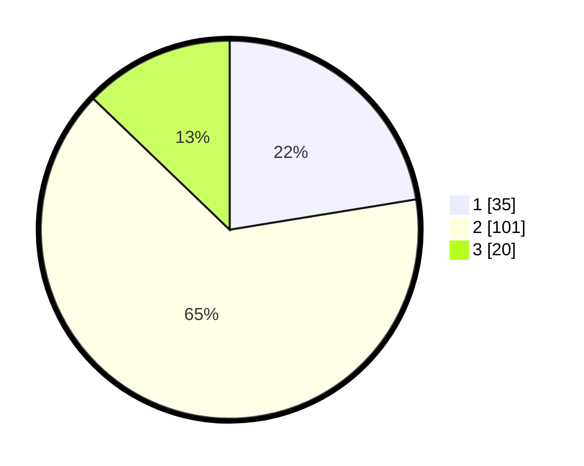

# Hasil

## Grafik

## Tabel

| No. | Nama Paslon    | Suara | Suara (raw) | Persentase |
|:--- |:-------------- | -----:| -----------:| ----------:|
| 1   | ANIES MUHAIMIN | 35    | [35][p-1]   | 22,44      |
| 2   | PRABOWO GIBRAN | 101   | [101][p-2]  | 64,74      |
| 3   | GANJAR MAHFUD  | 20    | [20][p-3]   | 12,82      |

[p-1]: https://github.com/gigit-pemilu/pemilu-2024-12-sumatera-utara/blob/main/pilpres/hitung-suara/sub/12-sumatera-utara/sub/19-batu-bara/sub/03-air-putih/sub/1001-indrapura/sub/003-tps/sub/paslon-1.txt
[p-2]: https://github.com/gigit-pemilu/pemilu-2024-12-sumatera-utara/blob/main/pilpres/hitung-suara/sub/12-sumatera-utara/sub/19-batu-bara/sub/03-air-putih/sub/1001-indrapura/sub/003-tps/sub/paslon-2.txt
[p-3]: https://github.com/gigit-pemilu/pemilu-2024-12-sumatera-utara/blob/main/pilpres/hitung-suara/sub/12-sumatera-utara/sub/19-batu-bara/sub/03-air-putih/sub/1001-indrapura/sub/003-tps/sub/paslon-3.txt

## Foto C Plano

https://sirekap-obj-formc.kpu.go.id/5afa/pemilu/ppwp/12/19/03/10/01/1219031001003-20240214-213307--88ac3621-d111-40de-9c0c-9f0bd59aafb2.jpg

https://sirekap-obj-formc.kpu.go.id/5afa/pemilu/ppwp/12/19/03/10/01/1219031001003-20240214-213313--63d01466-76c1-4814-87e5-34e32523e7ba.jpg

https://sirekap-obj-formc.kpu.go.id/5afa/pemilu/ppwp/12/19/03/10/01/1219031001003-20240214-213320--f04dc56b-517a-4478-9580-6916ce7fda1c.jpg

## Metadata

| Key        | Value               |
| ---------- | ------------------- |
| Time Stamp | 2024-02-15 15:00:29 |

