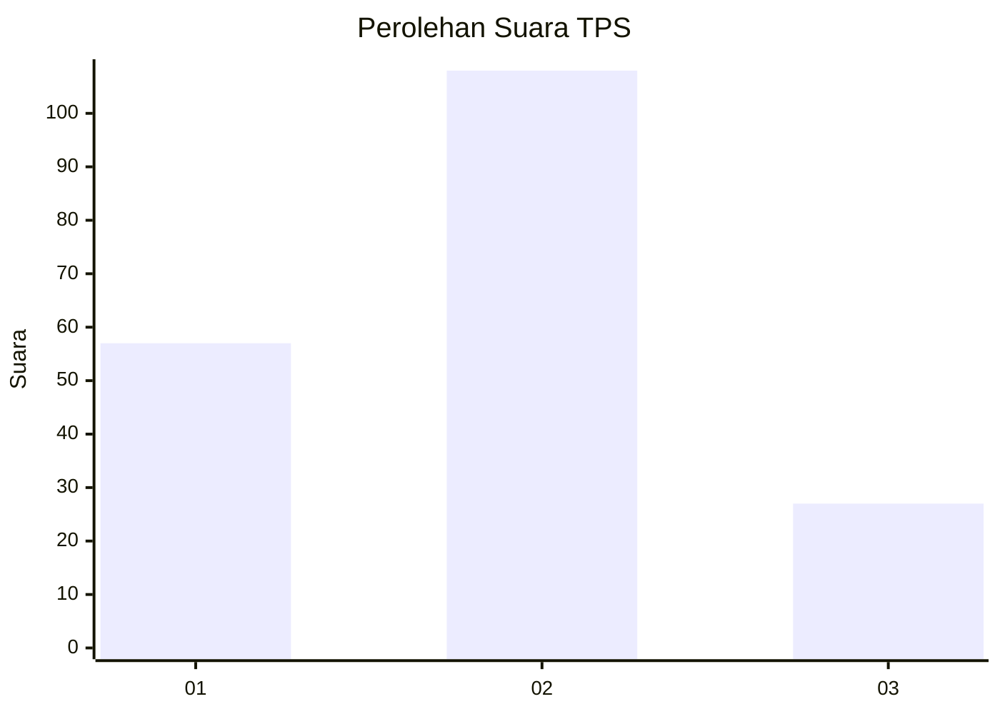
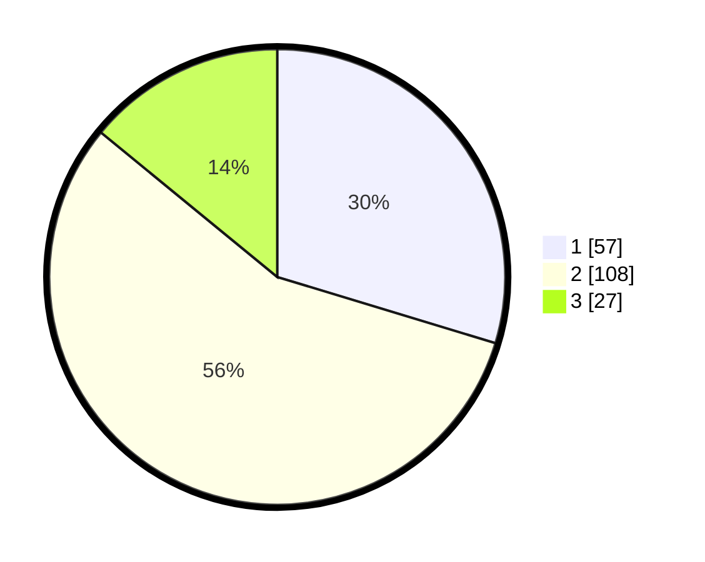

# Hasil

## Grafik

## Tabel

| No. | Nama Paslon    | Suara | Suara (raw) | Persentase |
|:--- |:-------------- | -----:| -----------:| ----------:|
| 1   | ANIES MUHAIMIN | 57    | [57][p-1]   | 29,69      |
| 2   | PRABOWO GIBRAN | 108   | [108][p-2]  | 56,25      |
| 3   | GANJAR MAHFUD  | 27    | [27][p-3]   | 14,06      |

[p-1]: https://github.com/gigit-pemilu/pemilu-2024/blob/main/pilpres/hitung-suara/sub/12-sumatera-utara/sub/19-batu-bara/sub/03-air-putih/sub/1001-indrapura/sub/004-tps/sub/paslon-1.txt
[p-2]: https://github.com/gigit-pemilu/pemilu-2024/blob/main/pilpres/hitung-suara/sub/12-sumatera-utara/sub/19-batu-bara/sub/03-air-putih/sub/1001-indrapura/sub/004-tps/sub/paslon-2.txt
[p-3]: https://github.com/gigit-pemilu/pemilu-2024/blob/main/pilpres/hitung-suara/sub/12-sumatera-utara/sub/19-batu-bara/sub/03-air-putih/sub/1001-indrapura/sub/004-tps/sub/paslon-3.txt

## Foto C Plano

https://sirekap-obj-formc.kpu.go.id/7f7d/pemilu/ppwp/12/19/03/10/01/1219031001004-20240214-202313--48316183-0cd6-47ce-a768-d6ada8a524f2.jpg

https://sirekap-obj-formc.kpu.go.id/7f7d/pemilu/ppwp/12/19/03/10/01/1219031001004-20240214-202358--b4d82ae0-fbcc-4f52-8e50-0094a74d1f15.jpg

https://sirekap-obj-formc.kpu.go.id/7f7d/pemilu/ppwp/12/19/03/10/01/1219031001004-20240214-202451--fa311bbf-14bd-4fa2-8f33-ec1aba743494.jpg

## Metadata

| Key        | Value               |
| ---------- | ------------------- |
| Time Stamp | 2024-02-15 21:01:18 |

