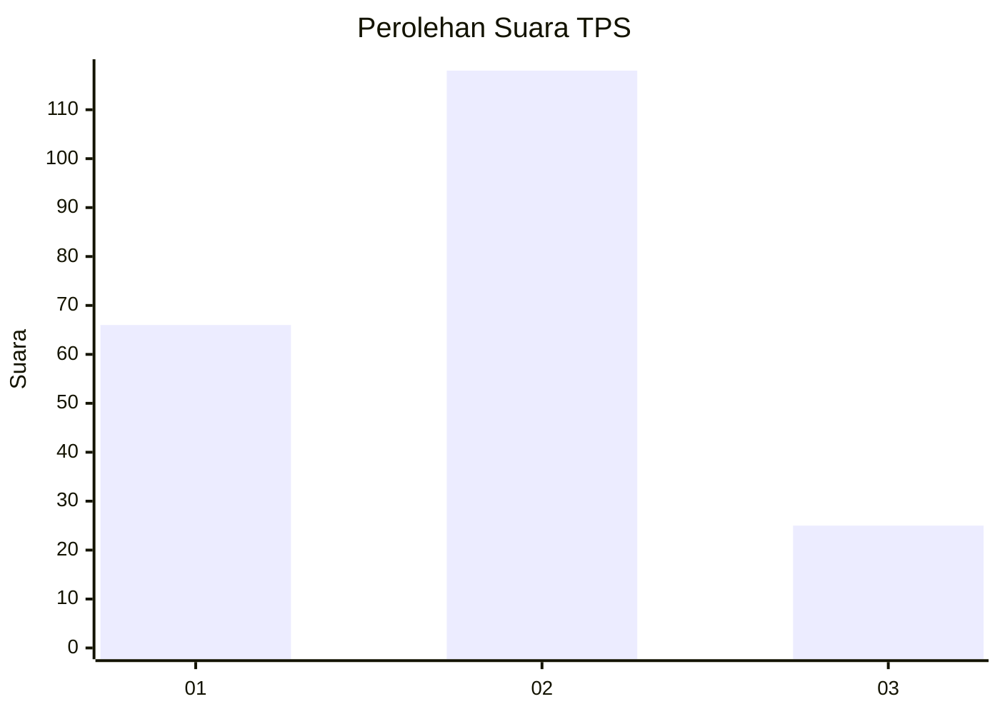
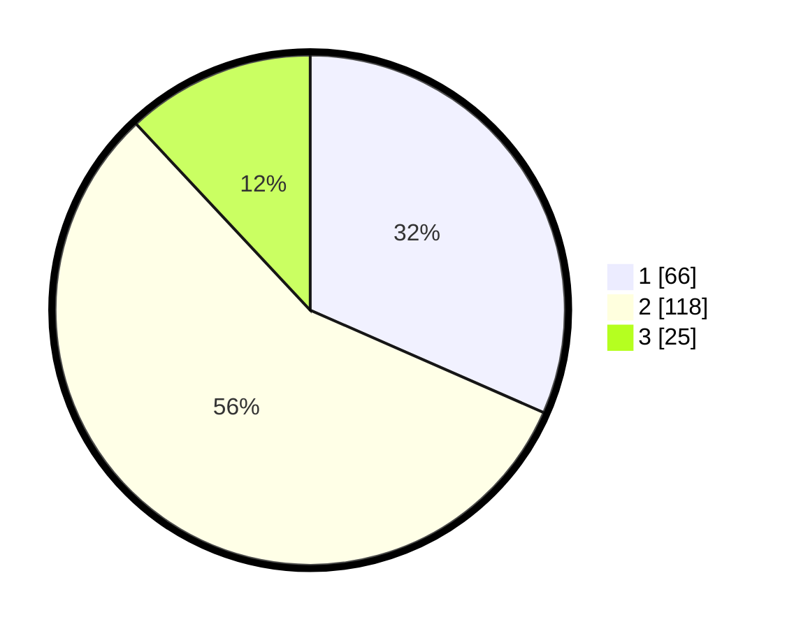

# Hasil

## Grafik

## Tabel

| No. | Nama Paslon    | Suara | Suara (raw) | Persentase |
|:--- |:-------------- | -----:| -----------:| ----------:|
| 1   | ANIES MUHAIMIN | 66    | [66][p-1]   | 31,58      |
| 2   | PRABOWO GIBRAN | 118   | [118][p-2]  | 56,46      |
| 3   | GANJAR MAHFUD  | 25    | [25][p-3]   | 11,96      |

[p-1]: https://github.com/gigit-pemilu/pemilu-2024-12-sumatera-utara/blob/main/pilpres/hitung-suara/sub/12-sumatera-utara/sub/19-batu-bara/sub/03-air-putih/sub/1001-indrapura/sub/005-tps/sub/paslon-1.txt
[p-2]: https://github.com/gigit-pemilu/pemilu-2024-12-sumatera-utara/blob/main/pilpres/hitung-suara/sub/12-sumatera-utara/sub/19-batu-bara/sub/03-air-putih/sub/1001-indrapura/sub/005-tps/sub/paslon-2.txt
[p-3]: https://github.com/gigit-pemilu/pemilu-2024-12-sumatera-utara/blob/main/pilpres/hitung-suara/sub/12-sumatera-utara/sub/19-batu-bara/sub/03-air-putih/sub/1001-indrapura/sub/005-tps/sub/paslon-3.txt

## Foto C Plano

https://sirekap-obj-formc.kpu.go.id/8ad3/pemilu/ppwp/12/19/03/10/01/1219031001005-20240214-213343--e71e1ee3-2fc0-4c37-b82a-b2637c7c86b9.jpg

https://sirekap-obj-formc.kpu.go.id/8ad3/pemilu/ppwp/12/19/03/10/01/1219031001005-20240214-213350--4a9eee9d-3996-4baa-8bc4-ae4b8b437b2b.jpg

https://sirekap-obj-formc.kpu.go.id/8ad3/pemilu/ppwp/12/19/03/10/01/1219031001005-20240214-213455--4e3e76d3-b974-4158-b09f-ff6b494735b6.jpg

## Metadata

| Key        | Value               |
| ---------- | ------------------- |
| Time Stamp | 2024-02-15 15:00:29 |

