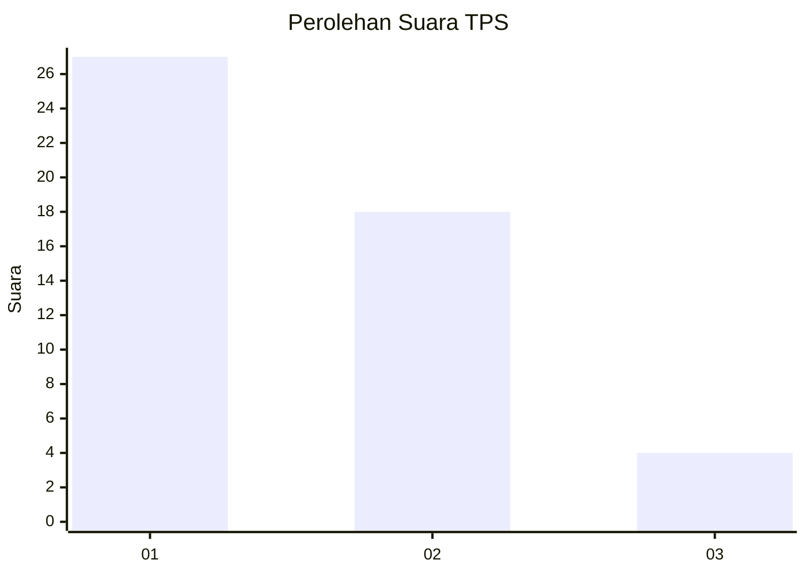
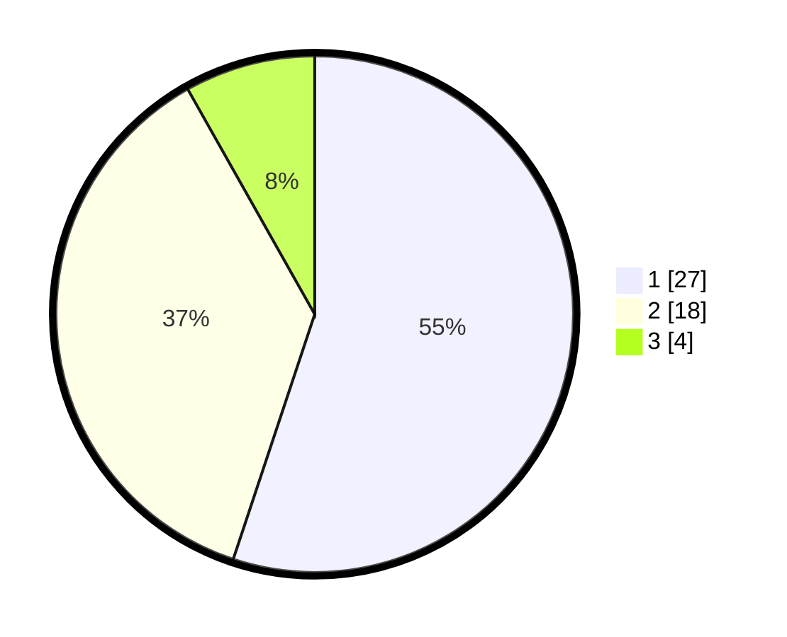

# Hasil

## Grafik

## Tabel

| No. | Nama Paslon    | Suara | Suara (raw) | Persentase |
|:--- |:-------------- | -----:| -----------:| ----------:|
| 1   | ANIES MUHAIMIN | 27    | [27][p-1]   | 55,10      |
| 2   | PRABOWO GIBRAN | 18    | [18][p-2]   | 36,73      |
| 3   | GANJAR MAHFUD  | 4     | [4][p-3]    | 8,16       |

[p-1]: https://github.com/gigit-pemilu/pemilu-2024/blob/main/pilpres/hitung-suara/sub/12-sumatera-utara/sub/19-batu-bara/sub/03-air-putih/sub/2017-perkotaan/sub/003-tps/sub/paslon-1.txt
[p-2]: https://github.com/gigit-pemilu/pemilu-2024/blob/main/pilpres/hitung-suara/sub/12-sumatera-utara/sub/19-batu-bara/sub/03-air-putih/sub/2017-perkotaan/sub/003-tps/sub/paslon-2.txt
[p-3]: https://github.com/gigit-pemilu/pemilu-2024/blob/main/pilpres/hitung-suara/sub/12-sumatera-utara/sub/19-batu-bara/sub/03-air-putih/sub/2017-perkotaan/sub/003-tps/sub/paslon-3.txt

## Foto C Plano

https://sirekap-obj-formc.kpu.go.id/414e/pemilu/ppwp/12/19/03/20/17/1219032017003-20240214-215620--4b4f4ad8-8254-4079-9b6c-0f003a2d2899.jpg

https://sirekap-obj-formc.kpu.go.id/414e/pemilu/ppwp/12/19/03/20/17/1219032017003-20240214-215733--09eec735-0ce6-4a86-add1-f80a20c0aa21.jpg

## Metadata

| Key        | Value               |
| ---------- | ------------------- |
| Time Stamp | 2024-02-24 22:31:28 |

