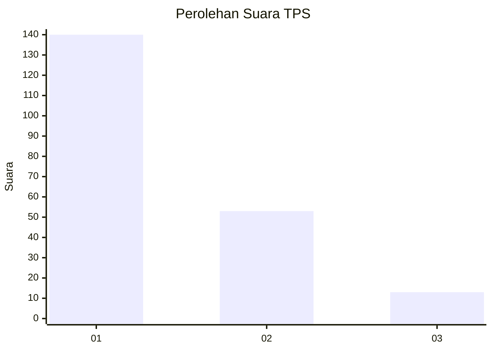
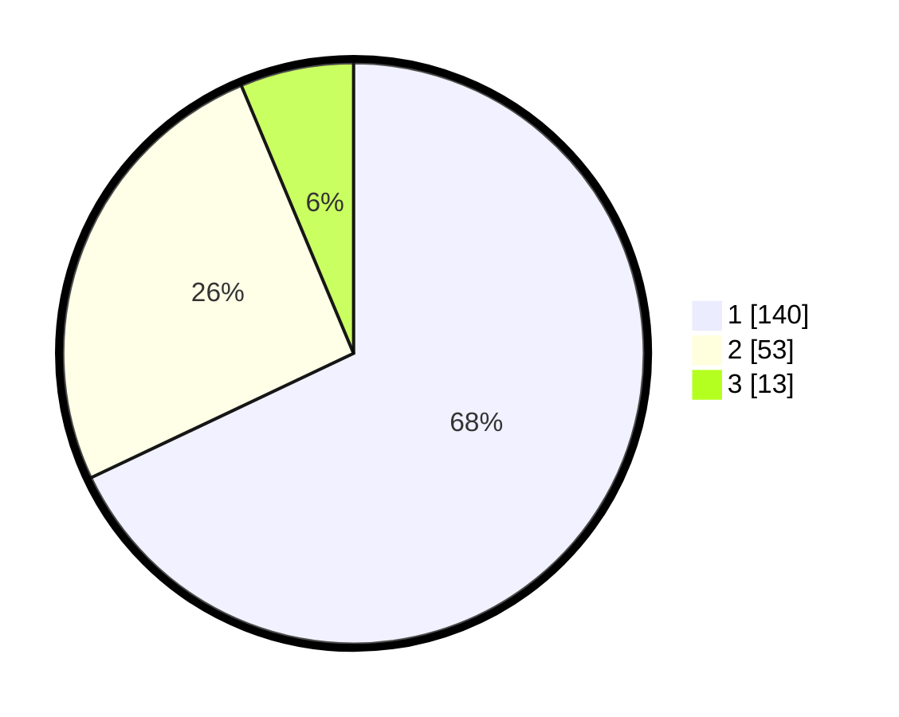

# Hasil

## Grafik

## Tabel

| No. | Nama Paslon    | Suara | Suara (raw) | Persentase |
|:--- |:-------------- | -----:| -----------:| ----------:|
| 1   | ANIES MUHAIMIN | 140   | [140][p-1]  | 67,96      |
| 2   | PRABOWO GIBRAN | 53    | [53][p-2]   | 25,73      |
| 3   | GANJAR MAHFUD  | 13    | [13][p-3]   | 6,31       |

[p-1]: https://github.com/gigit-pemilu/pemilu-2024/blob/main/pilpres/hitung-suara/sub/12-sumatera-utara/sub/19-batu-bara/sub/04-lima-puluh/sub/2025-simpang-gambus/sub/022-tps/sub/paslon-1.txt
[p-2]: https://github.com/gigit-pemilu/pemilu-2024/blob/main/pilpres/hitung-suara/sub/12-sumatera-utara/sub/19-batu-bara/sub/04-lima-puluh/sub/2025-simpang-gambus/sub/022-tps/sub/paslon-2.txt
[p-3]: https://github.com/gigit-pemilu/pemilu-2024/blob/main/pilpres/hitung-suara/sub/12-sumatera-utara/sub/19-batu-bara/sub/04-lima-puluh/sub/2025-simpang-gambus/sub/022-tps/sub/paslon-3.txt

## Foto C Plano

https://sirekap-obj-formc.kpu.go.id/52d4/pemilu/ppwp/12/19/04/20/25/1219042025022-20240214-223616--dcbc7b00-1c11-4611-96ba-34e9b047f210.jpg

https://sirekap-obj-formc.kpu.go.id/52d4/pemilu/ppwp/12/19/04/20/25/1219042025022-20240214-224020--e097599a-eafe-43fb-996e-c862f58b9f89.jpg

https://sirekap-obj-formc.kpu.go.id/52d4/pemilu/ppwp/12/19/04/20/25/1219042025022-20240214-224328--4a36e42b-4a7e-4b7d-8bbc-d8b5a1f76e71.jpg

## Metadata

| Key        | Value               |
| ---------- | ------------------- |
| Time Stamp | 2024-02-15 16:00:26 |

