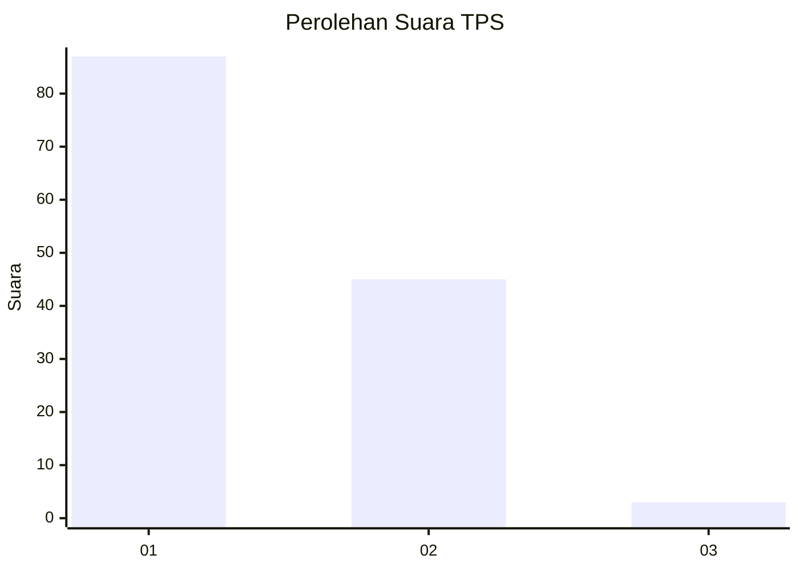
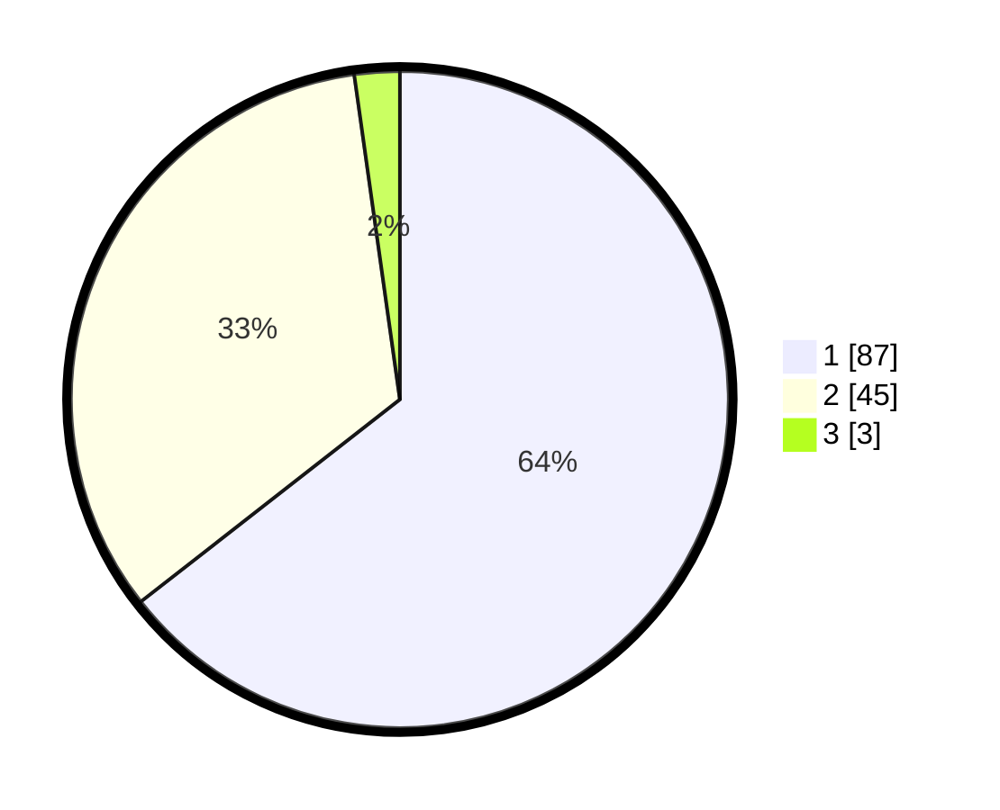

# Hasil

## Grafik

## Tabel

| No. | Nama Paslon    | Suara | Suara (raw) | Persentase |
|:--- |:-------------- | -----:| -----------:| ----------:|
| 1   | ANIES MUHAIMIN | 87    | [87][p-1]   | 64,44      |
| 2   | PRABOWO GIBRAN | 45    | [45][p-2]   | 33,33      |
| 3   | GANJAR MAHFUD  | 3     | [3][p-3]    | 2,22       |

[p-1]: https://github.com/gigit-pemilu/pemilu-2024/blob/main/pilpres/hitung-suara/sub/12-sumatera-utara/sub/19-batu-bara/sub/05-talawi/sub/1001-labuhan-ruku/sub/011-tps/sub/paslon-1.txt
[p-2]: https://github.com/gigit-pemilu/pemilu-2024/blob/main/pilpres/hitung-suara/sub/12-sumatera-utara/sub/19-batu-bara/sub/05-talawi/sub/1001-labuhan-ruku/sub/011-tps/sub/paslon-2.txt
[p-3]: https://github.com/gigit-pemilu/pemilu-2024/blob/main/pilpres/hitung-suara/sub/12-sumatera-utara/sub/19-batu-bara/sub/05-talawi/sub/1001-labuhan-ruku/sub/011-tps/sub/paslon-3.txt

## Foto C Plano

https://sirekap-obj-formc.kpu.go.id/370b/pemilu/ppwp/12/19/05/10/01/1219051001011-20240214-190423--c5fad1e1-2187-4db5-852a-108bb37c2da4.jpg

https://sirekap-obj-formc.kpu.go.id/370b/pemilu/ppwp/12/19/05/10/01/1219051001011-20240214-190111--e0155e54-a1b1-41ea-8454-d212d5b155bf.jpg

https://sirekap-obj-formc.kpu.go.id/370b/pemilu/ppwp/12/19/05/10/01/1219051001011-20240214-190343--aaa72cc1-af8e-488a-b4dc-6a16bb2692b9.jpg

## Metadata

| Key        | Value               |
| ---------- | ------------------- |
| Time Stamp | 2024-02-25 22:00:00 |

