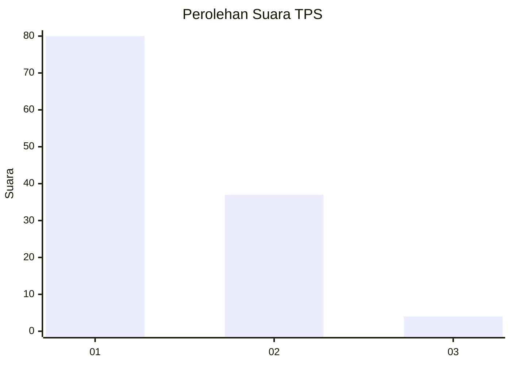
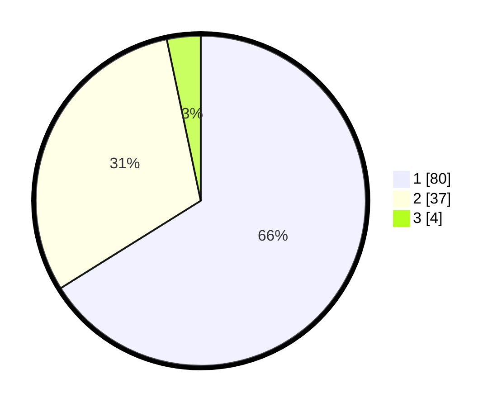

# Hasil

## Grafik

## Tabel

| No. | Nama Paslon    | Suara | Suara (raw) | Persentase |
|:--- |:-------------- | -----:| -----------:| ----------:|
| 1   | ANIES MUHAIMIN | 80    | [80][p-1]   | 66,12      |
| 2   | PRABOWO GIBRAN | 37    | [37][p-2]   | 30,58      |
| 3   | GANJAR MAHFUD  | 4     | [4][p-3]    | 3,31       |

[p-1]: https://github.com/gigit-pemilu/pemilu-2024/blob/main/pilpres/hitung-suara/sub/12-sumatera-utara/sub/19-batu-bara/sub/05-talawi/sub/1001-labuhan-ruku/sub/014-tps/sub/paslon-1.txt
[p-2]: https://github.com/gigit-pemilu/pemilu-2024/blob/main/pilpres/hitung-suara/sub/12-sumatera-utara/sub/19-batu-bara/sub/05-talawi/sub/1001-labuhan-ruku/sub/014-tps/sub/paslon-2.txt
[p-3]: https://github.com/gigit-pemilu/pemilu-2024/blob/main/pilpres/hitung-suara/sub/12-sumatera-utara/sub/19-batu-bara/sub/05-talawi/sub/1001-labuhan-ruku/sub/014-tps/sub/paslon-3.txt

## Foto C Plano

https://sirekap-obj-formc.kpu.go.id/ad15/pemilu/ppwp/12/19/05/10/01/1219051001014-20240214-225523--0cd90b2a-d313-4631-b6e7-472b74614001.jpg

https://sirekap-obj-formc.kpu.go.id/ad15/pemilu/ppwp/12/19/05/10/01/1219051001014-20240214-225901--460f992b-c42d-482c-a1fb-abee78b65baa.jpg

https://sirekap-obj-formc.kpu.go.id/ad15/pemilu/ppwp/12/19/05/10/01/1219051001014-20240214-230102--cf47f297-a07e-499e-9db4-2ffbb29bdd8a.jpg

## Metadata

| Key        | Value               |
| ---------- | ------------------- |
| Time Stamp | 2024-02-25 16:00:00 |

