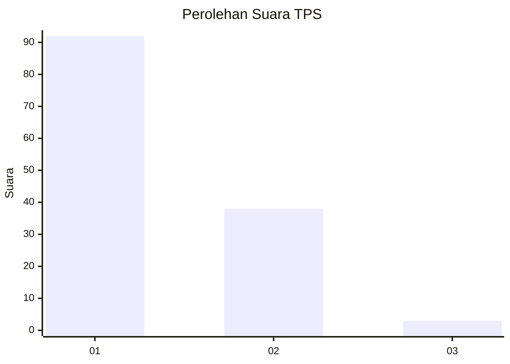
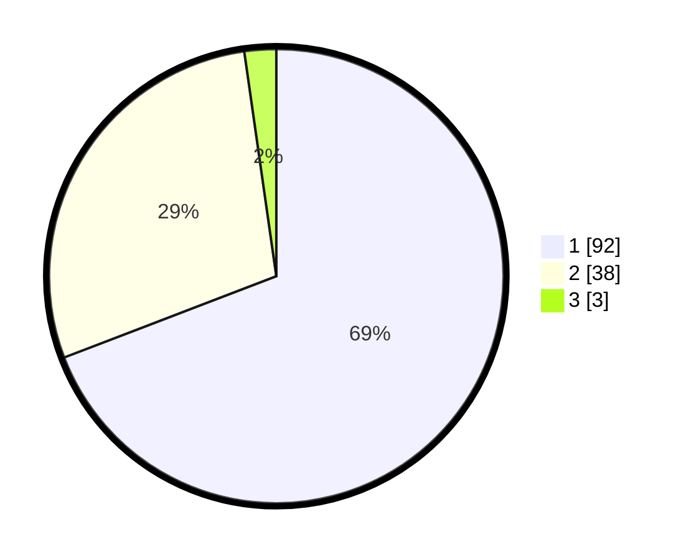

# Hasil

## Grafik

## Tabel

| No. | Nama Paslon    | Suara | Suara (raw) | Persentase |
|:--- |:-------------- | -----:| -----------:| ----------:|
| 1   | ANIES MUHAIMIN | 92    | [92][p-1]   | 69,17      |
| 2   | PRABOWO GIBRAN | 38    | [38][p-2]   | 28,57      |
| 3   | GANJAR MAHFUD  | 3     | [3][p-3]    | 2,26       |

[p-1]: https://github.com/gigit-pemilu/pemilu-2024/blob/main/pilpres/hitung-suara/sub/12-sumatera-utara/sub/19-batu-bara/sub/05-talawi/sub/1001-labuhan-ruku/sub/016-tps/sub/paslon-1.txt
[p-2]: https://github.com/gigit-pemilu/pemilu-2024/blob/main/pilpres/hitung-suara/sub/12-sumatera-utara/sub/19-batu-bara/sub/05-talawi/sub/1001-labuhan-ruku/sub/016-tps/sub/paslon-2.txt
[p-3]: https://github.com/gigit-pemilu/pemilu-2024/blob/main/pilpres/hitung-suara/sub/12-sumatera-utara/sub/19-batu-bara/sub/05-talawi/sub/1001-labuhan-ruku/sub/016-tps/sub/paslon-3.txt

## Foto C Plano

https://sirekap-obj-formc.kpu.go.id/3a50/pemilu/ppwp/12/19/05/10/01/1219051001016-20240215-054415--3ee93517-2c46-4e93-ac42-a1323359b725.jpg

https://sirekap-obj-formc.kpu.go.id/3a50/pemilu/ppwp/12/19/05/10/01/1219051001016-20240215-054441--bf85c546-bec8-4164-840e-9326292f2755.jpg

https://sirekap-obj-formc.kpu.go.id/3a50/pemilu/ppwp/12/19/05/10/01/1219051001016-20240215-054458--475b93a8-3811-4cb5-aa20-a9dd14ba0a54.jpg

## Metadata

| Key        | Value               |
| ---------- | ------------------- |
| Time Stamp | 2024-02-15 19:00:26 |

