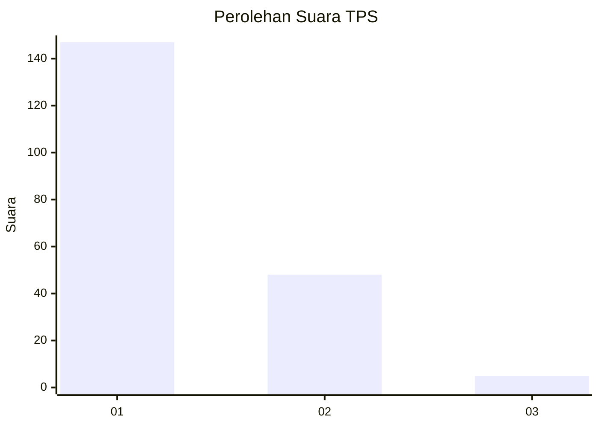
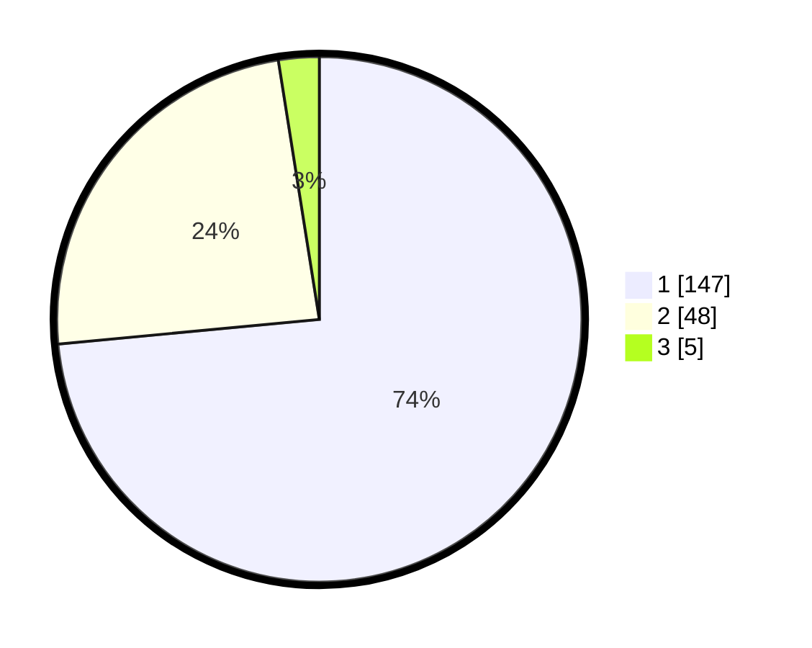

# Hasil

## Grafik

## Tabel

| No. | Nama Paslon    | Suara | Suara (raw) | Persentase |
|:--- |:-------------- | -----:| -----------:| ----------:|
| 1   | ANIES MUHAIMIN | 147   | [147][p-1]  | 73,50      |
| 2   | PRABOWO GIBRAN | 48    | [48][p-2]   | 24,00      |
| 3   | GANJAR MAHFUD  | 5     | [5][p-3]    | 2,50       |

[p-1]: https://github.com/gigit-pemilu/pemilu-2024-12-sumatera-utara/blob/main/pilpres/hitung-suara/sub/12-sumatera-utara/sub/19-batu-bara/sub/05-talawi/sub/2004-dahari-selebar/sub/007-tps/sub/paslon-1.txt
[p-2]: https://github.com/gigit-pemilu/pemilu-2024-12-sumatera-utara/blob/main/pilpres/hitung-suara/sub/12-sumatera-utara/sub/19-batu-bara/sub/05-talawi/sub/2004-dahari-selebar/sub/007-tps/sub/paslon-2.txt
[p-3]: https://github.com/gigit-pemilu/pemilu-2024-12-sumatera-utara/blob/main/pilpres/hitung-suara/sub/12-sumatera-utara/sub/19-batu-bara/sub/05-talawi/sub/2004-dahari-selebar/sub/007-tps/sub/paslon-3.txt

## Foto C Plano

https://sirekap-obj-formc.kpu.go.id/1e39/pemilu/ppwp/12/19/05/20/04/1219052004007-20240215-053103--6f624dbf-00c4-49ba-b46e-ff9e481340fd.jpg

https://sirekap-obj-formc.kpu.go.id/1e39/pemilu/ppwp/12/19/05/20/04/1219052004007-20240215-053317--825681de-4b5c-4bcd-a86b-c4c90d0820bd.jpg

https://sirekap-obj-formc.kpu.go.id/1e39/pemilu/ppwp/12/19/05/20/04/1219052004007-20240215-053610--7f543a2b-8ad5-4734-a533-d664b81c9d28.jpg

## Metadata

| Key        | Value               |
| ---------- | ------------------- |
| Time Stamp | 2024-02-15 20:30:46 |

