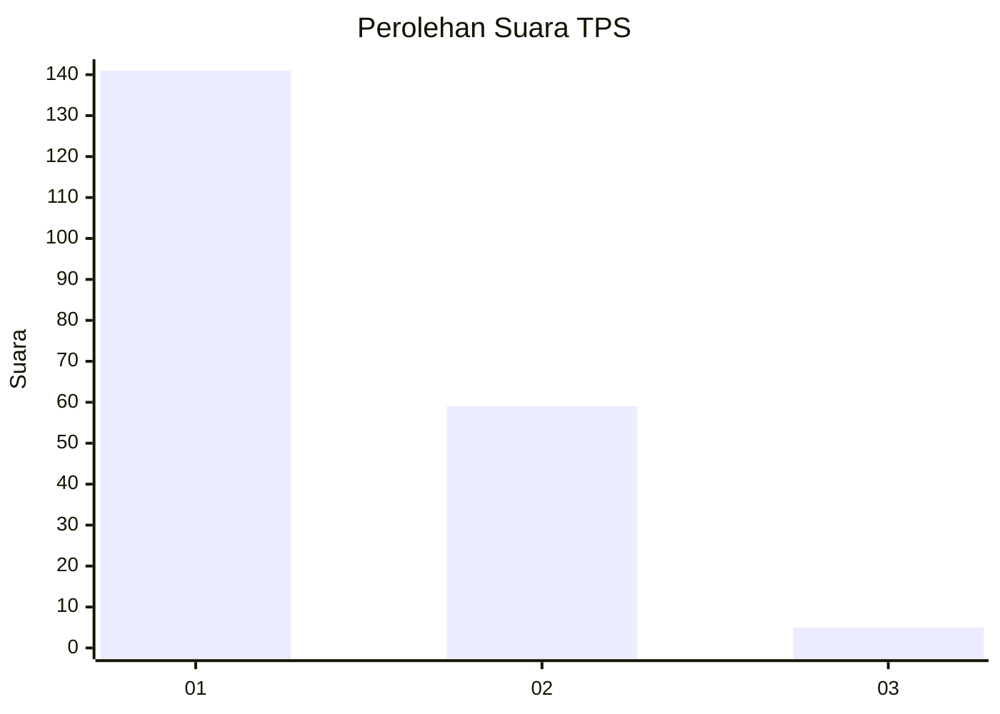
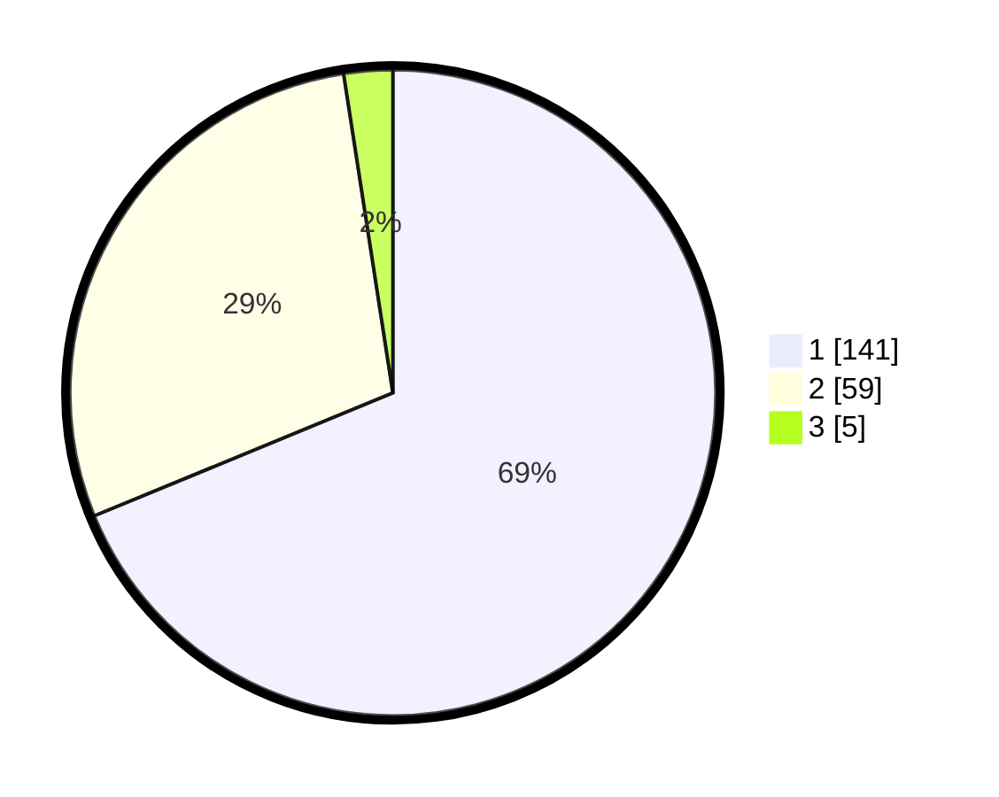

# Hasil

## Grafik

## Tabel

| No. | Nama Paslon    | Suara | Suara (raw) | Persentase |
|:--- |:-------------- | -----:| -----------:| ----------:|
| 1   | ANIES MUHAIMIN | 141   | [141][p-1]  | 68,78      |
| 2   | PRABOWO GIBRAN | 59    | [59][p-2]   | 28,78      |
| 3   | GANJAR MAHFUD  | 5     | [5][p-3]    | 2,44       |

[p-1]: https://github.com/gigit-pemilu/pemilu-2024/blob/main/pilpres/hitung-suara/sub/12-sumatera-utara/sub/19-batu-bara/sub/05-talawi/sub/2004-dahari-selebar/sub/010-tps/sub/paslon-1.txt
[p-2]: https://github.com/gigit-pemilu/pemilu-2024/blob/main/pilpres/hitung-suara/sub/12-sumatera-utara/sub/19-batu-bara/sub/05-talawi/sub/2004-dahari-selebar/sub/010-tps/sub/paslon-2.txt
[p-3]: https://github.com/gigit-pemilu/pemilu-2024/blob/main/pilpres/hitung-suara/sub/12-sumatera-utara/sub/19-batu-bara/sub/05-talawi/sub/2004-dahari-selebar/sub/010-tps/sub/paslon-3.txt

## Foto C Plano

https://sirekap-obj-formc.kpu.go.id/9198/pemilu/ppwp/12/19/05/20/04/1219052004010-20240215-003017--240fb81c-007f-4082-ab1f-8e704824dc93.jpg

https://sirekap-obj-formc.kpu.go.id/9198/pemilu/ppwp/12/19/05/20/04/1219052004010-20240215-003212--933c60af-4de8-4c27-9669-69e1ad773237.jpg

https://sirekap-obj-formc.kpu.go.id/9198/pemilu/ppwp/12/19/05/20/04/1219052004010-20240215-003326--69ca3c49-7cc0-4248-acb0-808e5b4e693c.jpg

## Metadata

| Key        | Value               |
| ---------- | ------------------- |
| Time Stamp | 2024-02-15 16:00:26 |

