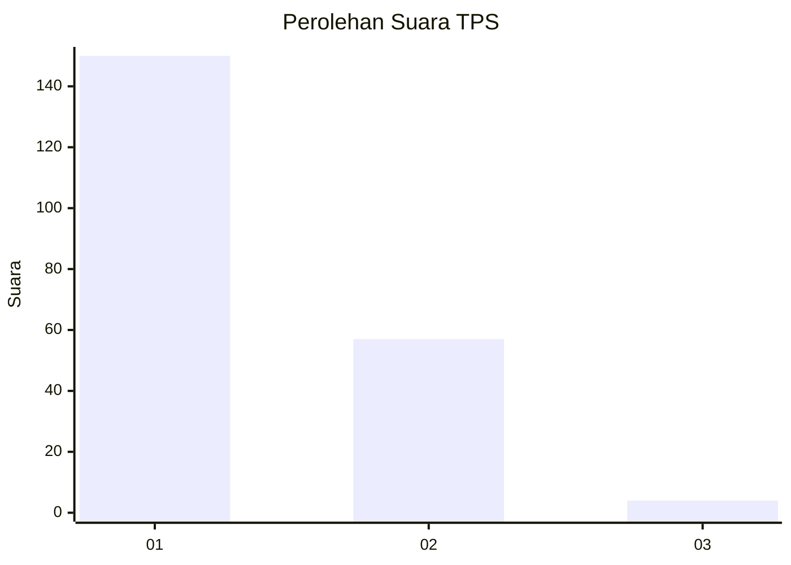
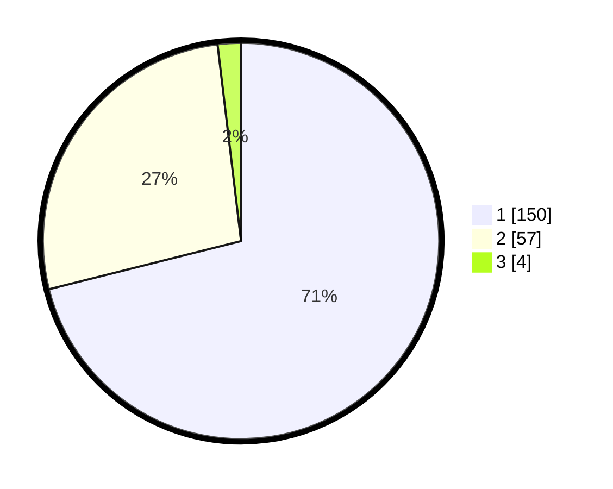

# Hasil

## Grafik

## Tabel

| No. | Nama Paslon    | Suara | Suara (raw) | Persentase |
|:--- |:-------------- | -----:| -----------:| ----------:|
| 1   | ANIES MUHAIMIN | 150   | [150][p-1]  | 71,09      |
| 2   | PRABOWO GIBRAN | 57    | [57][p-2]   | 27,01      |
| 3   | GANJAR MAHFUD  | 4     | [4][p-3]    | 1,90       |

[p-1]: https://github.com/gigit-pemilu/pemilu-2024/blob/main/pilpres/hitung-suara/sub/12-sumatera-utara/sub/19-batu-bara/sub/05-talawi/sub/2006-mesjid-lama/sub/004-tps/sub/paslon-1.txt
[p-2]: https://github.com/gigit-pemilu/pemilu-2024/blob/main/pilpres/hitung-suara/sub/12-sumatera-utara/sub/19-batu-bara/sub/05-talawi/sub/2006-mesjid-lama/sub/004-tps/sub/paslon-2.txt
[p-3]: https://github.com/gigit-pemilu/pemilu-2024/blob/main/pilpres/hitung-suara/sub/12-sumatera-utara/sub/19-batu-bara/sub/05-talawi/sub/2006-mesjid-lama/sub/004-tps/sub/paslon-3.txt

## Foto C Plano

https://sirekap-obj-formc.kpu.go.id/690c/pemilu/ppwp/12/19/05/20/06/1219052006004-20240214-224526--76316cb8-8ab7-4fb4-8eb5-43e727cb9683.jpg

https://sirekap-obj-formc.kpu.go.id/690c/pemilu/ppwp/12/19/05/20/06/1219052006004-20240214-211114--ea1c1072-d620-4300-b634-879d3a89fa86.jpg

https://sirekap-obj-formc.kpu.go.id/690c/pemilu/ppwp/12/19/05/20/06/1219052006004-20240214-224733--0aeaa6ed-76ec-4e7b-8cfb-740bd0ad30ef.jpg

## Metadata

| Key        | Value               |
| ---------- | ------------------- |
| Time Stamp | 2024-02-15 16:00:26 |

