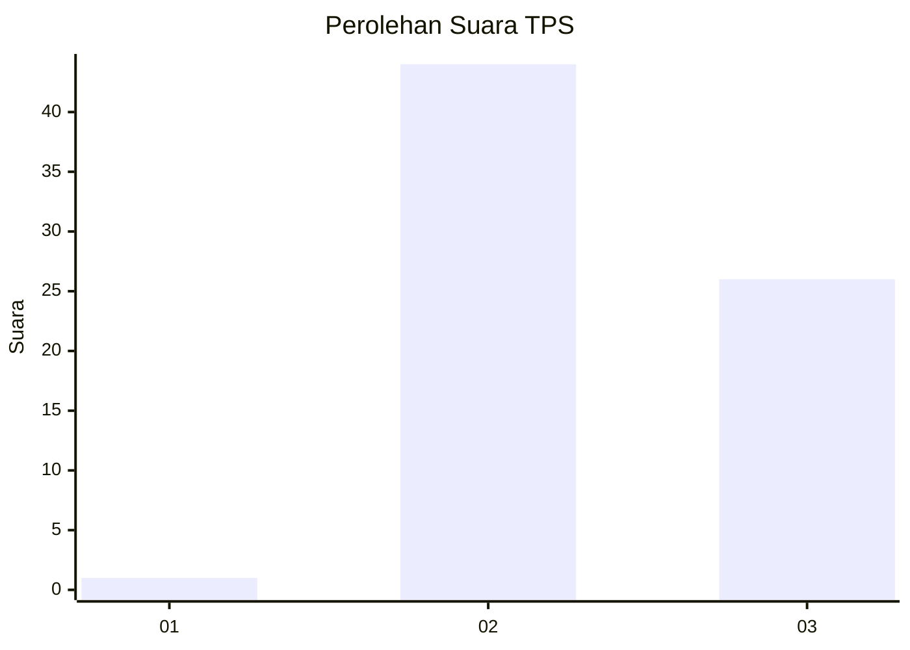
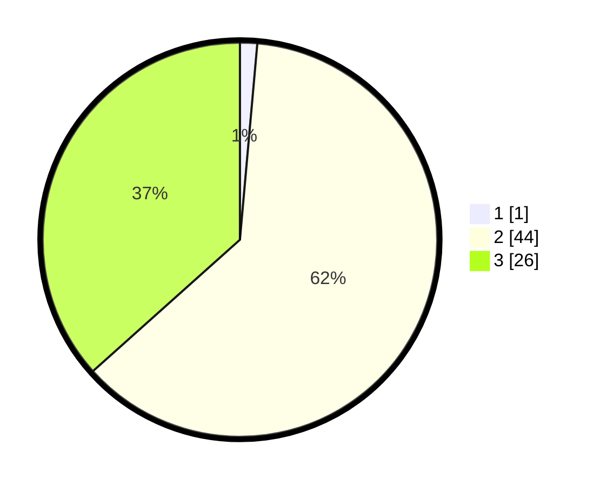

# Hasil

## Grafik

## Tabel

| No. | Nama Paslon    | Suara | Suara (raw) | Persentase |
|:--- |:-------------- | -----:| -----------:| ----------:|
| 1   | ANIES MUHAIMIN | 1     | [1][p-1]    | 1,41       |
| 2   | PRABOWO GIBRAN | 44    | [44][p-2]   | 61,97      |
| 3   | GANJAR MAHFUD  | 26    | [26][p-3]   | 36,62      |

[p-1]: https://github.com/gigit-pemilu/pemilu-2024/blob/main/pilpres/hitung-suara/sub/12-sumatera-utara/sub/19-batu-bara/sub/05-talawi/sub/2009-panjang/sub/004-tps/sub/paslon-1.txt
[p-2]: https://github.com/gigit-pemilu/pemilu-2024/blob/main/pilpres/hitung-suara/sub/12-sumatera-utara/sub/19-batu-bara/sub/05-talawi/sub/2009-panjang/sub/004-tps/sub/paslon-2.txt
[p-3]: https://github.com/gigit-pemilu/pemilu-2024/blob/main/pilpres/hitung-suara/sub/12-sumatera-utara/sub/19-batu-bara/sub/05-talawi/sub/2009-panjang/sub/004-tps/sub/paslon-3.txt

## Foto C Plano

https://sirekap-obj-formc.kpu.go.id/7719/pemilu/ppwp/12/19/05/20/09/1219052009004-20240214-223615--1839da3b-826c-48fb-a885-a61023a7b3f4.jpg

https://sirekap-obj-formc.kpu.go.id/7719/pemilu/ppwp/12/19/05/20/09/1219052009004-20240214-222546--94b93be6-6d3b-4fc4-a13f-a9342d6a96c7.jpg

https://sirekap-obj-formc.kpu.go.id/7719/pemilu/ppwp/12/19/05/20/09/1219052009004-20240214-222758--12650614-45f2-4a1c-a2da-9d2bf28f4121.jpg

## Metadata

| Key        | Value               |
| ---------- | ------------------- |
| Time Stamp | 2024-02-26 19:00:00 |

