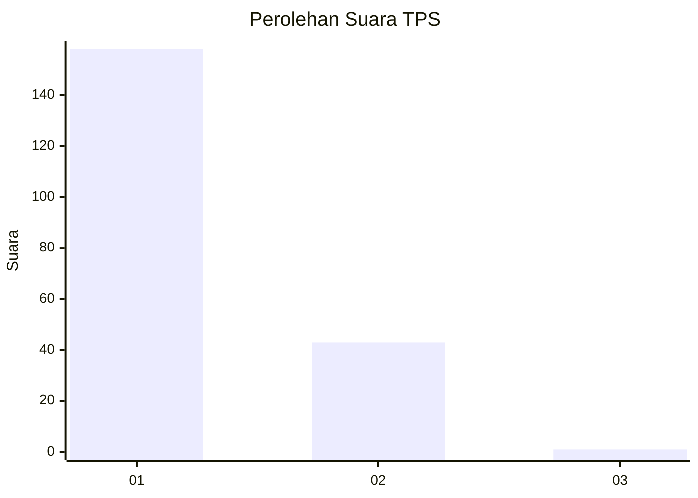
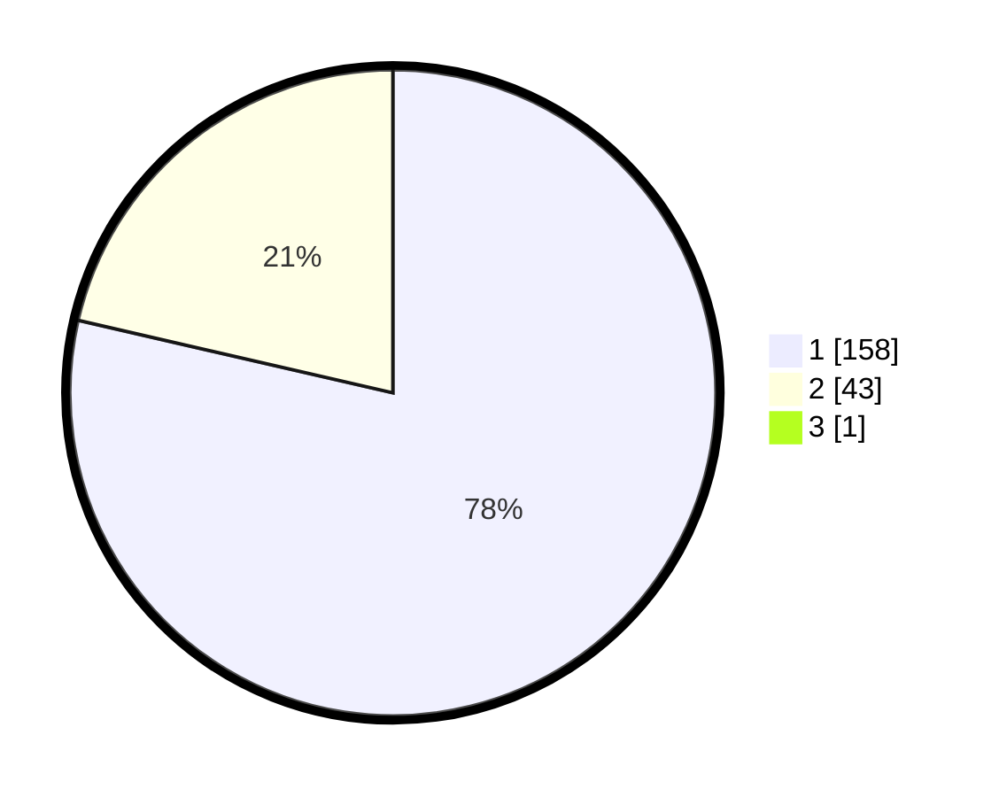

# Hasil

## Grafik

## Tabel

| No. | Nama Paslon    | Suara | Suara (raw) | Persentase |
|:--- |:-------------- | -----:| -----------:| ----------:|
| 1   | ANIES MUHAIMIN | 158   | [158][p-1]  | 78,22      |
| 2   | PRABOWO GIBRAN | 43    | [43][p-2]   | 21,29      |
| 3   | GANJAR MAHFUD  | 1     | [1][p-3]    | 0,50       |

[p-1]: https://github.com/gigit-pemilu/pemilu-2024-12-sumatera-utara/blob/main/pilpres/hitung-suara/sub/12-sumatera-utara/sub/19-batu-bara/sub/05-talawi/sub/2015-dahari-indah/sub/002-tps/sub/paslon-1.txt
[p-2]: https://github.com/gigit-pemilu/pemilu-2024-12-sumatera-utara/blob/main/pilpres/hitung-suara/sub/12-sumatera-utara/sub/19-batu-bara/sub/05-talawi/sub/2015-dahari-indah/sub/002-tps/sub/paslon-2.txt
[p-3]: https://github.com/gigit-pemilu/pemilu-2024-12-sumatera-utara/blob/main/pilpres/hitung-suara/sub/12-sumatera-utara/sub/19-batu-bara/sub/05-talawi/sub/2015-dahari-indah/sub/002-tps/sub/paslon-3.txt

## Foto C Plano

https://sirekap-obj-formc.kpu.go.id/4c4c/pemilu/ppwp/12/19/05/20/15/1219052015002-20240214-192017--fa4a1244-1a10-41a1-9869-46a64cc2665e.jpg

https://sirekap-obj-formc.kpu.go.id/4c4c/pemilu/ppwp/12/19/05/20/15/1219052015002-20240215-015506--ffc6f481-cd4d-46ca-b6f9-9c5aca4d7600.jpg

https://sirekap-obj-formc.kpu.go.id/4c4c/pemilu/ppwp/12/19/05/20/15/1219052015002-20240214-191623--bafb3c5a-419d-49b5-bb8b-489353916b97.jpg

## Metadata

| Key        | Value               |
| ---------- | ------------------- |
| Time Stamp | 2024-02-15 16:30:25 |

