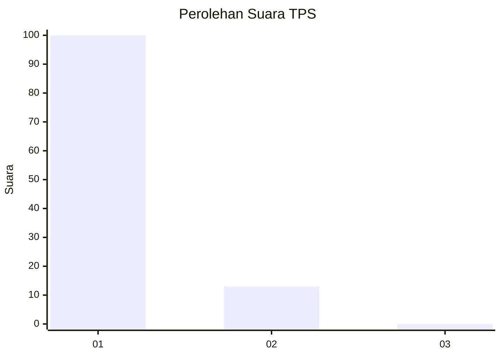
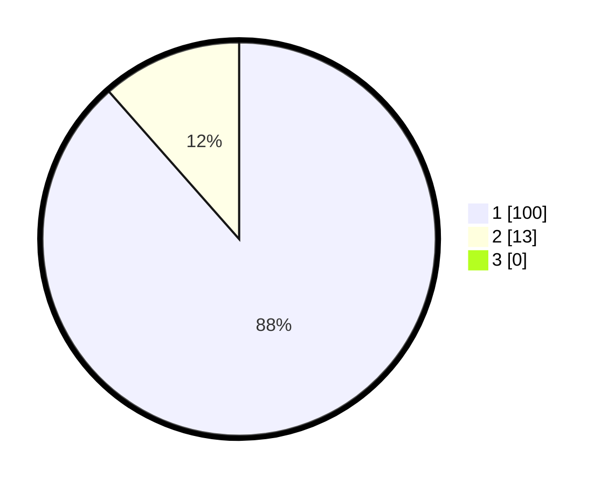

# Hasil

## Grafik

## Tabel

| No. | Nama Paslon    | Suara | Suara (raw) | Persentase |
|:--- |:-------------- | -----:| -----------:| ----------:|
| 1   | ANIES MUHAIMIN | 100   | [100][p-1]  | 88,50      |
| 2   | PRABOWO GIBRAN | 13    | [13][p-2]   | 11,50      |
| 3   | GANJAR MAHFUD  | 0     | [0][p-3]    | 0,00       |

[p-1]: https://github.com/gigit-pemilu/pemilu-2024/blob/main/pilpres/hitung-suara/sub/12-sumatera-utara/sub/19-batu-bara/sub/05-talawi/sub/2015-dahari-indah/sub/007-tps/sub/paslon-1.txt
[p-2]: https://github.com/gigit-pemilu/pemilu-2024/blob/main/pilpres/hitung-suara/sub/12-sumatera-utara/sub/19-batu-bara/sub/05-talawi/sub/2015-dahari-indah/sub/007-tps/sub/paslon-2.txt
[p-3]: https://github.com/gigit-pemilu/pemilu-2024/blob/main/pilpres/hitung-suara/sub/12-sumatera-utara/sub/19-batu-bara/sub/05-talawi/sub/2015-dahari-indah/sub/007-tps/sub/paslon-3.txt

## Foto C Plano

https://sirekap-obj-formc.kpu.go.id/b61b/pemilu/ppwp/12/19/05/20/15/1219052015007-20240214-190953--e3417f52-17be-45ff-9a32-f912e074b61b.jpg

https://sirekap-obj-formc.kpu.go.id/b61b/pemilu/ppwp/12/19/05/20/15/1219052015007-20240214-191000--1f9e754b-1acf-45b2-bb00-cfd55e6cfc8a.jpg

https://sirekap-obj-formc.kpu.go.id/b61b/pemilu/ppwp/12/19/05/20/15/1219052015007-20240214-191005--be707544-5c18-4e1d-91f9-593ef70c78db.jpg

## Metadata

| Key        | Value               |
| ---------- | ------------------- |
| Time Stamp | 2024-02-15 16:30:25 |

