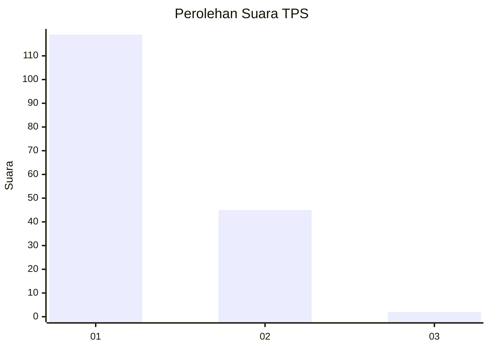
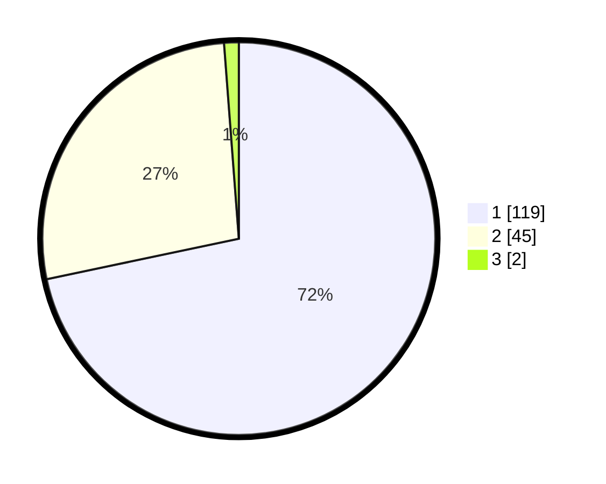

# Hasil

## Grafik

## Tabel

| No. | Nama Paslon    | Suara | Suara (raw) | Persentase |
|:--- |:-------------- | -----:| -----------:| ----------:|
| 1   | ANIES MUHAIMIN | 119   | [119][p-1]  | 71,69      |
| 2   | PRABOWO GIBRAN | 45    | [45][p-2]   | 27,11      |
| 3   | GANJAR MAHFUD  | 2     | [2][p-3]    | 1,20       |

[p-1]: https://github.com/gigit-pemilu/pemilu-2024-12-sumatera-utara/blob/main/pilpres/hitung-suara/sub/12-sumatera-utara/sub/19-batu-bara/sub/05-talawi/sub/2016-indra-yaman/sub/001-tps/sub/paslon-1.txt
[p-2]: https://github.com/gigit-pemilu/pemilu-2024-12-sumatera-utara/blob/main/pilpres/hitung-suara/sub/12-sumatera-utara/sub/19-batu-bara/sub/05-talawi/sub/2016-indra-yaman/sub/001-tps/sub/paslon-2.txt
[p-3]: https://github.com/gigit-pemilu/pemilu-2024-12-sumatera-utara/blob/main/pilpres/hitung-suara/sub/12-sumatera-utara/sub/19-batu-bara/sub/05-talawi/sub/2016-indra-yaman/sub/001-tps/sub/paslon-3.txt

## Foto C Plano

https://sirekap-obj-formc.kpu.go.id/037c/pemilu/ppwp/12/19/05/20/16/1219052016001-20240215-024920--10e7cd4f-6a31-47db-9595-233e1352a981.jpg

https://sirekap-obj-formc.kpu.go.id/037c/pemilu/ppwp/12/19/05/20/16/1219052016001-20240215-025057--7b0452a2-97f4-4781-8501-823cd67a1159.jpg

https://sirekap-obj-formc.kpu.go.id/037c/pemilu/ppwp/12/19/05/20/16/1219052016001-20240215-025221--0547015d-a789-486d-9091-7c2a9e8d68a5.jpg

## Metadata

| Key        | Value               |
| ---------- | ------------------- |
| Time Stamp | 2024-02-15 22:30:27 |

