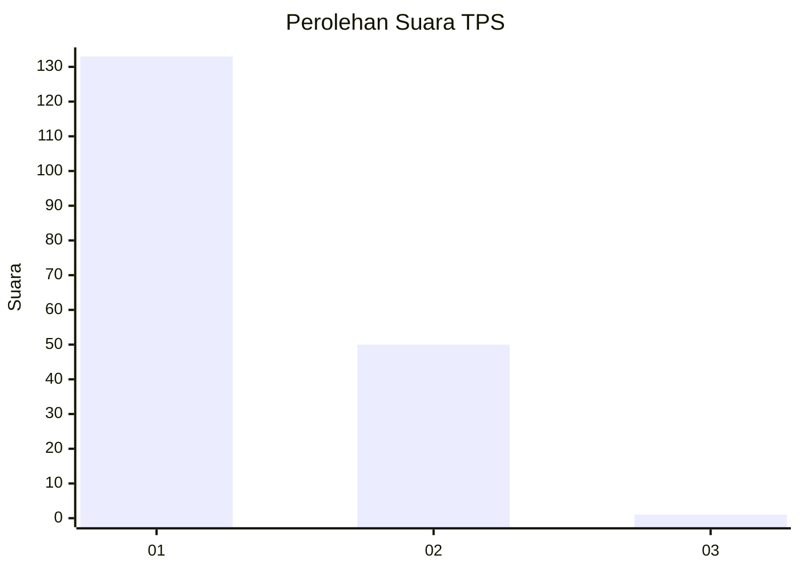
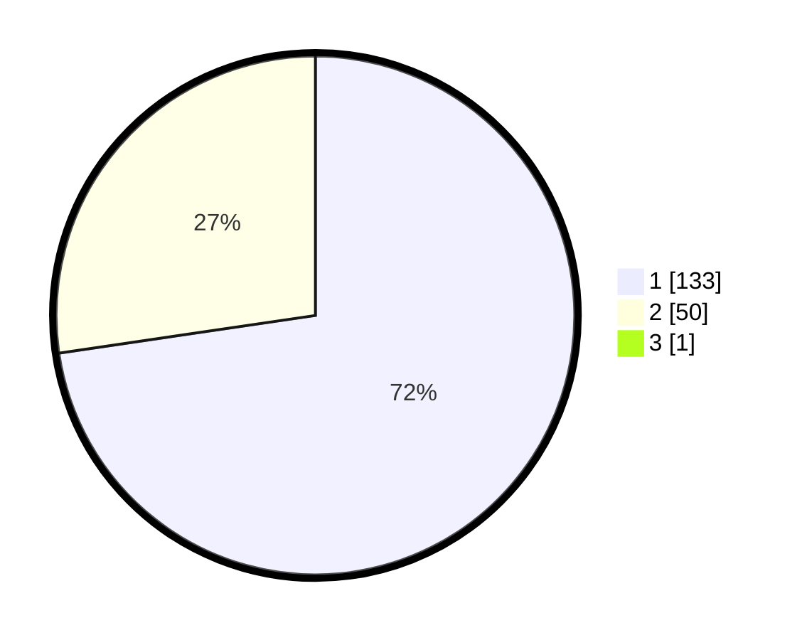

# Hasil

## Grafik

## Tabel

| No. | Nama Paslon    | Suara | Suara (raw) | Persentase |
|:--- |:-------------- | -----:| -----------:| ----------:|
| 1   | ANIES MUHAIMIN | 133   | [133][p-1]  | 72,28      |
| 2   | PRABOWO GIBRAN | 50    | [50][p-2]   | 27,17      |
| 3   | GANJAR MAHFUD  | 1     | [1][p-3]    | 0,54       |

[p-1]: https://github.com/gigit-pemilu/pemilu-2024/blob/main/pilpres/hitung-suara/sub/12-sumatera-utara/sub/19-batu-bara/sub/05-talawi/sub/2016-indra-yaman/sub/006-tps/sub/paslon-1.txt
[p-2]: https://github.com/gigit-pemilu/pemilu-2024/blob/main/pilpres/hitung-suara/sub/12-sumatera-utara/sub/19-batu-bara/sub/05-talawi/sub/2016-indra-yaman/sub/006-tps/sub/paslon-2.txt
[p-3]: https://github.com/gigit-pemilu/pemilu-2024/blob/main/pilpres/hitung-suara/sub/12-sumatera-utara/sub/19-batu-bara/sub/05-talawi/sub/2016-indra-yaman/sub/006-tps/sub/paslon-3.txt

## Foto C Plano

https://sirekap-obj-formc.kpu.go.id/841b/pemilu/ppwp/12/19/05/20/16/1219052016006-20240215-032528--3b90048a-d4ea-4365-9e80-29ca8b37a04a.jpg

https://sirekap-obj-formc.kpu.go.id/841b/pemilu/ppwp/12/19/05/20/16/1219052016006-20240215-032645--b6f397b2-d9bf-4d68-97dd-eb67173b0bdf.jpg

https://sirekap-obj-formc.kpu.go.id/841b/pemilu/ppwp/12/19/05/20/16/1219052016006-20240215-032746--ceae2675-c8ea-40f5-bf25-e1f722492005.jpg

## Metadata

| Key        | Value               |
| ---------- | ------------------- |
| Time Stamp | 2024-02-15 22:30:27 |

