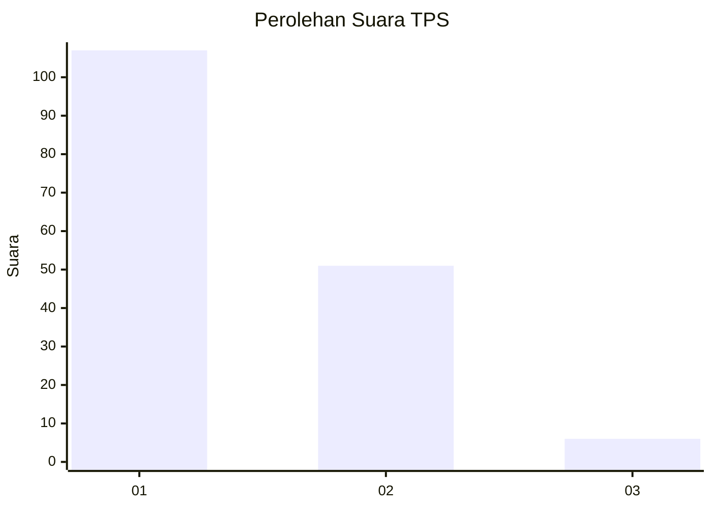
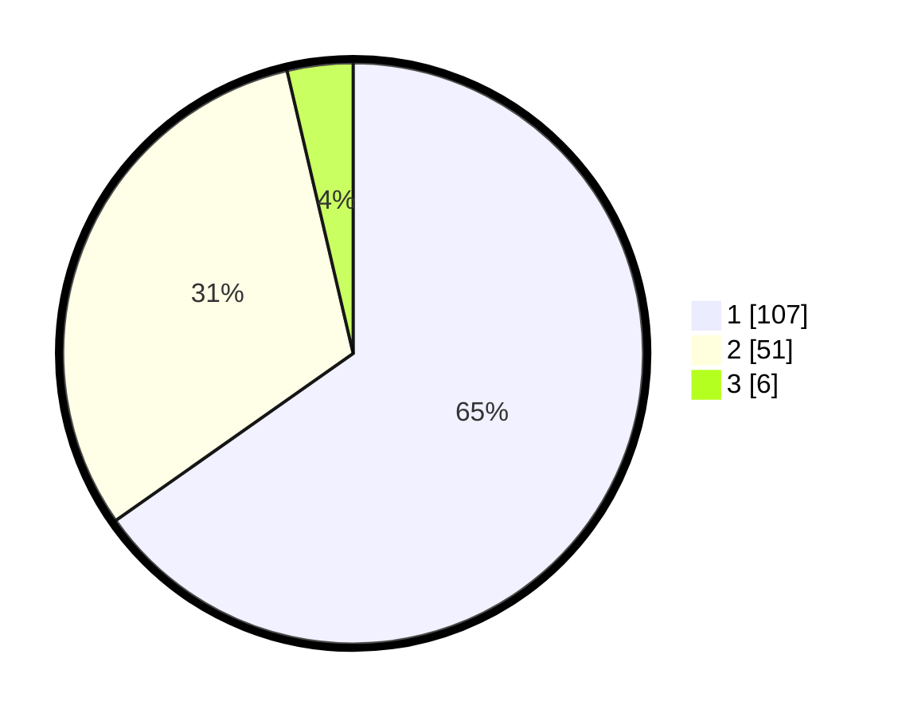

# Hasil

## Grafik

## Tabel

| No. | Nama Paslon    | Suara | Suara (raw) | Persentase |
|:--- |:-------------- | -----:| -----------:| ----------:|
| 1   | ANIES MUHAIMIN | 107   | [107][p-1]  | 65,24      |
| 2   | PRABOWO GIBRAN | 51    | [51][p-2]   | 31,10      |
| 3   | GANJAR MAHFUD  | 6     | [6][p-3]    | 3,66       |

[p-1]: https://github.com/gigit-pemilu/pemilu-2024/blob/main/pilpres/hitung-suara/sub/12-sumatera-utara/sub/19-batu-bara/sub/05-talawi/sub/2016-indra-yaman/sub/009-tps/sub/paslon-1.txt
[p-2]: https://github.com/gigit-pemilu/pemilu-2024/blob/main/pilpres/hitung-suara/sub/12-sumatera-utara/sub/19-batu-bara/sub/05-talawi/sub/2016-indra-yaman/sub/009-tps/sub/paslon-2.txt
[p-3]: https://github.com/gigit-pemilu/pemilu-2024/blob/main/pilpres/hitung-suara/sub/12-sumatera-utara/sub/19-batu-bara/sub/05-talawi/sub/2016-indra-yaman/sub/009-tps/sub/paslon-3.txt

## Foto C Plano

https://sirekap-obj-formc.kpu.go.id/4232/pemilu/ppwp/12/19/05/20/16/1219052016009-20240215-010901--a00d3048-04e7-42b5-bc77-06d0fb798fbe.jpg

https://sirekap-obj-formc.kpu.go.id/4232/pemilu/ppwp/12/19/05/20/16/1219052016009-20240215-011115--8dbf88f7-f508-49f5-a6bf-f028aaabdf8b.jpg

https://sirekap-obj-formc.kpu.go.id/4232/pemilu/ppwp/12/19/05/20/16/1219052016009-20240215-011217--5829feb8-b2cb-40fe-bdaa-f688bd61a383.jpg

## Metadata

| Key        | Value               |
| ---------- | ------------------- |
| Time Stamp | 2024-02-15 16:30:25 |

