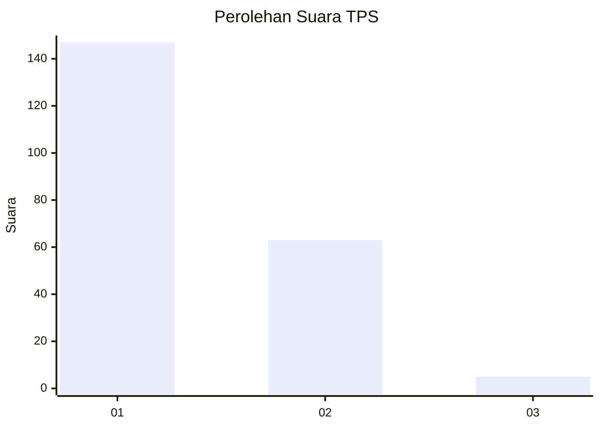
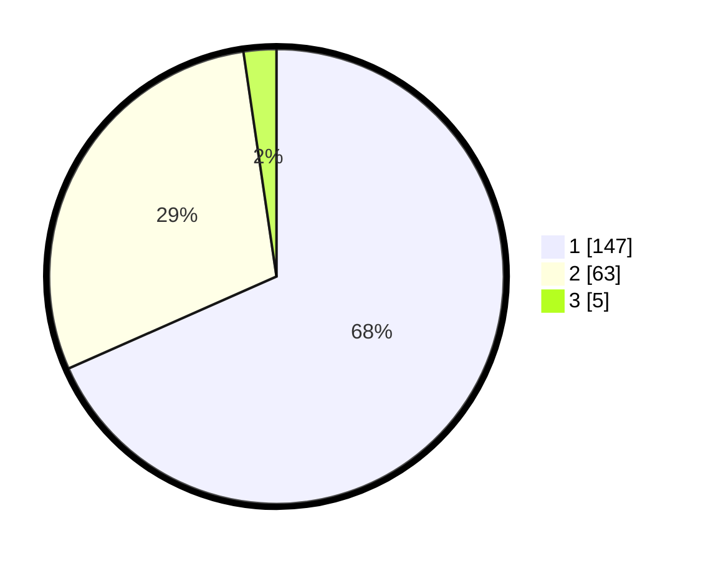

# Hasil

## Grafik

## Tabel

| No. | Nama Paslon    | Suara | Suara (raw) | Persentase |
|:--- |:-------------- | -----:| -----------:| ----------:|
| 1   | ANIES MUHAIMIN | 147   | [147][p-1]  | 68,37      |
| 2   | PRABOWO GIBRAN | 63    | [63][p-2]   | 29,30      |
| 3   | GANJAR MAHFUD  | 5     | [5][p-3]    | 2,33       |

[p-1]: https://github.com/gigit-pemilu/pemilu-2024/blob/main/pilpres/hitung-suara/sub/12-sumatera-utara/sub/19-batu-bara/sub/05-talawi/sub/2017-benteng/sub/006-tps/sub/paslon-1.txt
[p-2]: https://github.com/gigit-pemilu/pemilu-2024/blob/main/pilpres/hitung-suara/sub/12-sumatera-utara/sub/19-batu-bara/sub/05-talawi/sub/2017-benteng/sub/006-tps/sub/paslon-2.txt
[p-3]: https://github.com/gigit-pemilu/pemilu-2024/blob/main/pilpres/hitung-suara/sub/12-sumatera-utara/sub/19-batu-bara/sub/05-talawi/sub/2017-benteng/sub/006-tps/sub/paslon-3.txt

## Foto C Plano

https://sirekap-obj-formc.kpu.go.id/392f/pemilu/ppwp/12/19/05/20/17/1219052017006-20240215-082117--99bbd791-7234-4a2d-87b5-70380923de41.jpg

https://sirekap-obj-formc.kpu.go.id/392f/pemilu/ppwp/12/19/05/20/17/1219052017006-20240215-082230--1cea4391-911b-465f-ae01-49e983046ef8.jpg

https://sirekap-obj-formc.kpu.go.id/392f/pemilu/ppwp/12/19/05/20/17/1219052017006-20240215-082330--d8f88658-201c-4cfe-9760-105f7cbab346.jpg

## Metadata

| Key        | Value               |
| ---------- | ------------------- |
| Time Stamp | 2024-02-16 12:51:22 |

