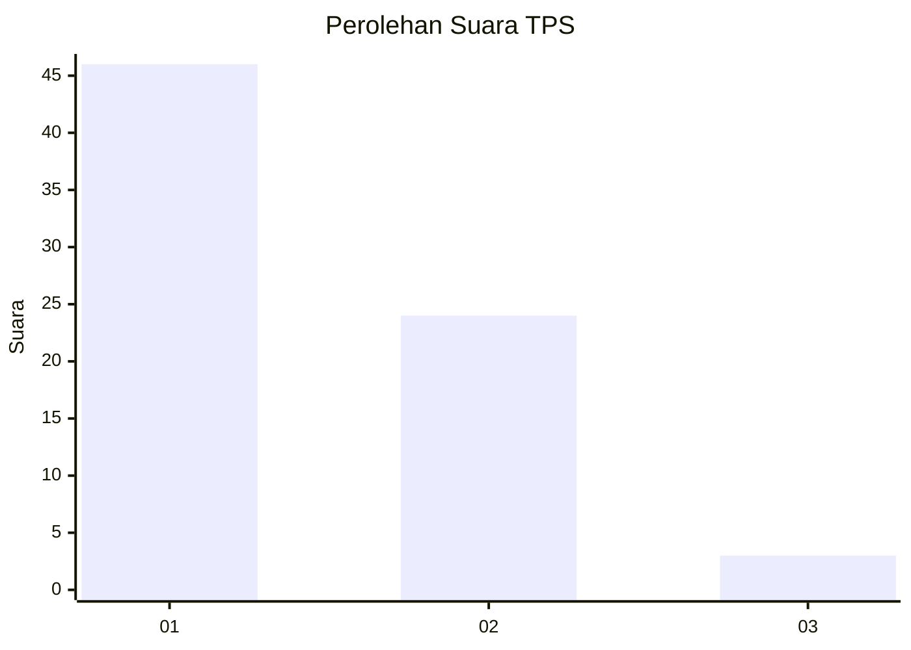
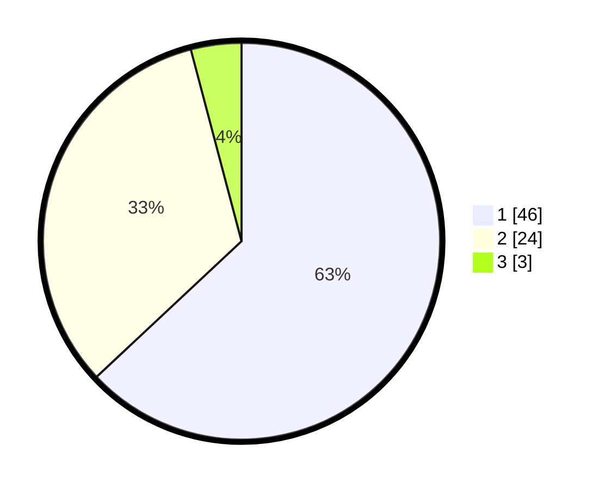

# Hasil

## Grafik

## Tabel

| No. | Nama Paslon    | Suara | Suara (raw) | Persentase |
|:--- |:-------------- | -----:| -----------:| ----------:|
| 1   | ANIES MUHAIMIN | 46    | [46][p-1]   | 63,01      |
| 2   | PRABOWO GIBRAN | 24    | [24][p-2]   | 32,88      |
| 3   | GANJAR MAHFUD  | 3     | [3][p-3]    | 4,11       |

[p-1]: https://github.com/gigit-pemilu/pemilu-2024-12-sumatera-utara/blob/main/pilpres/hitung-suara/sub/12-sumatera-utara/sub/19-batu-bara/sub/05-talawi/sub/2017-benteng/sub/007-tps/sub/paslon-1.txt
[p-2]: https://github.com/gigit-pemilu/pemilu-2024-12-sumatera-utara/blob/main/pilpres/hitung-suara/sub/12-sumatera-utara/sub/19-batu-bara/sub/05-talawi/sub/2017-benteng/sub/007-tps/sub/paslon-2.txt
[p-3]: https://github.com/gigit-pemilu/pemilu-2024-12-sumatera-utara/blob/main/pilpres/hitung-suara/sub/12-sumatera-utara/sub/19-batu-bara/sub/05-talawi/sub/2017-benteng/sub/007-tps/sub/paslon-3.txt

## Foto C Plano

https://sirekap-obj-formc.kpu.go.id/a2a0/pemilu/ppwp/12/19/05/20/17/1219052017007-20240214-221324--9fb6041a-0676-47de-829a-e5836100bff9.jpg

https://sirekap-obj-formc.kpu.go.id/a2a0/pemilu/ppwp/12/19/05/20/17/1219052017007-20240214-203826--8274905f-e974-4018-82d2-17ad84d2f39d.jpg

https://sirekap-obj-formc.kpu.go.id/a2a0/pemilu/ppwp/12/19/05/20/17/1219052017007-20240214-221625--b43b3b30-6d3f-4874-b51b-59f88897b930.jpg

## Metadata

| Key        | Value               |
| ---------- | ------------------- |
| Time Stamp | 2024-02-15 15:00:29 |

