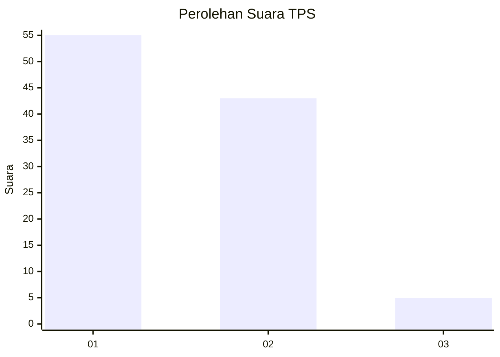
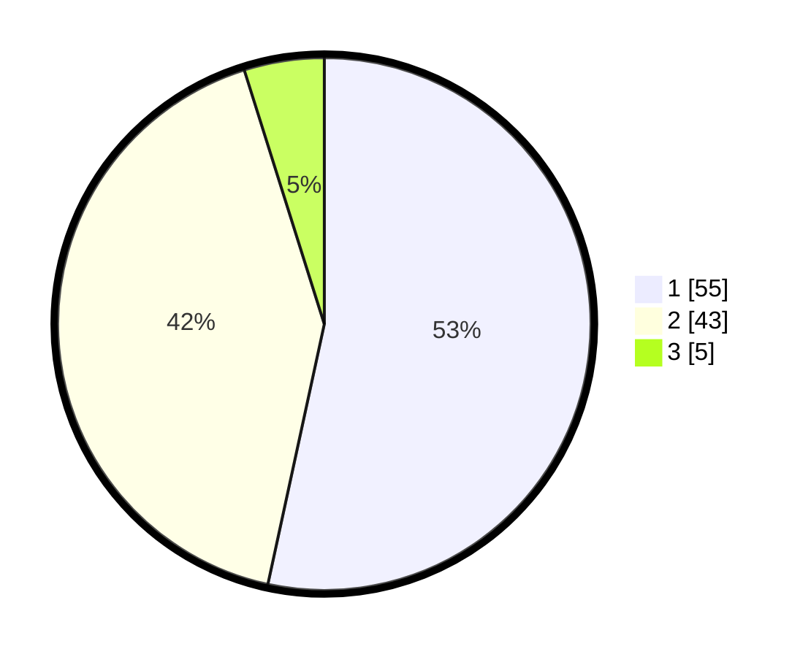

# Hasil

## Grafik

## Tabel

| No. | Nama Paslon    | Suara | Suara (raw) | Persentase |
|:--- |:-------------- | -----:| -----------:| ----------:|
| 1   | ANIES MUHAIMIN | 55    | [55][p-1]   | 53,40      |
| 2   | PRABOWO GIBRAN | 43    | [43][p-2]   | 41,75      |
| 3   | GANJAR MAHFUD  | 5     | [5][p-3]    | 4,85       |

[p-1]: https://github.com/gigit-pemilu/pemilu-2024-12-sumatera-utara/blob/main/pilpres/hitung-suara/sub/12-sumatera-utara/sub/19-batu-bara/sub/06-tanjung-tiram/sub/1001-tanjung-tiram/sub/006-tps/sub/paslon-1.txt
[p-2]: https://github.com/gigit-pemilu/pemilu-2024-12-sumatera-utara/blob/main/pilpres/hitung-suara/sub/12-sumatera-utara/sub/19-batu-bara/sub/06-tanjung-tiram/sub/1001-tanjung-tiram/sub/006-tps/sub/paslon-2.txt
[p-3]: https://github.com/gigit-pemilu/pemilu-2024-12-sumatera-utara/blob/main/pilpres/hitung-suara/sub/12-sumatera-utara/sub/19-batu-bara/sub/06-tanjung-tiram/sub/1001-tanjung-tiram/sub/006-tps/sub/paslon-3.txt

## Foto C Plano

https://sirekap-obj-formc.kpu.go.id/6977/pemilu/ppwp/12/19/06/10/01/1219061001006-20240214-203615--cabd9163-c9fd-4c08-93fc-bf8411e4c556.jpg

https://sirekap-obj-formc.kpu.go.id/6977/pemilu/ppwp/12/19/06/10/01/1219061001006-20240214-203747--acdabfac-6c0c-4237-8639-1cd01b214043.jpg

https://sirekap-obj-formc.kpu.go.id/6977/pemilu/ppwp/12/19/06/10/01/1219061001006-20240214-203926--b196a55c-163a-4e17-9611-5e651b877e82.jpg

## Metadata

| Key        | Value               |
| ---------- | ------------------- |
| Time Stamp | 2024-02-15 16:30:25 |

