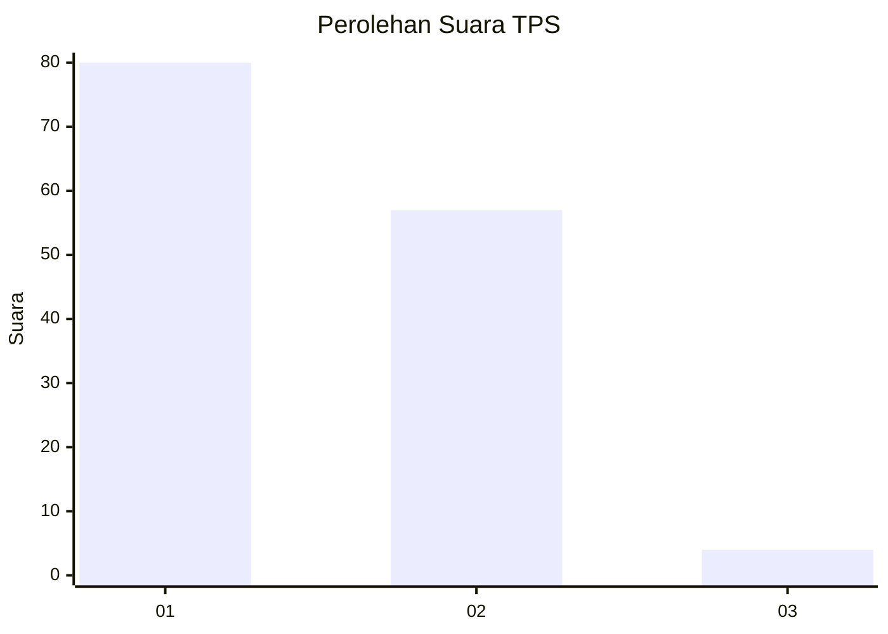
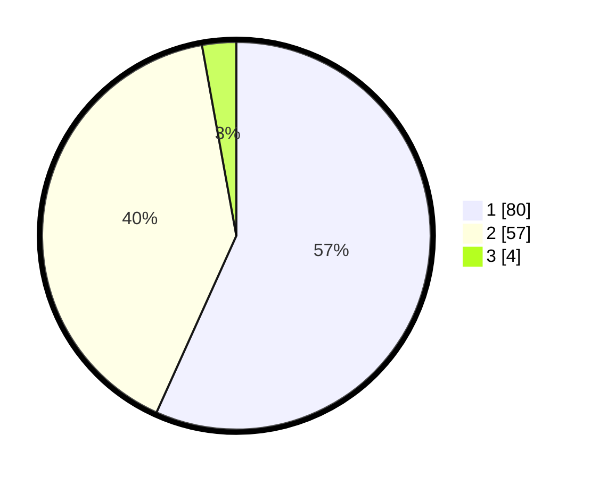

# Hasil

## Grafik

## Tabel

| No. | Nama Paslon    | Suara | Suara (raw) | Persentase |
|:--- |:-------------- | -----:| -----------:| ----------:|
| 1   | ANIES MUHAIMIN | 80    | [80][p-1]   | 56,74      |
| 2   | PRABOWO GIBRAN | 57    | [57][p-2]   | 40,43      |
| 3   | GANJAR MAHFUD  | 4     | [4][p-3]    | 2,84       |

[p-1]: https://github.com/gigit-pemilu/pemilu-2024/blob/main/pilpres/hitung-suara/sub/12-sumatera-utara/sub/19-batu-bara/sub/06-tanjung-tiram/sub/1001-tanjung-tiram/sub/007-tps/sub/paslon-1.txt
[p-2]: https://github.com/gigit-pemilu/pemilu-2024/blob/main/pilpres/hitung-suara/sub/12-sumatera-utara/sub/19-batu-bara/sub/06-tanjung-tiram/sub/1001-tanjung-tiram/sub/007-tps/sub/paslon-2.txt
[p-3]: https://github.com/gigit-pemilu/pemilu-2024/blob/main/pilpres/hitung-suara/sub/12-sumatera-utara/sub/19-batu-bara/sub/06-tanjung-tiram/sub/1001-tanjung-tiram/sub/007-tps/sub/paslon-3.txt

## Foto C Plano

https://sirekap-obj-formc.kpu.go.id/6529/pemilu/ppwp/12/19/06/10/01/1219061001007-20240214-195007--ed8e5975-c530-43b0-8c6d-f5d25b12001b.jpg

https://sirekap-obj-formc.kpu.go.id/6529/pemilu/ppwp/12/19/06/10/01/1219061001007-20240214-195608--5bcade5c-92b4-4396-9785-11a1d54e8a93.jpg

https://sirekap-obj-formc.kpu.go.id/6529/pemilu/ppwp/12/19/06/10/01/1219061001007-20240214-195759--e8d29cbe-11e9-461b-974b-e225a64bbcaf.jpg

## Metadata

| Key        | Value               |
| ---------- | ------------------- |
| Time Stamp | 2024-02-14 21:46:01 |

