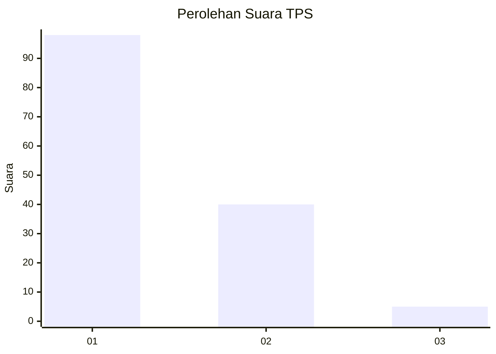
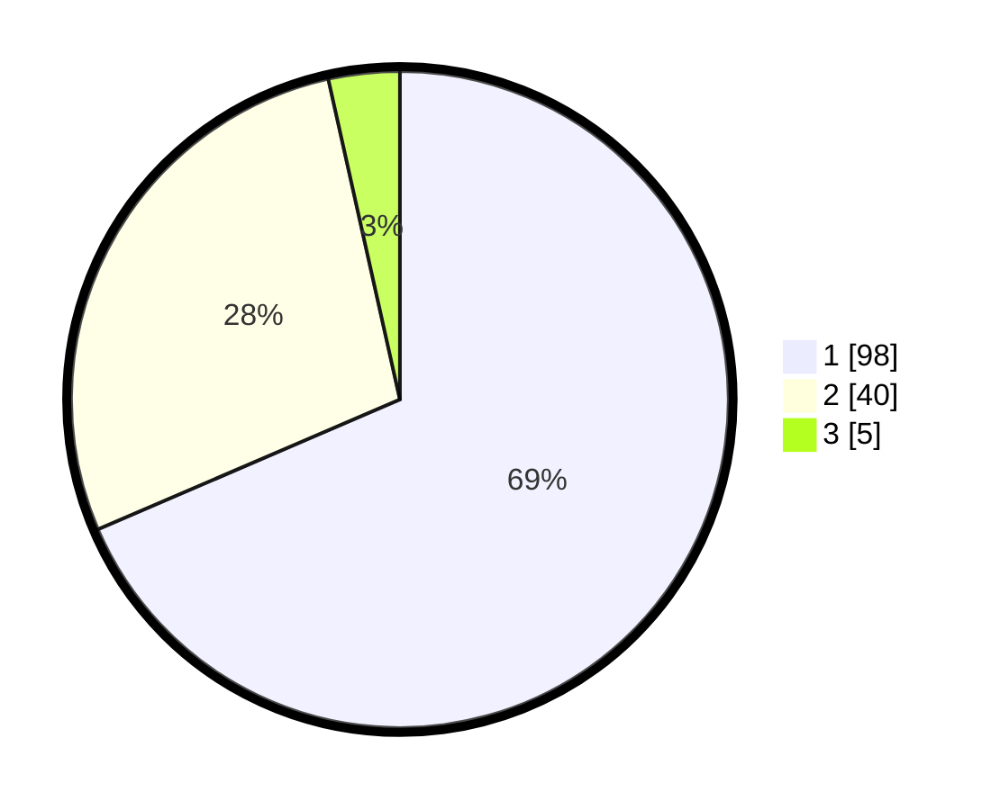

# Hasil

## Grafik

## Tabel

| No. | Nama Paslon    | Suara | Suara (raw) | Persentase |
|:--- |:-------------- | -----:| -----------:| ----------:|
| 1   | ANIES MUHAIMIN | 98    | [98][p-1]   | 68,53      |
| 2   | PRABOWO GIBRAN | 40    | [40][p-2]   | 27,97      |
| 3   | GANJAR MAHFUD  | 5     | [5][p-3]    | 3,50       |

[p-1]: https://github.com/gigit-pemilu/pemilu-2024/blob/main/pilpres/hitung-suara/sub/12-sumatera-utara/sub/19-batu-bara/sub/06-tanjung-tiram/sub/1001-tanjung-tiram/sub/008-tps/sub/paslon-1.txt
[p-2]: https://github.com/gigit-pemilu/pemilu-2024/blob/main/pilpres/hitung-suara/sub/12-sumatera-utara/sub/19-batu-bara/sub/06-tanjung-tiram/sub/1001-tanjung-tiram/sub/008-tps/sub/paslon-2.txt
[p-3]: https://github.com/gigit-pemilu/pemilu-2024/blob/main/pilpres/hitung-suara/sub/12-sumatera-utara/sub/19-batu-bara/sub/06-tanjung-tiram/sub/1001-tanjung-tiram/sub/008-tps/sub/paslon-3.txt

## Foto C Plano

https://sirekap-obj-formc.kpu.go.id/8ef5/pemilu/ppwp/12/19/06/10/01/1219061001008-20240214-193357--7f7183b2-2f78-47db-8b0a-bb2bc280fb7f.jpg

https://sirekap-obj-formc.kpu.go.id/8ef5/pemilu/ppwp/12/19/06/10/01/1219061001008-20240214-193740--1ebafb7f-be76-4178-bbe9-dba470b18ca5.jpg

https://sirekap-obj-formc.kpu.go.id/8ef5/pemilu/ppwp/12/19/06/10/01/1219061001008-20240214-193236--46f67145-9b42-48ef-862e-8816363e51bb.jpg

## Metadata

| Key        | Value               |
| ---------- | ------------------- |
| Time Stamp | 2024-02-15 16:30:25 |

