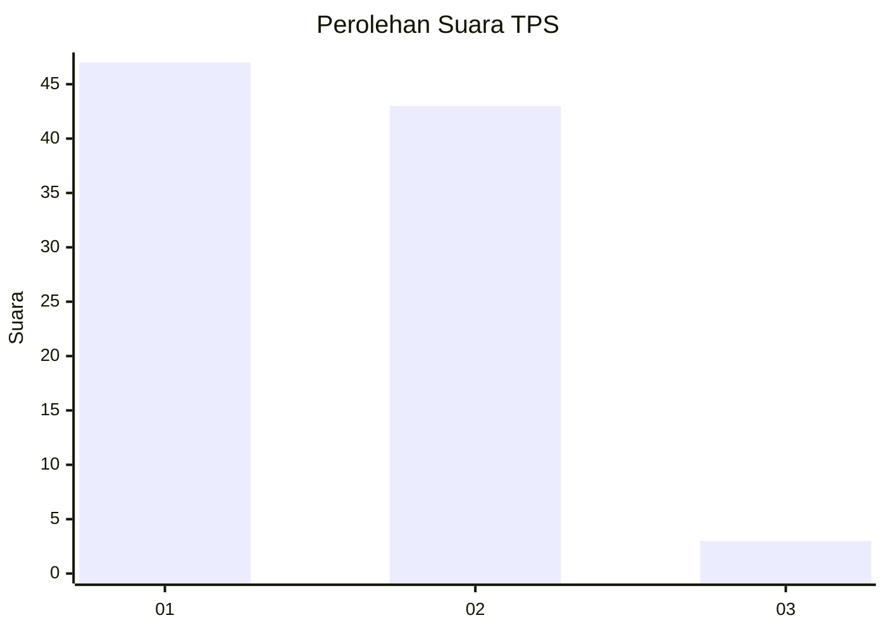
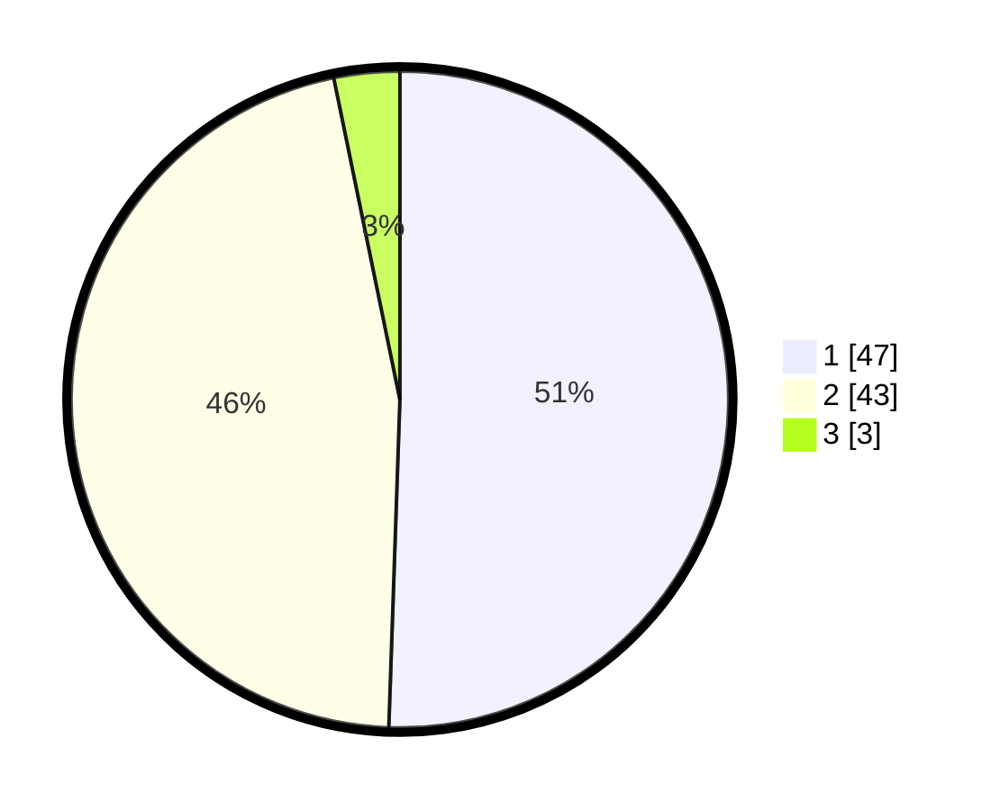

# Hasil

## Grafik

## Tabel

| No. | Nama Paslon    | Suara | Suara (raw) | Persentase |
|:--- |:-------------- | -----:| -----------:| ----------:|
| 1   | ANIES MUHAIMIN | 47    | [47][p-1]   | 50,54      |
| 2   | PRABOWO GIBRAN | 43    | [43][p-2]   | 46,24      |
| 3   | GANJAR MAHFUD  | 3     | [3][p-3]    | 3,23       |

[p-1]: https://github.com/gigit-pemilu/pemilu-2024-12-sumatera-utara/blob/main/pilpres/hitung-suara/sub/12-sumatera-utara/sub/19-batu-bara/sub/06-tanjung-tiram/sub/2006-suka-maju/sub/029-tps/sub/paslon-1.txt
[p-2]: https://github.com/gigit-pemilu/pemilu-2024-12-sumatera-utara/blob/main/pilpres/hitung-suara/sub/12-sumatera-utara/sub/19-batu-bara/sub/06-tanjung-tiram/sub/2006-suka-maju/sub/029-tps/sub/paslon-2.txt
[p-3]: https://github.com/gigit-pemilu/pemilu-2024-12-sumatera-utara/blob/main/pilpres/hitung-suara/sub/12-sumatera-utara/sub/19-batu-bara/sub/06-tanjung-tiram/sub/2006-suka-maju/sub/029-tps/sub/paslon-3.txt

## Foto C Plano

https://sirekap-obj-formc.kpu.go.id/dd60/pemilu/ppwp/12/19/06/20/06/1219062006029-20240215-001740--d0638ac9-a495-40ff-8da4-643589cbd46c.jpg

https://sirekap-obj-formc.kpu.go.id/dd60/pemilu/ppwp/12/19/06/20/06/1219062006029-20240215-002059--6e5a7975-3d2d-470d-97bf-a81435c6d242.jpg

https://sirekap-obj-formc.kpu.go.id/dd60/pemilu/ppwp/12/19/06/20/06/1219062006029-20240215-001925--6cb0144c-a743-442a-bbaf-24a03d5f55dc.jpg

## Metadata

| Key        | Value               |
| ---------- | ------------------- |
| Time Stamp | 2024-02-15 16:30:25 |

