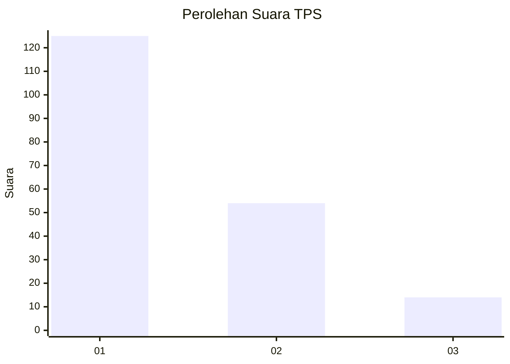
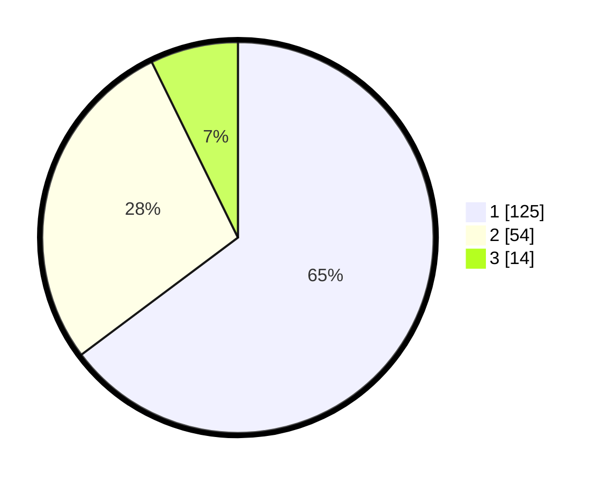

# Hasil

## Grafik

## Tabel

| No. | Nama Paslon    | Suara | Suara (raw) | Persentase |
|:--- |:-------------- | -----:| -----------:| ----------:|
| 1   | ANIES MUHAIMIN | 125   | [125][p-1]  | 64,77      |
| 2   | PRABOWO GIBRAN | 54    | [54][p-2]   | 27,98      |
| 3   | GANJAR MAHFUD  | 14    | [14][p-3]   | 7,25       |

[p-1]: https://github.com/gigit-pemilu/pemilu-2024/blob/main/pilpres/hitung-suara/sub/12-sumatera-utara/sub/19-batu-bara/sub/07-sei-balai/sub/2001-kwala-sikasim/sub/001-tps/sub/paslon-1.txt
[p-2]: https://github.com/gigit-pemilu/pemilu-2024/blob/main/pilpres/hitung-suara/sub/12-sumatera-utara/sub/19-batu-bara/sub/07-sei-balai/sub/2001-kwala-sikasim/sub/001-tps/sub/paslon-2.txt
[p-3]: https://github.com/gigit-pemilu/pemilu-2024/blob/main/pilpres/hitung-suara/sub/12-sumatera-utara/sub/19-batu-bara/sub/07-sei-balai/sub/2001-kwala-sikasim/sub/001-tps/sub/paslon-3.txt

## Foto C Plano

https://sirekap-obj-formc.kpu.go.id/ffb0/pemilu/ppwp/12/19/07/20/01/1219072001001-20240215-052112--f0b7d826-27da-41cf-9ec1-d416d5accf1f.jpg

https://sirekap-obj-formc.kpu.go.id/ffb0/pemilu/ppwp/12/19/07/20/01/1219072001001-20240215-025546--8248b68b-7a53-41d1-98e3-13390e00f4a6.jpg

https://sirekap-obj-formc.kpu.go.id/ffb0/pemilu/ppwp/12/19/07/20/01/1219072001001-20240215-052408--87709179-d1b5-4ebd-bdc9-d5cf1c9f7795.jpg

## Metadata

| Key        | Value               |
| ---------- | ------------------- |
| Time Stamp | 2024-02-15 19:30:26 |

