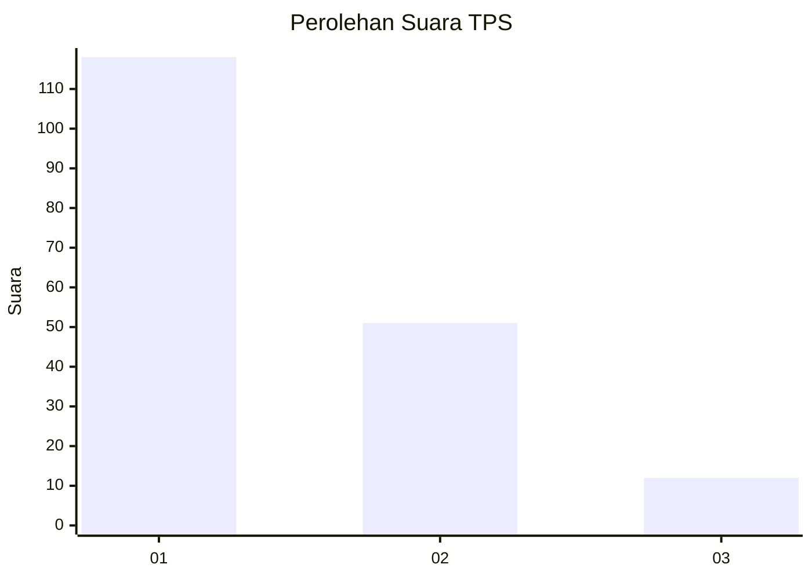
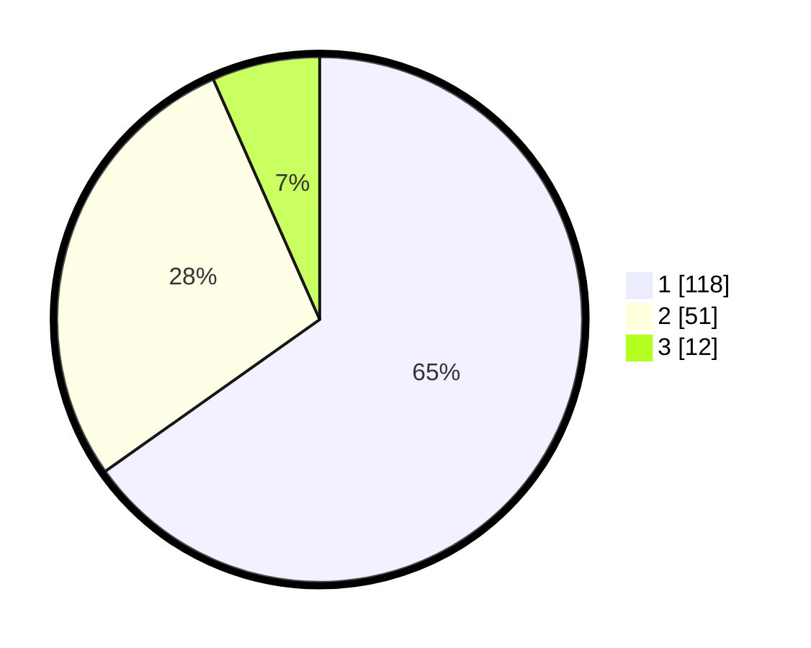

# Hasil

## Grafik

## Tabel

| No. | Nama Paslon    | Suara | Suara (raw) | Persentase |
|:--- |:-------------- | -----:| -----------:| ----------:|
| 1   | ANIES MUHAIMIN | 118   | [118][p-1]  | 65,19      |
| 2   | PRABOWO GIBRAN | 51    | [51][p-2]   | 28,18      |
| 3   | GANJAR MAHFUD  | 12    | [12][p-3]   | 6,63       |

[p-1]: https://github.com/gigit-pemilu/pemilu-2024-12-sumatera-utara/blob/main/pilpres/hitung-suara/sub/12-sumatera-utara/sub/19-batu-bara/sub/07-sei-balai/sub/2001-kwala-sikasim/sub/007-tps/sub/paslon-1.txt
[p-2]: https://github.com/gigit-pemilu/pemilu-2024-12-sumatera-utara/blob/main/pilpres/hitung-suara/sub/12-sumatera-utara/sub/19-batu-bara/sub/07-sei-balai/sub/2001-kwala-sikasim/sub/007-tps/sub/paslon-2.txt
[p-3]: https://github.com/gigit-pemilu/pemilu-2024-12-sumatera-utara/blob/main/pilpres/hitung-suara/sub/12-sumatera-utara/sub/19-batu-bara/sub/07-sei-balai/sub/2001-kwala-sikasim/sub/007-tps/sub/paslon-3.txt

## Foto C Plano

https://sirekap-obj-formc.kpu.go.id/d42f/pemilu/ppwp/12/19/07/20/01/1219072001007-20240215-052247--2467f9b1-4393-4bd7-a348-ed2c0e6ec0ae.jpg

https://sirekap-obj-formc.kpu.go.id/d42f/pemilu/ppwp/12/19/07/20/01/1219072001007-20240214-200354--7c863cb4-6bf5-41fa-9dc0-dcc7586634db.jpg

https://sirekap-obj-formc.kpu.go.id/d42f/pemilu/ppwp/12/19/07/20/01/1219072001007-20240214-200406--6e35e5a2-10f6-45d5-a2ac-b8d4ef094a71.jpg

## Metadata

| Key        | Value               |
| ---------- | ------------------- |
| Time Stamp | 2024-02-15 16:30:25 |

