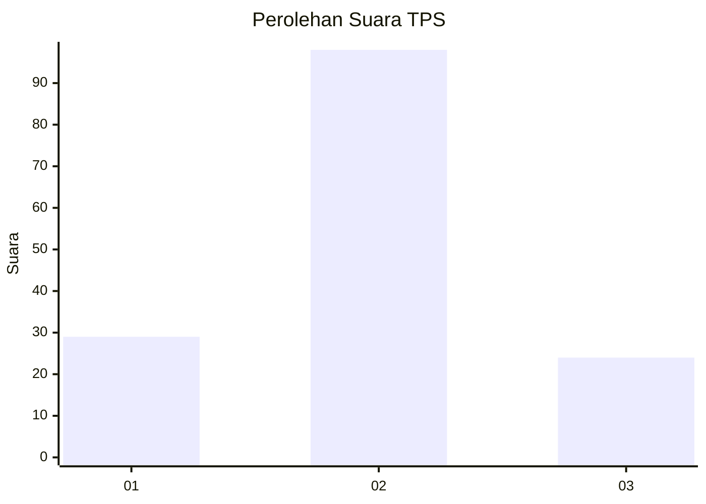
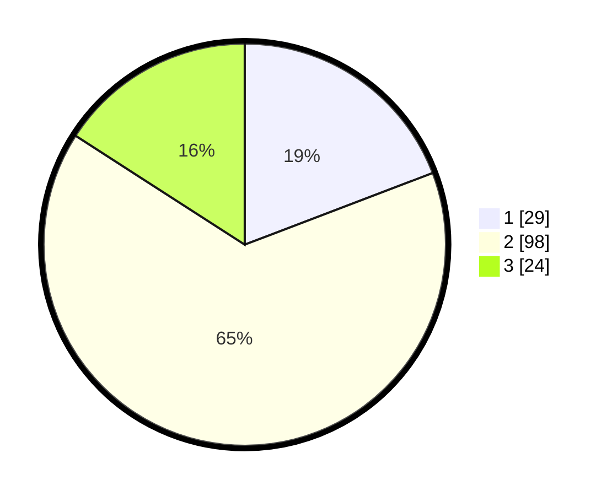

# Hasil

## Grafik

## Tabel

| No. | Nama Paslon    | Suara | Suara (raw) | Persentase |
|:--- |:-------------- | -----:| -----------:| ----------:|
| 1   | ANIES MUHAIMIN | 29    | [29][p-1]   | 19,21      |
| 2   | PRABOWO GIBRAN | 98    | [98][p-2]   | 64,90      |
| 3   | GANJAR MAHFUD  | 24    | [24][p-3]   | 15,89      |

[p-1]: https://github.com/gigit-pemilu/pemilu-2024/blob/main/pilpres/hitung-suara/sub/12-sumatera-utara/sub/19-batu-bara/sub/07-sei-balai/sub/2008-sei-bejangkar/sub/006-tps/sub/paslon-1.txt
[p-2]: https://github.com/gigit-pemilu/pemilu-2024/blob/main/pilpres/hitung-suara/sub/12-sumatera-utara/sub/19-batu-bara/sub/07-sei-balai/sub/2008-sei-bejangkar/sub/006-tps/sub/paslon-2.txt
[p-3]: https://github.com/gigit-pemilu/pemilu-2024/blob/main/pilpres/hitung-suara/sub/12-sumatera-utara/sub/19-batu-bara/sub/07-sei-balai/sub/2008-sei-bejangkar/sub/006-tps/sub/paslon-3.txt

## Foto C Plano

https://sirekap-obj-formc.kpu.go.id/d359/pemilu/ppwp/12/19/07/20/08/1219072008006-20240215-030619--29f64ca9-8e45-4a55-a295-0c41d9d70c82.jpg

https://sirekap-obj-formc.kpu.go.id/d359/pemilu/ppwp/12/19/07/20/08/1219072008006-20240215-030840--8ffef659-d74f-4f5b-8b5a-e8a5de588c8b.jpg

https://sirekap-obj-formc.kpu.go.id/d359/pemilu/ppwp/12/19/07/20/08/1219072008006-20240215-031000--12fe3aae-cebe-4fba-9812-af60f6f4df1b.jpg

## Metadata

| Key        | Value               |
| ---------- | ------------------- |
| Time Stamp | 2024-02-15 17:00:25 |

