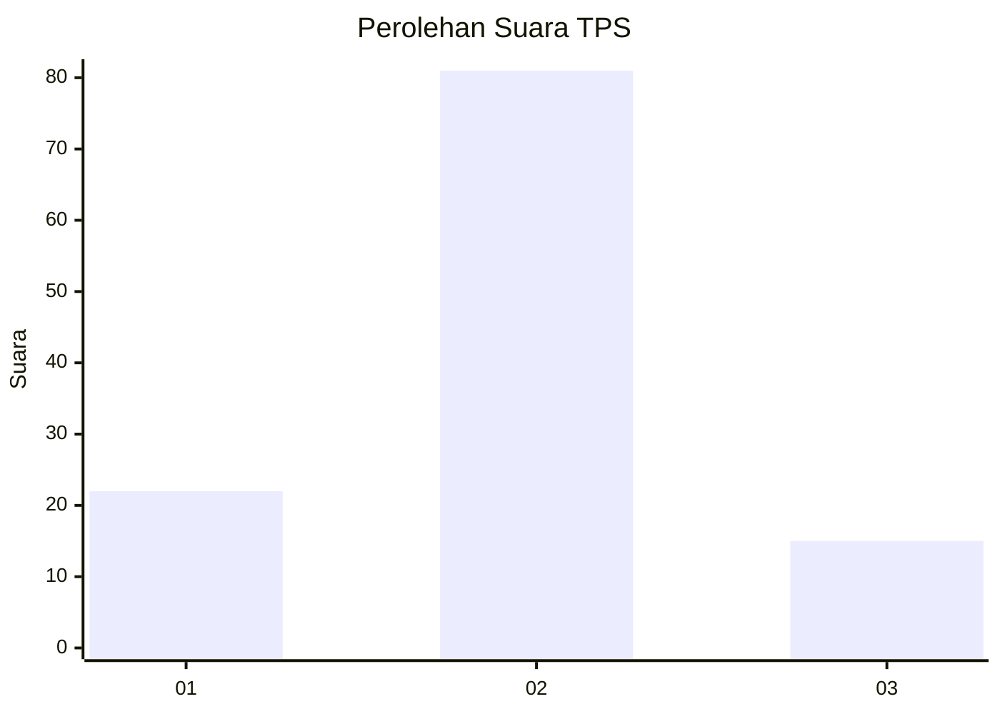
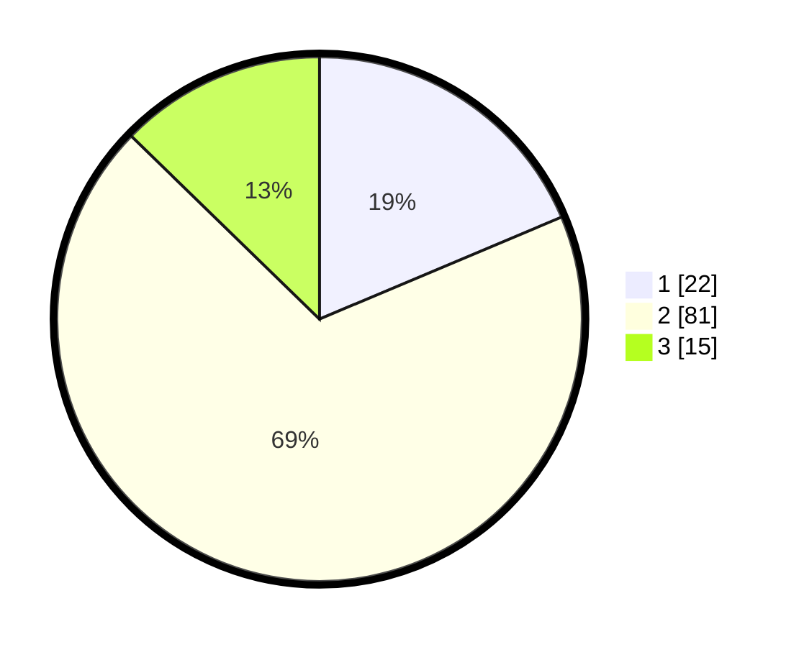

# Hasil

## Grafik

## Tabel

| No. | Nama Paslon    | Suara | Suara (raw) | Persentase |
|:--- |:-------------- | -----:| -----------:| ----------:|
| 1   | ANIES MUHAIMIN | 22    | [22][p-1]   | 18,64      |
| 2   | PRABOWO GIBRAN | 81    | [81][p-2]   | 68,64      |
| 3   | GANJAR MAHFUD  | 15    | [15][p-3]   | 12,71      |

[p-1]: https://github.com/gigit-pemilu/pemilu-2024-12-sumatera-utara/blob/main/pilpres/hitung-suara/sub/12-sumatera-utara/sub/19-batu-bara/sub/07-sei-balai/sub/2017-suko-rejo/sub/005-tps/sub/paslon-1.txt
[p-2]: https://github.com/gigit-pemilu/pemilu-2024-12-sumatera-utara/blob/main/pilpres/hitung-suara/sub/12-sumatera-utara/sub/19-batu-bara/sub/07-sei-balai/sub/2017-suko-rejo/sub/005-tps/sub/paslon-2.txt
[p-3]: https://github.com/gigit-pemilu/pemilu-2024-12-sumatera-utara/blob/main/pilpres/hitung-suara/sub/12-sumatera-utara/sub/19-batu-bara/sub/07-sei-balai/sub/2017-suko-rejo/sub/005-tps/sub/paslon-3.txt

## Foto C Plano

https://sirekap-obj-formc.kpu.go.id/88e6/pemilu/ppwp/12/19/07/20/17/1219072017005-20240214-235813--43b335c8-5b75-407c-940a-dd5517da9f91.jpg

https://sirekap-obj-formc.kpu.go.id/88e6/pemilu/ppwp/12/19/07/20/17/1219072017005-20240214-235940--9f117ae0-7f97-48d1-9071-4ea39a0d12a6.jpg

https://sirekap-obj-formc.kpu.go.id/88e6/pemilu/ppwp/12/19/07/20/17/1219072017005-20240219-111445--e3f5efe6-5268-44ae-b02a-3ad8e70716c2.jpg

## Metadata

| Key        | Value               |
| ---------- | ------------------- |
| Time Stamp | 2024-02-25 17:00:00 |

