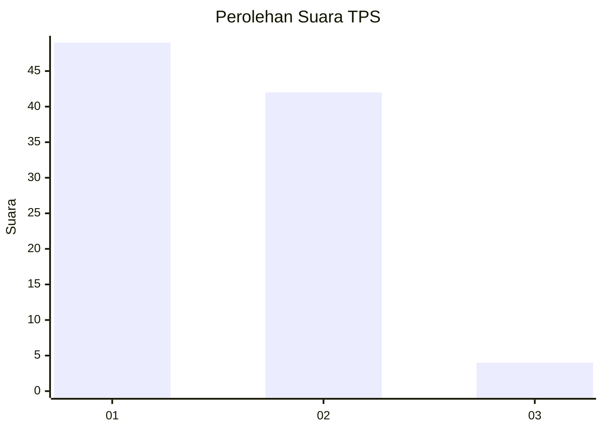
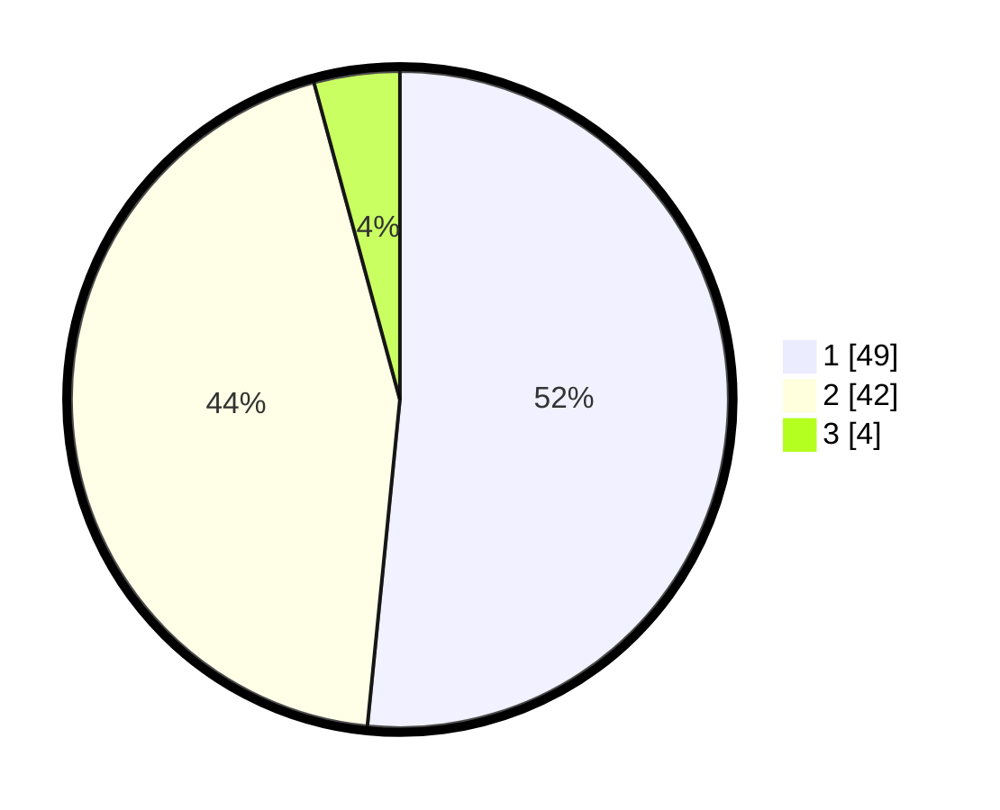

# Hasil

## Grafik

## Tabel

| No. | Nama Paslon    | Suara | Suara (raw) | Persentase |
|:--- |:-------------- | -----:| -----------:| ----------:|
| 1   | ANIES MUHAIMIN | 49    | [49][p-1]   | 51,58      |
| 2   | PRABOWO GIBRAN | 42    | [42][p-2]   | 44,21      |
| 3   | GANJAR MAHFUD  | 4     | [4][p-3]    | 4,21       |

[p-1]: https://github.com/gigit-pemilu/pemilu-2024/blob/main/pilpres/hitung-suara/sub/12-sumatera-utara/sub/19-batu-bara/sub/07-sei-balai/sub/2017-suko-rejo/sub/008-tps/sub/paslon-1.txt
[p-2]: https://github.com/gigit-pemilu/pemilu-2024/blob/main/pilpres/hitung-suara/sub/12-sumatera-utara/sub/19-batu-bara/sub/07-sei-balai/sub/2017-suko-rejo/sub/008-tps/sub/paslon-2.txt
[p-3]: https://github.com/gigit-pemilu/pemilu-2024/blob/main/pilpres/hitung-suara/sub/12-sumatera-utara/sub/19-batu-bara/sub/07-sei-balai/sub/2017-suko-rejo/sub/008-tps/sub/paslon-3.txt

## Foto C Plano

https://sirekap-obj-formc.kpu.go.id/b6c5/pemilu/ppwp/12/19/07/20/17/1219072017008-20240214-231624--8c3bef39-1d1c-4fa1-b0b3-62fbc86ba043.jpg

https://sirekap-obj-formc.kpu.go.id/b6c5/pemilu/ppwp/12/19/07/20/17/1219072017008-20240214-231847--9d3278ce-5a0f-4bd4-a366-ea2c16126519.jpg

https://sirekap-obj-formc.kpu.go.id/b6c5/pemilu/ppwp/12/19/07/20/17/1219072017008-20240214-232817--31c13c2b-5c1f-46fe-a837-c4d35845f13a.jpg

## Metadata

| Key        | Value               |
| ---------- | ------------------- |
| Time Stamp | 2024-02-26 17:00:04 |

