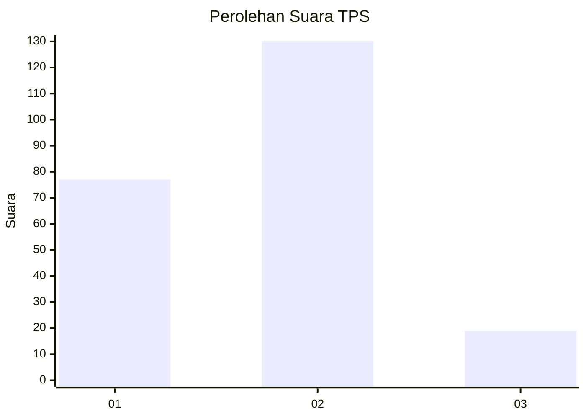
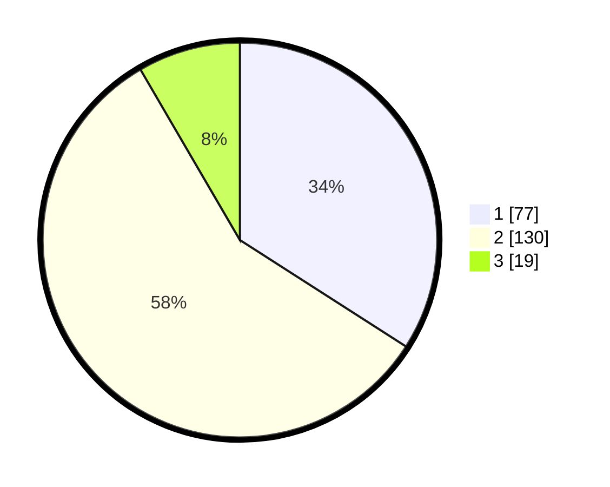

# Hasil

## Grafik

## Tabel

| No. | Nama Paslon    | Suara | Suara (raw) | Persentase |
|:--- |:-------------- | -----:| -----------:| ----------:|
| 1   | ANIES MUHAIMIN | 77    | [77][p-1]   | 34,07      |
| 2   | PRABOWO GIBRAN | 130   | [130][p-2]  | 57,52      |
| 3   | GANJAR MAHFUD  | 19    | [19][p-3]   | 8,41       |

[p-1]: https://github.com/gigit-pemilu/pemilu-2024-12-sumatera-utara/blob/main/pilpres/hitung-suara/sub/12-sumatera-utara/sub/19-batu-bara/sub/08-laut-tador/sub/2003-pelanggiran-laut-tador/sub/001-tps/sub/paslon-1.txt
[p-2]: https://github.com/gigit-pemilu/pemilu-2024-12-sumatera-utara/blob/main/pilpres/hitung-suara/sub/12-sumatera-utara/sub/19-batu-bara/sub/08-laut-tador/sub/2003-pelanggiran-laut-tador/sub/001-tps/sub/paslon-2.txt
[p-3]: https://github.com/gigit-pemilu/pemilu-2024-12-sumatera-utara/blob/main/pilpres/hitung-suara/sub/12-sumatera-utara/sub/19-batu-bara/sub/08-laut-tador/sub/2003-pelanggiran-laut-tador/sub/001-tps/sub/paslon-3.txt

## Foto C Plano

https://sirekap-obj-formc.kpu.go.id/9ed4/pemilu/ppwp/12/19/08/20/03/1219082003001-20240215-011517--50a3c26d-82a3-4751-8a1a-b17478511969.jpg

https://sirekap-obj-formc.kpu.go.id/9ed4/pemilu/ppwp/12/19/08/20/03/1219082003001-20240215-011528--2dab72f1-c5f4-4970-915e-dd1c221c0cae.jpg

https://sirekap-obj-formc.kpu.go.id/9ed4/pemilu/ppwp/12/19/08/20/03/1219082003001-20240215-011539--3d8c9cd6-57f9-4dbb-a6f0-c95509647339.jpg

## Metadata

| Key        | Value               |
| ---------- | ------------------- |
| Time Stamp | 2024-02-15 16:00:26 |

