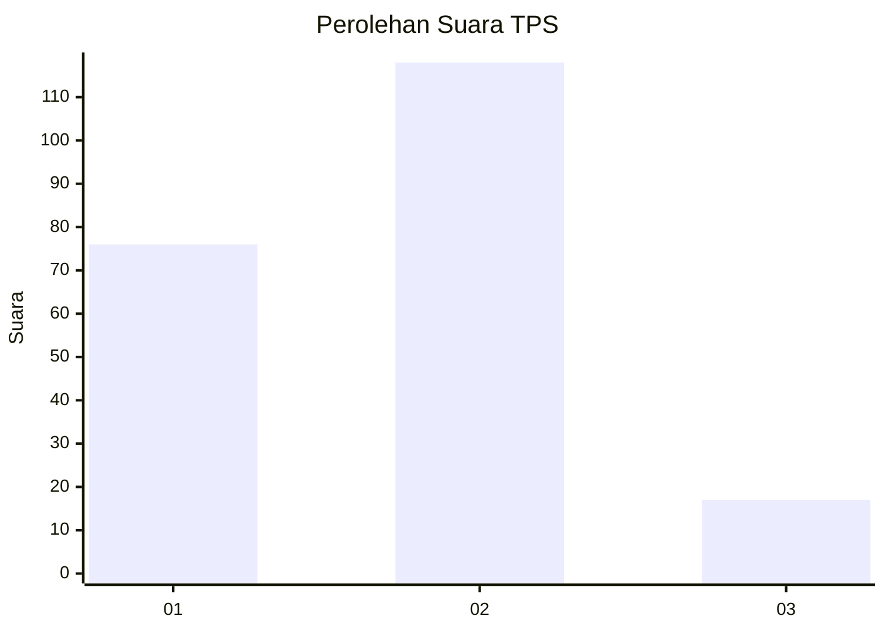

# Hasil

## Grafik

## Tabel

| No. | Nama Paslon    | Suara | Suara (raw) | Persentase |
|:--- |:-------------- | -----:| -----------:| ----------:|
| 1   | ANIES MUHAIMIN | 76    | [76][p-1]   | 36,02      |
| 2   | PRABOWO GIBRAN | 118   | [118][p-2]  | 55,92      |
| 3   | GANJAR MAHFUD  | 17    | [17][p-3]   | 8,06       |

[p-1]: https://github.com/gigit-pemilu/pemilu-2024-12-sumatera-utara/blob/main/pilpres/hitung-suara/sub/12-sumatera-utara/sub/19-batu-bara/sub/08-laut-tador/sub/2003-pelanggiran-laut-tador/sub/006-tps/sub/paslon-1.txt
[p-2]: https://github.com/gigit-pemilu/pemilu-2024-12-sumatera-utara/blob/main/pilpres/hitung-suara/sub/12-sumatera-utara/sub/19-batu-bara/sub/08-laut-tador/sub/2003-pelanggiran-laut-tador/sub/006-tps/sub/paslon-2.txt
[p-3]: https://github.com/gigit-pemilu/pemilu-2024-12-sumatera-utara/blob/main/pilpres/hitung-suara/sub/12-sumatera-utara/sub/19-batu-bara/sub/08-laut-tador/sub/2003-pelanggiran-laut-tador/sub/006-tps/sub/paslon-3.txt

## Foto C Plano

https://sirekap-obj-formc.kpu.go.id/c8e7/pemilu/ppwp/12/19/08/20/03/1219082003006-20240215-022017--6bc7a986-7d14-4ee4-bc06-87f9866dc53e.jpg

https://sirekap-obj-formc.kpu.go.id/c8e7/pemilu/ppwp/12/19/08/20/03/1219082003006-20240215-022036--905149af-97f5-4df7-b524-381aafa7fb58.jpg

https://sirekap-obj-formc.kpu.go.id/c8e7/pemilu/ppwp/12/19/08/20/03/1219082003006-20240215-022053--e48262c3-f14e-48ad-beb8-28c3fcca6a9c.jpg

## Metadata

| Key        | Value               |
| ---------- | ------------------- |
| Time Stamp | 2024-02-16 14:00:34 |

