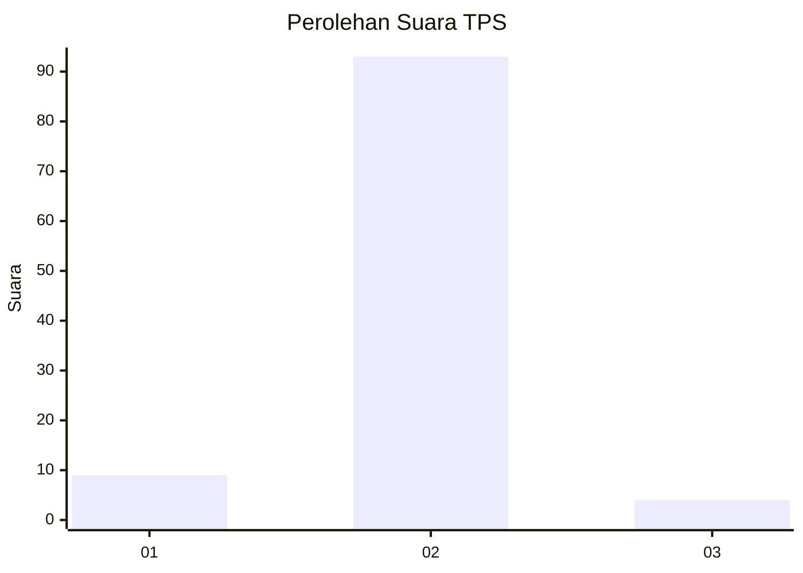
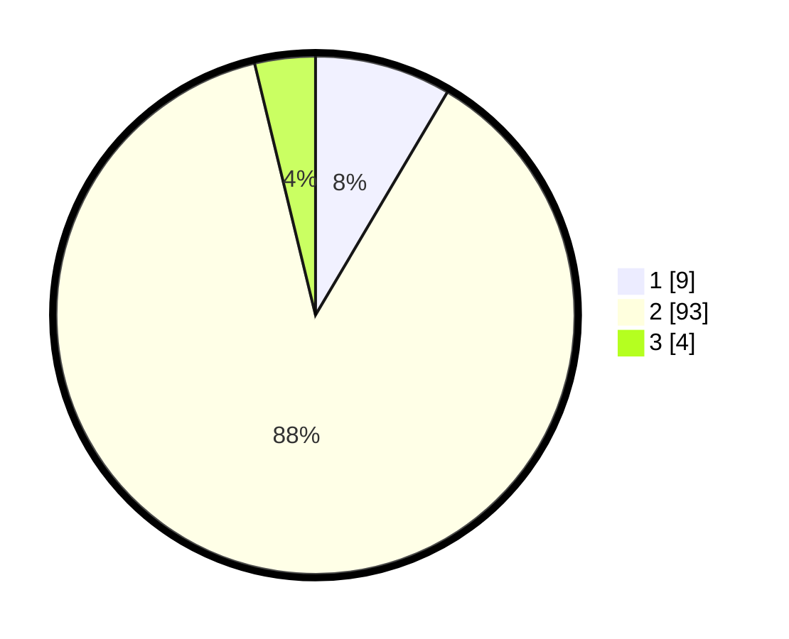

# Hasil

## Grafik

## Tabel

| No. | Nama Paslon    | Suara | Suara (raw) | Persentase |
|:--- |:-------------- | -----:| -----------:| ----------:|
| 1   | ANIES MUHAIMIN | 9     | [9][p-1]    | 8,49       |
| 2   | PRABOWO GIBRAN | 93    | [93][p-2]   | 87,74      |
| 3   | GANJAR MAHFUD  | 4     | [4][p-3]    | 3,77       |

[p-1]: https://github.com/gigit-pemilu/pemilu-2024/blob/main/pilpres/hitung-suara/sub/12-sumatera-utara/sub/19-batu-bara/sub/08-laut-tador/sub/2010-kandangan/sub/001-tps/sub/paslon-1.txt
[p-2]: https://github.com/gigit-pemilu/pemilu-2024/blob/main/pilpres/hitung-suara/sub/12-sumatera-utara/sub/19-batu-bara/sub/08-laut-tador/sub/2010-kandangan/sub/001-tps/sub/paslon-2.txt
[p-3]: https://github.com/gigit-pemilu/pemilu-2024/blob/main/pilpres/hitung-suara/sub/12-sumatera-utara/sub/19-batu-bara/sub/08-laut-tador/sub/2010-kandangan/sub/001-tps/sub/paslon-3.txt

## Foto C Plano

https://sirekap-obj-formc.kpu.go.id/4c0f/pemilu/ppwp/12/19/08/20/10/1219082010001-20240215-041417--7d401c81-2c26-4253-9498-6c7e699b71ef.jpg

https://sirekap-obj-formc.kpu.go.id/4c0f/pemilu/ppwp/12/19/08/20/10/1219082010001-20240215-041123--e8fd1aba-dd89-4d22-a0c9-f4995c7da912.jpg

https://sirekap-obj-formc.kpu.go.id/4c0f/pemilu/ppwp/12/19/08/20/10/1219082010001-20240214-235154--7cca5a6b-c319-46ea-bfae-8fd85966737b.jpg

## Metadata

| Key        | Value               |
| ---------- | ------------------- |
| Time Stamp | 2024-02-15 15:00:29 |

