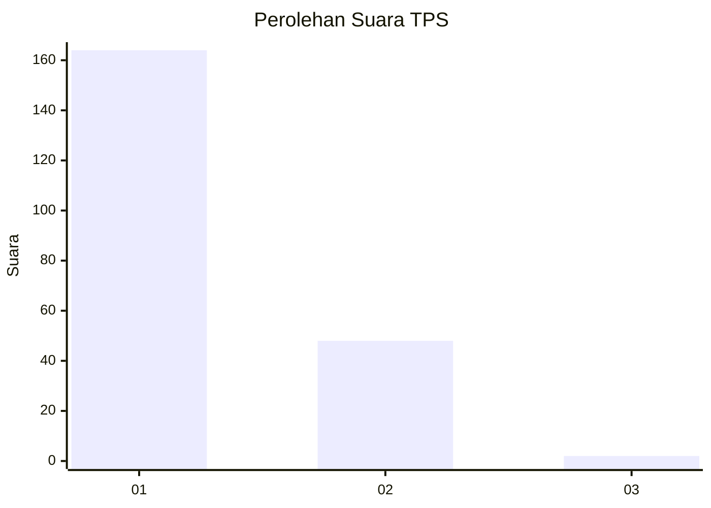
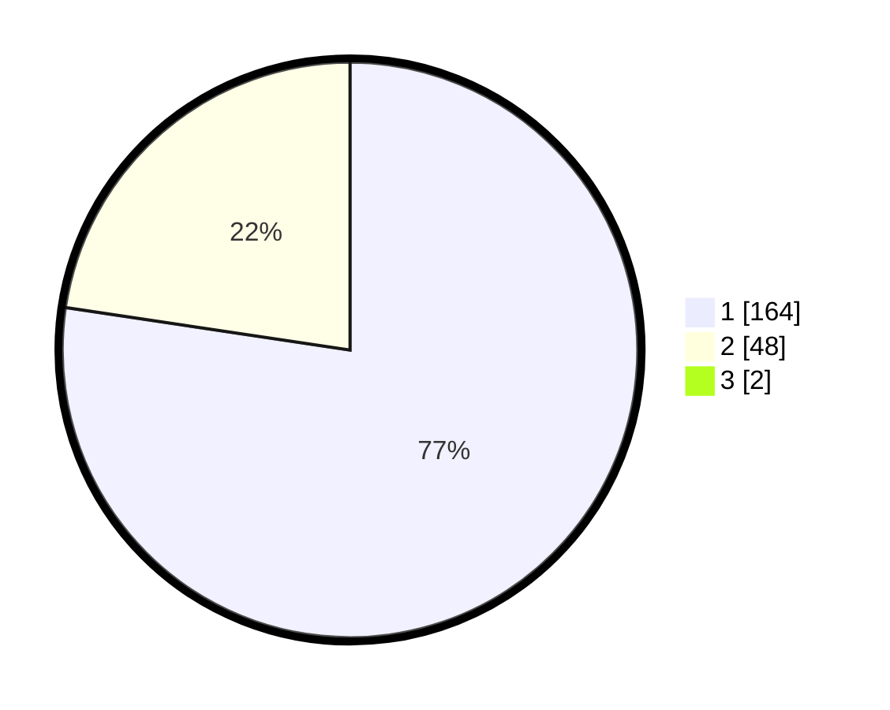

# Hasil

## Grafik

## Tabel

| No. | Nama Paslon    | Suara | Suara (raw) | Persentase |
|:--- |:-------------- | -----:| -----------:| ----------:|
| 1   | ANIES MUHAIMIN | 164   | [164][p-1]  | 76,64      |
| 2   | PRABOWO GIBRAN | 48    | [48][p-2]   | 22,43      |
| 3   | GANJAR MAHFUD  | 2     | [2][p-3]    | 0,93       |

[p-1]: https://github.com/gigit-pemilu/pemilu-2024-12-sumatera-utara/blob/main/pilpres/hitung-suara/sub/12-sumatera-utara/sub/19-batu-bara/sub/09-lima-puluh-pesisir/sub/2001-gambus-laut/sub/001-tps/sub/paslon-1.txt
[p-2]: https://github.com/gigit-pemilu/pemilu-2024-12-sumatera-utara/blob/main/pilpres/hitung-suara/sub/12-sumatera-utara/sub/19-batu-bara/sub/09-lima-puluh-pesisir/sub/2001-gambus-laut/sub/001-tps/sub/paslon-2.txt
[p-3]: https://github.com/gigit-pemilu/pemilu-2024-12-sumatera-utara/blob/main/pilpres/hitung-suara/sub/12-sumatera-utara/sub/19-batu-bara/sub/09-lima-puluh-pesisir/sub/2001-gambus-laut/sub/001-tps/sub/paslon-3.txt

## Foto C Plano

https://sirekap-obj-formc.kpu.go.id/329b/pemilu/ppwp/12/19/09/20/01/1219092001001-20240215-060259--71cff0d3-f41f-4d69-a1c0-d65a886b05d0.jpg

https://sirekap-obj-formc.kpu.go.id/329b/pemilu/ppwp/12/19/09/20/01/1219092001001-20240215-060428--69166046-f162-4624-a7f1-0fa457eba023.jpg

https://sirekap-obj-formc.kpu.go.id/329b/pemilu/ppwp/12/19/09/20/01/1219092001001-20240215-060550--5043537f-7e2c-428e-89eb-cb5f3e64e6e7.jpg

## Metadata

| Key        | Value               |
| ---------- | ------------------- |
| Time Stamp | 2024-02-15 19:30:26 |

