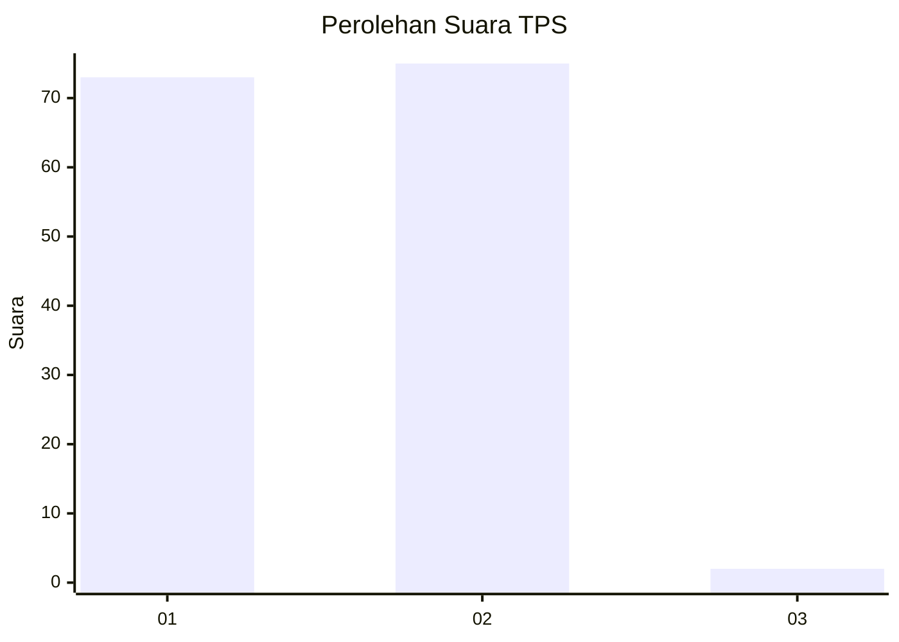
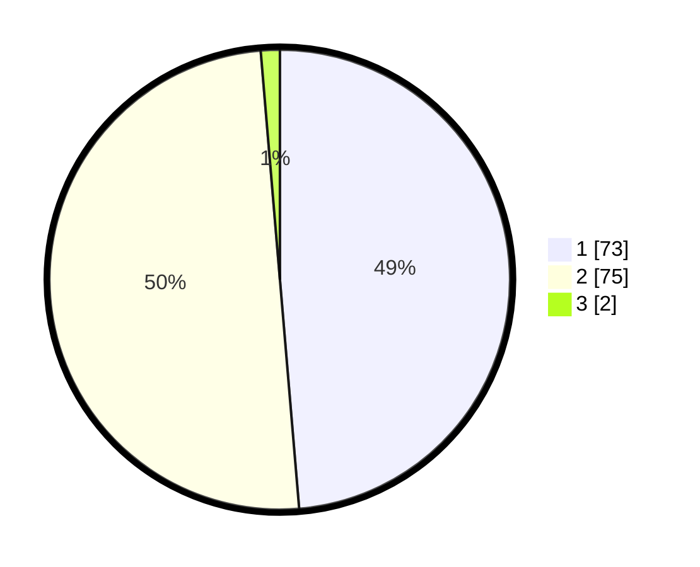

# Hasil

## Grafik

## Tabel

| No. | Nama Paslon    | Suara | Suara (raw) | Persentase |
|:--- |:-------------- | -----:| -----------:| ----------:|
| 1   | ANIES MUHAIMIN | 73    | [73][p-1]   | 48,67      |
| 2   | PRABOWO GIBRAN | 75    | [75][p-2]   | 50,00      |
| 3   | GANJAR MAHFUD  | 2     | [2][p-3]    | 1,33       |

[p-1]: https://github.com/gigit-pemilu/pemilu-2024/blob/main/pilpres/hitung-suara/sub/12-sumatera-utara/sub/19-batu-bara/sub/09-lima-puluh-pesisir/sub/2001-gambus-laut/sub/011-tps/sub/paslon-1.txt
[p-2]: https://github.com/gigit-pemilu/pemilu-2024/blob/main/pilpres/hitung-suara/sub/12-sumatera-utara/sub/19-batu-bara/sub/09-lima-puluh-pesisir/sub/2001-gambus-laut/sub/011-tps/sub/paslon-2.txt
[p-3]: https://github.com/gigit-pemilu/pemilu-2024/blob/main/pilpres/hitung-suara/sub/12-sumatera-utara/sub/19-batu-bara/sub/09-lima-puluh-pesisir/sub/2001-gambus-laut/sub/011-tps/sub/paslon-3.txt

## Foto C Plano

https://sirekap-obj-formc.kpu.go.id/b2d5/pemilu/ppwp/12/19/09/20/01/1219092001011-20240215-052935--ebbde468-65f8-4274-9a36-9d4f4e2dd4e5.jpg

https://sirekap-obj-formc.kpu.go.id/b2d5/pemilu/ppwp/12/19/09/20/01/1219092001011-20240215-053054--b8b1f3cf-236c-4a52-9129-92acc01a04c9.jpg

https://sirekap-obj-formc.kpu.go.id/b2d5/pemilu/ppwp/12/19/09/20/01/1219092001011-20240215-053330--a636e255-16b5-4b48-8644-1edf547031e8.jpg

## Metadata

| Key        | Value               |
| ---------- | ------------------- |
| Time Stamp | 2024-02-15 19:30:26 |

