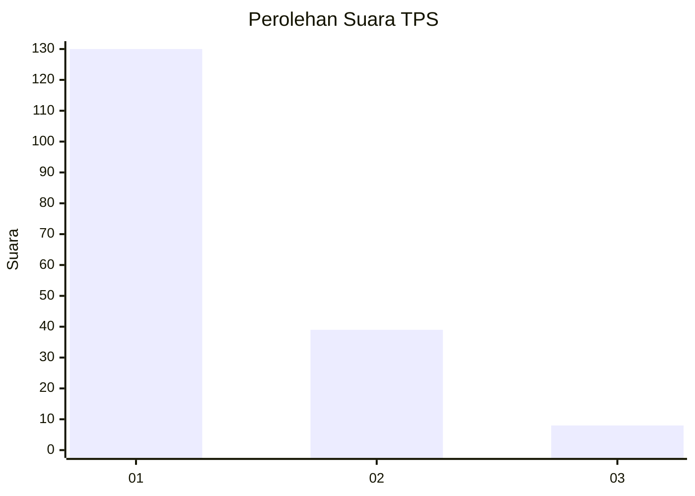
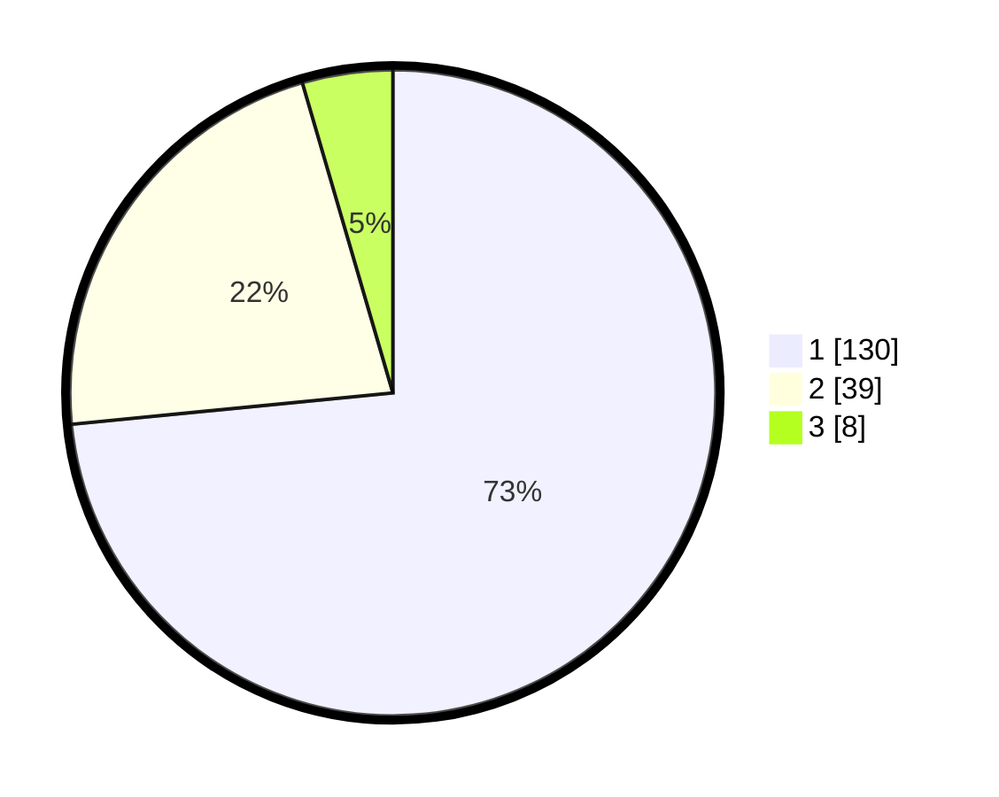

# Hasil

## Grafik

## Tabel

| No. | Nama Paslon    | Suara | Suara (raw) | Persentase |
|:--- |:-------------- | -----:| -----------:| ----------:|
| 1   | ANIES MUHAIMIN | 130   | [130][p-1]  | 73,45      |
| 2   | PRABOWO GIBRAN | 39    | [39][p-2]   | 22,03      |
| 3   | GANJAR MAHFUD  | 8     | [8][p-3]    | 4,52       |

[p-1]: https://github.com/gigit-pemilu/pemilu-2024-12-sumatera-utara/blob/main/pilpres/hitung-suara/sub/12-sumatera-utara/sub/19-batu-bara/sub/09-lima-puluh-pesisir/sub/2001-gambus-laut/sub/013-tps/sub/paslon-1.txt
[p-2]: https://github.com/gigit-pemilu/pemilu-2024-12-sumatera-utara/blob/main/pilpres/hitung-suara/sub/12-sumatera-utara/sub/19-batu-bara/sub/09-lima-puluh-pesisir/sub/2001-gambus-laut/sub/013-tps/sub/paslon-2.txt
[p-3]: https://github.com/gigit-pemilu/pemilu-2024-12-sumatera-utara/blob/main/pilpres/hitung-suara/sub/12-sumatera-utara/sub/19-batu-bara/sub/09-lima-puluh-pesisir/sub/2001-gambus-laut/sub/013-tps/sub/paslon-3.txt

## Foto C Plano

https://sirekap-obj-formc.kpu.go.id/89e2/pemilu/ppwp/12/19/09/20/01/1219092001013-20240215-022054--5c78b09e-b163-4ccc-b5d0-da2e95c0fac5.jpg

https://sirekap-obj-formc.kpu.go.id/89e2/pemilu/ppwp/12/19/09/20/01/1219092001013-20240215-022250--00b01122-ed5e-44ef-9ae2-9b5bddc42e64.jpg

https://sirekap-obj-formc.kpu.go.id/89e2/pemilu/ppwp/12/19/09/20/01/1219092001013-20240215-030354--fb071c00-4575-486b-b640-7234989c409e.jpg

## Metadata

| Key        | Value               |
| ---------- | ------------------- |
| Time Stamp | 2024-02-15 19:30:26 |

