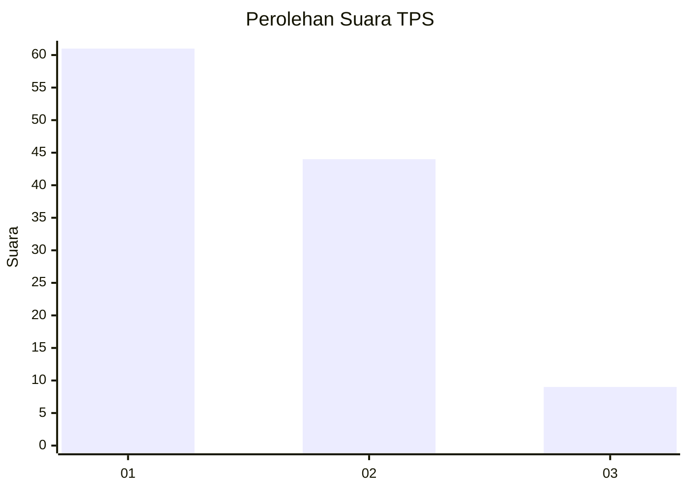
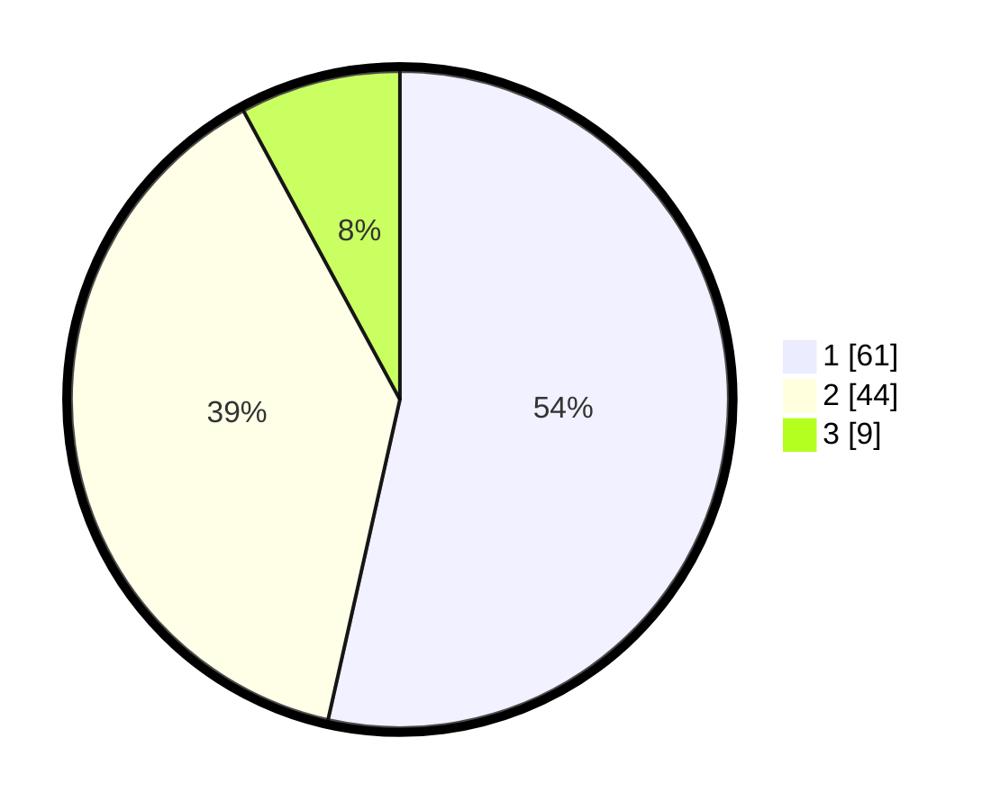

# Hasil

## Grafik

## Tabel

| No. | Nama Paslon    | Suara | Suara (raw) | Persentase |
|:--- |:-------------- | -----:| -----------:| ----------:|
| 1   | ANIES MUHAIMIN | 61    | [61][p-1]   | 53,51      |
| 2   | PRABOWO GIBRAN | 44    | [44][p-2]   | 38,60      |
| 3   | GANJAR MAHFUD  | 9     | [9][p-3]    | 7,89       |

[p-1]: https://github.com/gigit-pemilu/pemilu-2024/blob/main/pilpres/hitung-suara/sub/12-sumatera-utara/sub/19-batu-bara/sub/09-lima-puluh-pesisir/sub/2009-bulan-bulan/sub/008-tps/sub/paslon-1.txt
[p-2]: https://github.com/gigit-pemilu/pemilu-2024/blob/main/pilpres/hitung-suara/sub/12-sumatera-utara/sub/19-batu-bara/sub/09-lima-puluh-pesisir/sub/2009-bulan-bulan/sub/008-tps/sub/paslon-2.txt
[p-3]: https://github.com/gigit-pemilu/pemilu-2024/blob/main/pilpres/hitung-suara/sub/12-sumatera-utara/sub/19-batu-bara/sub/09-lima-puluh-pesisir/sub/2009-bulan-bulan/sub/008-tps/sub/paslon-3.txt

## Foto C Plano

https://sirekap-obj-formc.kpu.go.id/bfb1/pemilu/ppwp/12/19/09/20/09/1219092009008-20240215-050355--e20f506a-a570-4b53-9dd7-337230efbead.jpg

https://sirekap-obj-formc.kpu.go.id/bfb1/pemilu/ppwp/12/19/09/20/09/1219092009008-20240215-050756--09a9e088-1e0f-457f-b9be-b1dbb8b9f12c.jpg

https://sirekap-obj-formc.kpu.go.id/bfb1/pemilu/ppwp/12/19/09/20/09/1219092009008-20240215-050917--e9737956-1e7c-4955-a09f-0ac3b79e9a0d.jpg

## Metadata

| Key        | Value               |
| ---------- | ------------------- |
| Time Stamp | 2024-02-15 20:00:44 |

