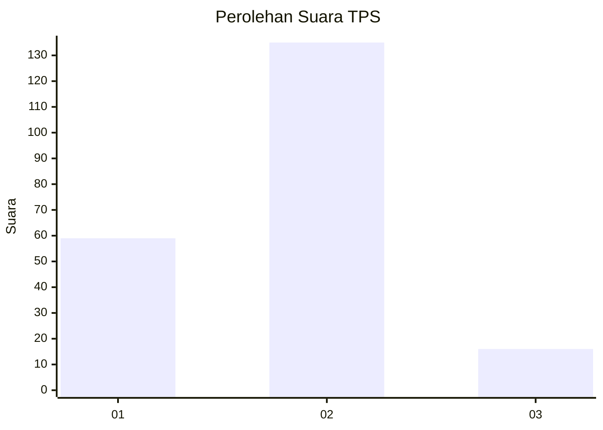
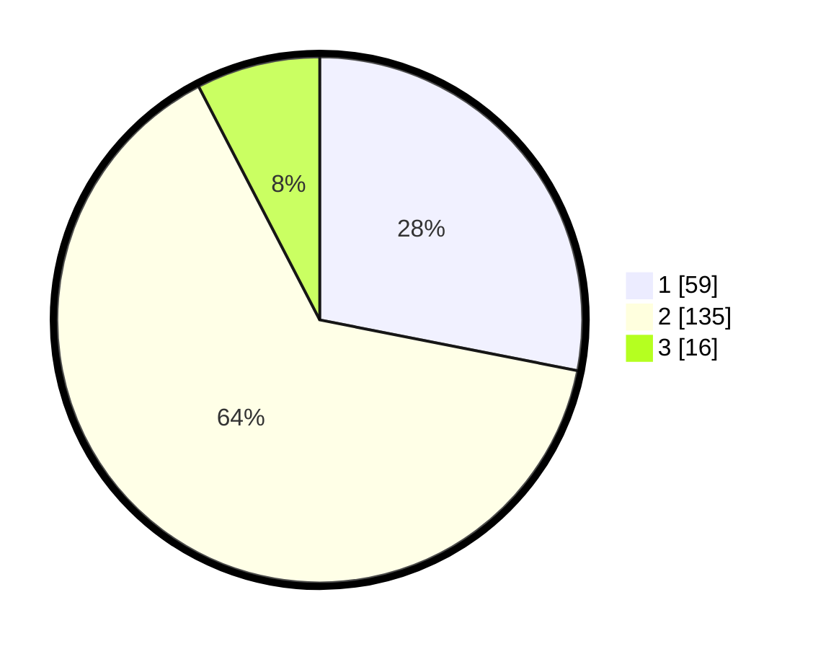

# Hasil

## Grafik

## Tabel

| No. | Nama Paslon    | Suara | Suara (raw) | Persentase |
|:--- |:-------------- | -----:| -----------:| ----------:|
| 1   | ANIES MUHAIMIN | 59    | [59][p-1]   | 28,10      |
| 2   | PRABOWO GIBRAN | 135   | [135][p-2]  | 64,29      |
| 3   | GANJAR MAHFUD  | 16    | [16][p-3]   | 7,62       |

[p-1]: https://github.com/gigit-pemilu/pemilu-2024/blob/main/pilpres/hitung-suara/sub/12-sumatera-utara/sub/19-batu-bara/sub/09-lima-puluh-pesisir/sub/2011-lubuk-cuik/sub/009-tps/sub/paslon-1.txt
[p-2]: https://github.com/gigit-pemilu/pemilu-2024/blob/main/pilpres/hitung-suara/sub/12-sumatera-utara/sub/19-batu-bara/sub/09-lima-puluh-pesisir/sub/2011-lubuk-cuik/sub/009-tps/sub/paslon-2.txt
[p-3]: https://github.com/gigit-pemilu/pemilu-2024/blob/main/pilpres/hitung-suara/sub/12-sumatera-utara/sub/19-batu-bara/sub/09-lima-puluh-pesisir/sub/2011-lubuk-cuik/sub/009-tps/sub/paslon-3.txt

## Foto C Plano

https://sirekap-obj-formc.kpu.go.id/45d0/pemilu/ppwp/12/19/09/20/11/1219092011009-20240215-095034--008c6fcb-d142-49db-9bc4-8e033a6d7c05.jpg

https://sirekap-obj-formc.kpu.go.id/45d0/pemilu/ppwp/12/19/09/20/11/1219092011009-20240215-095134--38d4a62c-0814-4ac7-890b-82c24faf5b97.jpg

https://sirekap-obj-formc.kpu.go.id/45d0/pemilu/ppwp/12/19/09/20/11/1219092011009-20240215-095335--77bc5b57-75a5-432d-bf6c-b0503ae1811b.jpg

## Metadata

| Key        | Value               |
| ---------- | ------------------- |
| Time Stamp | 2024-02-15 20:00:44 |

