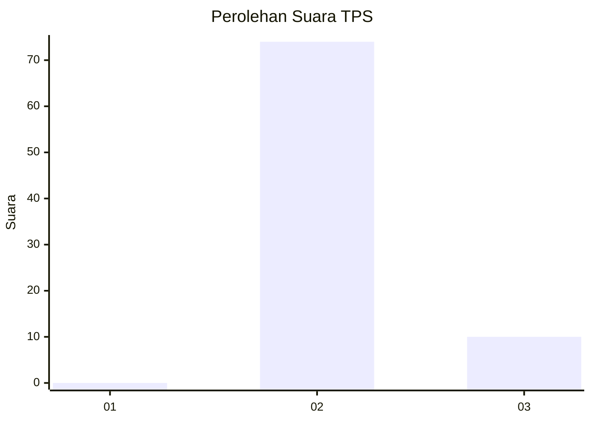
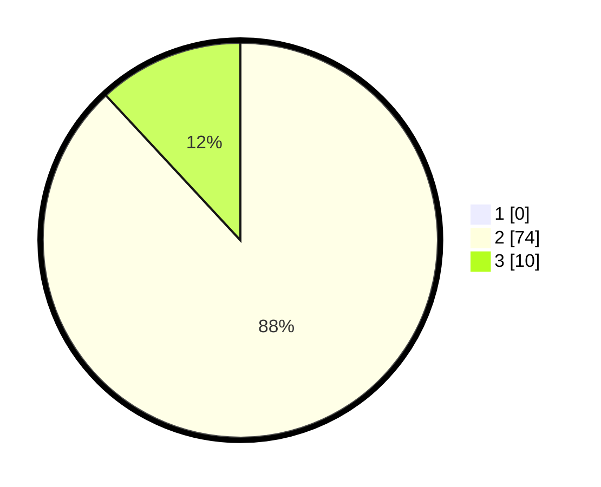

# Hasil

## Grafik

## Tabel

| No. | Nama Paslon    | Suara | Suara (raw) | Persentase |
|:--- |:-------------- | -----:| -----------:| ----------:|
| 1   | ANIES MUHAIMIN | 0     | [0][p-1]    | 0,00       |
| 2   | PRABOWO GIBRAN | 74    | [74][p-2]   | 88,10      |
| 3   | GANJAR MAHFUD  | 10    | [10][p-3]   | 11,90      |

[p-1]: https://github.com/gigit-pemilu/pemilu-2024/blob/main/pilpres/hitung-suara/sub/12-sumatera-utara/sub/19-batu-bara/sub/09-lima-puluh-pesisir/sub/2013-pematang-tengah/sub/003-tps/sub/paslon-1.txt
[p-2]: https://github.com/gigit-pemilu/pemilu-2024/blob/main/pilpres/hitung-suara/sub/12-sumatera-utara/sub/19-batu-bara/sub/09-lima-puluh-pesisir/sub/2013-pematang-tengah/sub/003-tps/sub/paslon-2.txt
[p-3]: https://github.com/gigit-pemilu/pemilu-2024/blob/main/pilpres/hitung-suara/sub/12-sumatera-utara/sub/19-batu-bara/sub/09-lima-puluh-pesisir/sub/2013-pematang-tengah/sub/003-tps/sub/paslon-3.txt

## Foto C Plano

https://sirekap-obj-formc.kpu.go.id/b9e5/pemilu/ppwp/12/19/09/20/13/1219092013003-20240214-214718--86e10afc-ca5e-4767-95bd-75b0eba09296.jpg

https://sirekap-obj-formc.kpu.go.id/b9e5/pemilu/ppwp/12/19/09/20/13/1219092013003-20240214-222235--4a11fc68-bf85-4c72-8381-16c702c4814b.jpg

https://sirekap-obj-formc.kpu.go.id/b9e5/pemilu/ppwp/12/19/09/20/13/1219092013003-20240214-215023--5961b9e4-1aa3-48f0-9374-6d360e0c3707.jpg

## Metadata

| Key        | Value               |
| ---------- | ------------------- |
| Time Stamp | 2024-02-15 19:30:26 |

