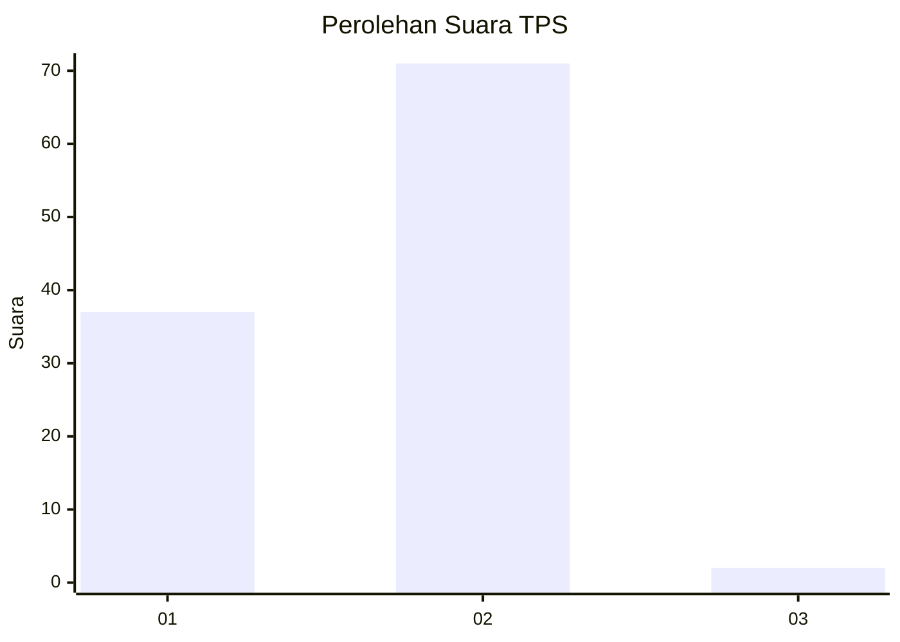
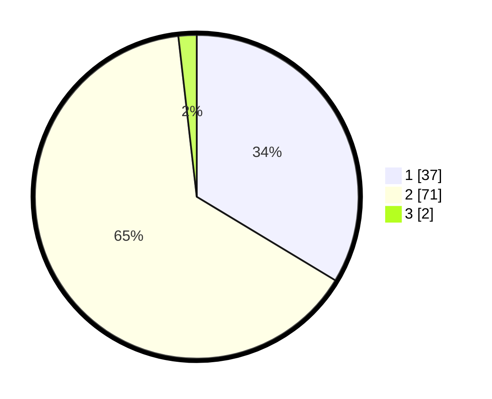

# Hasil

## Grafik

## Tabel

| No. | Nama Paslon    | Suara | Suara (raw) | Persentase |
|:--- |:-------------- | -----:| -----------:| ----------:|
| 1   | ANIES MUHAIMIN | 37    | [37][p-1]   | 33,64      |
| 2   | PRABOWO GIBRAN | 71    | [71][p-2]   | 64,55      |
| 3   | GANJAR MAHFUD  | 2     | [2][p-3]    | 1,82       |

[p-1]: https://github.com/gigit-pemilu/pemilu-2024-12-sumatera-utara/blob/main/pilpres/hitung-suara/sub/12-sumatera-utara/sub/19-batu-bara/sub/10-datuk-lima-puluh/sub/2004-lubuk-hulu/sub/006-tps/sub/paslon-1.txt
[p-2]: https://github.com/gigit-pemilu/pemilu-2024-12-sumatera-utara/blob/main/pilpres/hitung-suara/sub/12-sumatera-utara/sub/19-batu-bara/sub/10-datuk-lima-puluh/sub/2004-lubuk-hulu/sub/006-tps/sub/paslon-2.txt
[p-3]: https://github.com/gigit-pemilu/pemilu-2024-12-sumatera-utara/blob/main/pilpres/hitung-suara/sub/12-sumatera-utara/sub/19-batu-bara/sub/10-datuk-lima-puluh/sub/2004-lubuk-hulu/sub/006-tps/sub/paslon-3.txt

## Foto C Plano

https://sirekap-obj-formc.kpu.go.id/66d3/pemilu/ppwp/12/19/10/20/04/1219102004006-20240215-025703--7bb08a00-e8d1-4eb2-b8f3-f57fc5036c33.jpg

https://sirekap-obj-formc.kpu.go.id/66d3/pemilu/ppwp/12/19/10/20/04/1219102004006-20240215-025815--9c3fedfd-d9a0-40b5-9a84-5eb07c44e28d.jpg

https://sirekap-obj-formc.kpu.go.id/66d3/pemilu/ppwp/12/19/10/20/04/1219102004006-20240215-025954--9baf13de-d2db-4b6a-874c-1bb89f7e7c33.jpg

## Metadata

| Key        | Value               |
| ---------- | ------------------- |
| Time Stamp | 2024-02-15 15:00:29 |

