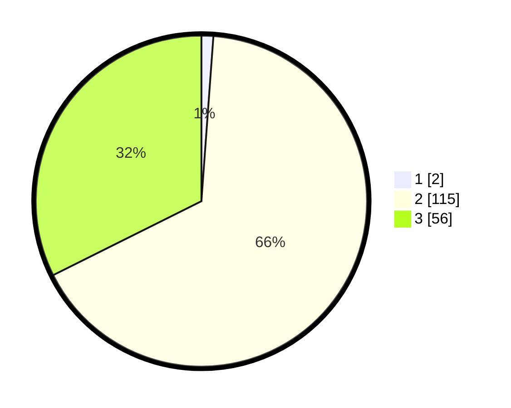

# Hasil

## Grafik

## Tabel

| No. | Nama Paslon    | Suara | Suara (raw) | Persentase |
|:--- |:-------------- | -----:| -----------:| ----------:|
| 1   | ANIES MUHAIMIN | 2     | [2][p-1]    | 1,16       |
| 2   | PRABOWO GIBRAN | 115   | [115][p-2]  | 66,47      |
| 3   | GANJAR MAHFUD  | 56    | [56][p-3]   | 32,37      |

[p-1]: https://github.com/gigit-pemilu/pemilu-2024/blob/main/pilpres/hitung-suara/sub/12-sumatera-utara/sub/19-batu-bara/sub/11-datuk-tanah-datar/sub/2001-sumber-tani/sub/004-tps/sub/paslon-1.txt
[p-2]: https://github.com/gigit-pemilu/pemilu-2024/blob/main/pilpres/hitung-suara/sub/12-sumatera-utara/sub/19-batu-bara/sub/11-datuk-tanah-datar/sub/2001-sumber-tani/sub/004-tps/sub/paslon-2.txt
[p-3]: https://github.com/gigit-pemilu/pemilu-2024/blob/main/pilpres/hitung-suara/sub/12-sumatera-utara/sub/19-batu-bara/sub/11-datuk-tanah-datar/sub/2001-sumber-tani/sub/004-tps/sub/paslon-3.txt

## Foto C Plano

https://sirekap-obj-formc.kpu.go.id/94ee/pemilu/ppwp/12/19/11/20/01/1219112001004-20240215-015031--dfabd27b-70f2-4746-a193-821256733b66.jpg

https://sirekap-obj-formc.kpu.go.id/94ee/pemilu/ppwp/12/19/11/20/01/1219112001004-20240215-015709--54b78e99-9fd7-4b76-975d-0560fbbd48bc.jpg

https://sirekap-obj-formc.kpu.go.id/94ee/pemilu/ppwp/12/19/11/20/01/1219112001004-20240215-015805--46d3bcf8-d9ce-4266-847e-c54db66cb6c9.jpg

## Metadata

| Key        | Value               |
| ---------- | ------------------- |
| Time Stamp | 2024-02-15 16:30:25 |

